# Delegated Authority in the London Market

---

## Preface

### Purpose and Scope

This guide examines delegated underwriting and claims authority as practised in the London insurance market. It covers both the Lloyd's and the "company" market, examining the legal, regulatory, contractual, operational, financial, data, and governance dimensions of this complex area of the insurance industry.

### Conventions

| Term used in this guide | Meaning |
|---|---|
| **Capacity provider** | A risk carrier granting authority: a Lloyd's managing agent acting for one or more syndicates, Lloyd's Insurance Company S.A., or a company market insurer. |
| **Delegate** | The party receiving authority: an MGA, service company, TPA, or other agent. |
| **Binding Authority Agreement** | The agreement by which a capacity provider authorises a delegate to accept risks and issue documentation on its behalf. In the company market it is frequently called a Delegated Underwriting Authority (DUA), and somtimes a "binder". This guide avoids the latter term, which outside of London, can be used to refer to a slip given on bind in lieu of the full policy wording. |
| **Coverholder** | The Lloyd's term for an entity approved to enter into contracts of insurance on behalf of Lloyd's underwriters under a binding authority. |
| **MGA** | Managing general agent. The term is used generically across both markets and in the US programme business context. |
| **Act** | Refers to an "Act of Parliament", which are the primary piece of legislation in the UK, that creates a new law or changes an existing law after being approved by the legislature and receiving royal or executive assent. |


---

# Part I — Foundations

## 1. The Nature and Rationale of Delegated Authority

### 1.1 Definition

Delegated authority is an arrangement under which an insurer authorises a third party to act on its behalf in one or more insurance functions. Those functions may include:

- quoting
- binding cover
- issuing policy documentation
- collecting premium
- handling and settling claims
- handling complaints

The delegate acts as the insurer's agent. When the delegate acts within its authority, the insurer is bound as though it had acted itself.

### 1.2 Economic Rationale

London capacity is concentrated geographically, but the risks it insures are dispersed globally. Many of those risks are small, homogeneous or specialist, and they are uneconomic to place individually through the subscription market. Delegation addresses this mismatch.

| Stakeholder | Principal benefits |
|---|---|
| **Capacity provider** | Access to distant or niche markets without a local establishment; lower acquisition cost per risk; portfolio diversification; use of specialist local expertise. |
| **Delegate** | Access to highly rated security, including the Lloyd's brand and licences; the ability to build a franchise without holding regulatory capital as a risk carrier; income from commission, fees and profit commission. |
| **Policyholder** | Local service, speed of binding, products tailored to local conditions, and access to London security. |
| **Producing broker** | A reliable market for small and mid-sized risks with predictable appetite. |

Delegated business accounts for a substantial share of Lloyd's gross written premium. It is commonly cited at between one-third and two-fifths of market premium, written through several thousand approved coverholders worldwide. Company market delegation is also significant, particularly in property, casualty, specialty and personal lines programmes, and in capacity supporting MGAs.

### 1.3 The Central Tension

The defining risk of delegated authority is the separation of *decision* from *consequence*. The delegate makes underwriting and claims decisions. The capacity provider bears the financial result.

Every structural feature of a well-run arrangement is designed to realign incentives, maintain visibility and preserve control across that separation. These features include:

- due diligence
- limits
- referral provisions
- bordereaux
- audit
- profit commission
- termination rights
- regulatory accountability

---

## 2. Historical Development

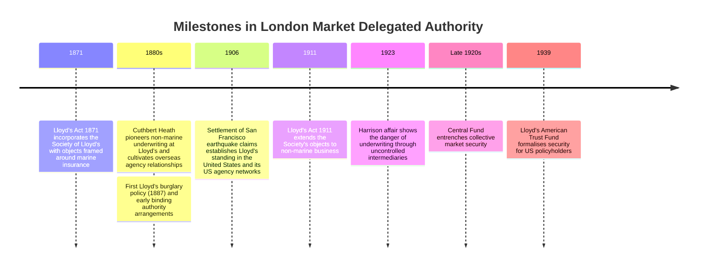

## 2.1 Origins (1871–1939)

### 2.1.1 The legal foundation

The **Lloyd's Act 1871** incorporated the Society of Lloyd's, giving legal identity to what was, at the time, a coffee-house association of marine underwriters. The Act was narrow in it's scope, being framed specifically for marine insurance, and it gave the Society limited power over how individual members conducted business. Each underwriting member (a "Name") wrote risks severally, with unlimited personal liability, through underwriters acting on their behalf.

This first form of delegation, from Names to the underwriting agents who committed their capital, was to shape every later crisis.

### 2.1.2 Cuthbert Heath and the non-marine revolution

In 1880, **Cuthbert Heath** joined the society as an underwriter and transformed Lloyd's into a general insurance market. He is credited with writing the first burglary policy in 1887, and pioneered reinsurance of American fire risks, jewellers' block, and a range of other novel covers. Heath understood that growth in non-marine business, particularly overseas, depended on local intermediaries who could originate and underwrite risk on Lloyd's behalf, since underwriter sitting in The Room, could assess risks a continent away.

Heath planted the seeds for **binding authority**. A local agent received a written authority to accept risks within defined limits and bind Lloyd's underwriters to them, then reported the business back to London. The legal questions it raised remain the core questions today:

- What is the scope of the agent's **actual authority**?
- What **apparent authority** does the principal's conduct create towards third parties?
- What information must flow back, and how quickly?

The **Lloyd's Act 1911** extended the Society's objects to cover non-marine business, formally recognising what Heath and others had already built.

### 2.1.3 1906: San Francisco and the American franchise

The San Francisco earthquake and fire of April 1906, were the defining test of this new model. Heath reportedly instructed his agents to pay all policyholders in full, irrespective of the terms of their policies. Whatever the precise wording, Lloyd's underwriters settled claims promptly while several other insurers disputed fire-versus-earthquake causation or failed outright.

The consequences were lasting. Lloyd's secured a reputation in the United States that underpins its surplus lines business to this day. Claims conduct by one underwriter or agent reflected on the whole market, which remains the logic behind the modern Society's central oversight of coverholders.

### 2.1.4 1923: The Harrison affair

In the early 1920s, the underwriter **Stanley Harrison** wrote guarantee policies covering hire-purchase motor finance, much of it introduced through an intermediary engaged in fraud. When the scheme collapsed in 1923, the losses far exceeded the syndicate's means. Other Lloyd's members voluntarily made good the policyholders' claims to protect the market's name.

Clearly, Lloyd's could not rely on the self-discipline of individual underwriters dealing through intermediaries they did not control.The market therefore developed collective security mechanisms, culminating in the 1920s in the establishment of a **Central Fund**. These entrenched the principle that the whole market bears the tail risk of individual failures.

The **Lloyd's American Trust Fund**, established in 1939, formalised security for US policyholders. Regulators in the market's largest territory would require assets located where the policyholders were.

---

## 2.2 Expansion and Crisis (1950s–1990s)

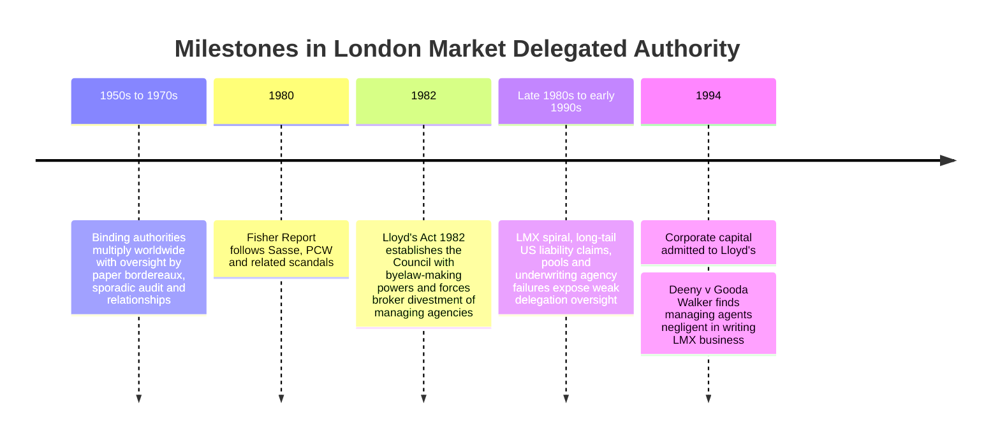

### 2.2.1 Growth of the binder model

In the post-war decades, binding authorities multiplied across the United States, Canada, Australia, South Africa, and elsewhere, with coverholders writing property, casualty, motor, personal accident, and specialty lines. Oversight relied largely on:

- **Bordereaux**: periodic (and often paper-based) schedules of risks and premiums, frequently months in arrears.
- **Audits**: sporadic and variable in quality.
- **Relationships**: trust between London underwriters and agents, often cultivated over decades.

The model worked well when agents were competent and aligned, but offered few early warning signals when they were not.

### 2.2.2 The 1982 Act and the Council

Scandals in the late 1970s and early 1980s culminated in the Fisher Report (1980) and the **Lloyd's Act 1982**. Two strands of conduct prompted them: the Sasse syndicate's losses on US business written through an agency and the misappropriation affairs connected with Cameron-Webb and the PCW syndicates, and later Howden and Posgate. 

The Act established the **Council of Lloyd's**, with powers to make byelaws binding on members and agents. Brokers were required to divest themselves of managing agencies, attacking a conflict of interest at the heart of the market, and giving the Society statutory immunity from certain damages claims, which later became controversial in litigation by Names.

The Act made Lloyd's a self-regulating organisation with real rule-making teeth.

### 2.2.3 The LMX spiral

The **London Market Excess of Loss (LMX) spiral** was, at its root, a failure of delegated judgement with regards reinsurance risk. Syndicates wrote excess-of-loss reinsurance for one another, then reinsured the exposure again, often back into the same pool of capital. Each transaction generated premium and brokerage and participants believed risk was being dispersed, whereas in fact it circulated and concentrated within a closed loop.

When a run of catastrophes struck in the late 1980s, losses cascaded through the spiral: Piper Alpha (1988), Hurricane Hugo (1989), the Exxon Valdez (1989), and European windstorms (in 1987 and 1990). Syndicates such as **Gooda Walker** and **Feltrim** suffered catastrophic losses. In *Deeny v Gooda Walker* (1994), the court found the managing agents negligent in the way they wrote LMX business.

Names had delegated their capital to agents whose incentives (premium income, fees, profit commission on apparently profitable years), diverged from their own. No one had a view of net exposure. Each participant saw its own contracts but not the network. 

Alongside the spiral, came a long-tail of US liability business (the Outhwaite syndicates are the emblematic case) surrounding asbestos and pollution claims, and the collapse of various **underwriting pools** and agencies. In several cases, agents holding pen had written business far beyond their principals' appetite, retained premium or delayed remittance, and arranged reinsurance that looped risk back rather than laying it off.

### 2.2.4 Sphere Drake: the late-1990s coda

The workers' compensation carve-out market of 1997–98 showed that these lessons had yet again, not been fully absorbed. Workers' comp exposures were "carved out" of US primary covers and passed through multiple layers of reinsurance, with commissions taken at each step. The related US Unicover pool generated its own extensive arbitrations.

In the case of *Sphere Drake*, investigations found delegated business to be grossly loss-making, with its attraction primarily seated in the commissions it generated. Courts found that certain of those involved acted dishonestly, or with "blind-eye" knowledge that the agent was not acting in its principal's interests. The consequence was that Sphere Drake was **not bound** by those contracts where the counterparties had such knowledge.

This case clarifies several legal points:

- An agent's authority is limited by its **purpose**, not just its numerical parameters. An agent acting against its principal's interests, to the counterparty's knowledge, does not bind the principal.
- **Knowledge** matters, including blind-eye knowledge. Records of what each party knew and when can be decisive.
- Supervision failures are rarely about one missing control. They reflect a system in which nobody is positioned to see the whole picture.

Anyone building systems for the modern market should read the judgment in full. It is long, but provides a detailed anatomy of how delegated authority fails.

---

## 2.3 Reconstruction and Statutory Regulation (1996–2007)

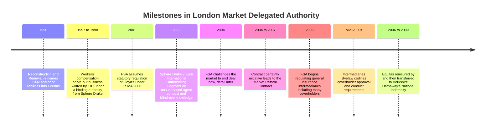

### 2.3.1 1996: Reconstruction and Renewal

By the mid-90s, Lloyd's faced litigation from thousands of Names and the real possibility of collapse. The **Reconstruction and Renewal (R&R)** plan, approved in 1996, reinsured all 1992-and-prior non-life liabilities into **Equitas**, a newly authorised run-off reinsurer. In exchange for a settlement offer, Names gave up litigation against the Society and agents. Equitas was later reinsured and ultimately taken over by Berkshire Hathaway's National Indemnity in 2006–2009.

R&R accelerated structural change. **Corporate capital** entered the market in '94 and **limited liability** membership went on to become dominant. The principal-agent problem between Names and managing agents did not disappear, but institutional capital brought professional scrutiny of agents that individual Names could seldom provide.

### 2.3.2 2001: FSMA and the FSA

On 1 December 2001, the **Financial Services and Markets Act 2000** came into force and the **Financial Services Authority** assumed statutory regulation of Lloyd's. Lloyd's retained significant powers over its members and agents, but now operated within a framework in which the FSA could:

- authorise and supervise managing agents directly
- impose requirements on the Society itself
- intervene where self-regulation fell short

From January 2005, the FSA also regulated **general insurance intermediaries**, bringing many coverholders and brokers into direct conduct regulation.

### 2.3.3 The Intermediaries Byelaw

Against this backdrop, Lloyd's codified its requirements for coverholders and brokers in the **Intermediaries Byelaw** of the mid-2000s. Its central features persist in today's framework:

- **Coverholder approval.** No managing agent may grant a binding authority to an entity not approved by Lloyd's. Approval turns on financial standing, competence, integrity, systems, and controls
- **Conduct requirements** governing how coverholders deal with policyholders, handle premium and claims, and report to their principals
- **Lloyd's power to suspend or withdraw approval** and to require managing agents to act

The byelaw's importance lies in the principle that "authority must be approved before it is exercised."

### 2.3.4 2004–2007: Contract certainty and the MRC

In November 2004, the FSA challenged the London Market to end placing practices known at the time as "deal now, detail later". It was not unusual for risks to be bound with final terms still unsettled, sometimes long after inception. In the delegated context, this meant coverholders could be operating under authorities whose precise terms were uncertain.

The market's response was the "Contract Certainty Initiative", which led to the development of today's **Market Reform Contract (MRC)**. The MRC is a standardised slip structure with defined sections covering risk details, information, security details, subscription agreements, fiscal and regulatory details, and broker remuneration. Its significance for today's implementors is considerable. The MRC was the first serious attempt to impose a **consistent schema** on London Market contracts. It is, in effect, the ancestor of the data models now used in digital placement.

For binding authorities specifically, LMA model wordings and the MRC format gave the market consistent terms for authority limits, reporting requirements, claims authority and termination rights.

---

## 2.4 The Governance Era (2013–2019)

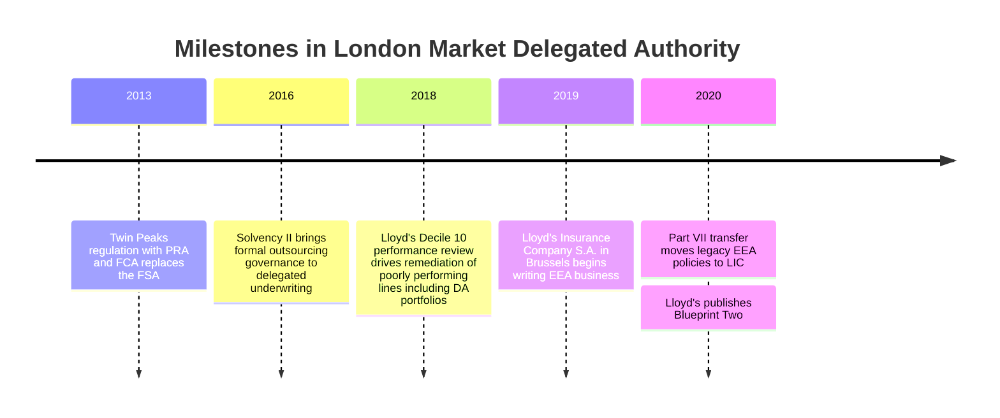

### 2.4.1 2013: Twin Peaks

The **Financial Services Act 2012** abolished the FSA. From 1 April 2013, regulation was split between:

- the **Prudential Regulation Authority (PRA)**, responsible for the safety and soundness of insurers, including Lloyd's managing agents and the Society
- the **Financial Conduct Authority (FCA)**, responsible for conduct, consumer protection, and market integrity, making it the sole regulator for most coverholders and brokers

For delegated authority, this created a **dual lens**. The same Binding Authority Agreement creates a question of prudence (is the managing agent controlling its exposures and outsourced functions well?) and of conduct (are policyholders being treated fairly by the coverholder?).

### 2.4.2 2016: Solvency II and outsourcing governance

**Solvency II** took effect on 1 January 2016. Article 49 of the Directive and Article 274 of the Delegated Regulation required insurers that outsource "critical or important functions" to:

- remain fully responsible for their obligations
- perform due diligence on the service provider
- have a written agreement setting out rights and obligations, including audit and access rights
- ensure the outsourcing does not impair governance, operational risk, or the supervisor's ability to monitor

Delegating underwriting authority to a coverholder is outsourcing of a critical function. Solvency II therefore turned what Lloyd's had managed through byelaws and market practice into a **statutory governance obligation**, with EIOPA guidelines on the system of governance adding detail.

### 2.4.3 2018: Decile 10

In 2018, after several years of poor market results, Lloyd's launched the **Decile 10** review. It required each managing agent to identify its worst-performing 10% of business and present credible remediation plans. Delegated authority portfolios featured prominently. Some binders had grown on the back of generous commissions and loose authority terms, and their loss ratios could not be sustained.

The outcome was substantial remediation. Business was non-renewed, restructured, re-priced or placed under tighter authority limits. The review showed that Lloyd's would use its **performance management** powers as well as its approval powers, to reshape delegated portfolios.

### 2.4.4 2019: Lloyd's Insurance Company S.A.

In anticipation of Brexit, Lloyd's established **Lloyd's Insurance Company S.A. (LIC)** in Brussels. It was authorised by the National Bank of Belgium and began writing EEA business from 1 January 2019. Legacy EEA policies were transferred to LIC by a Part VII transfer completed at the end of 2020.

LIC is itself a study in delegation. It writes business, much of it through coverholders, and then:

- reinsures that business back to Lloyd's syndicates
- outsources underwriting and related functions to the managing agents of those syndicates under outsourcing agreements

This layering creates **chains of authority**. A single risk may involve a policyholder, a coverholder, LIC, a managing agent acting as LIC's outsourced underwriter, and a syndicate acting as reinsurer. Each link sits under a different regulatory regime (Belgian, the EU, and the UK), and each must be evidenced.

---

## 2.5 Principles, Conduct and Solvency UK (2021–2024)

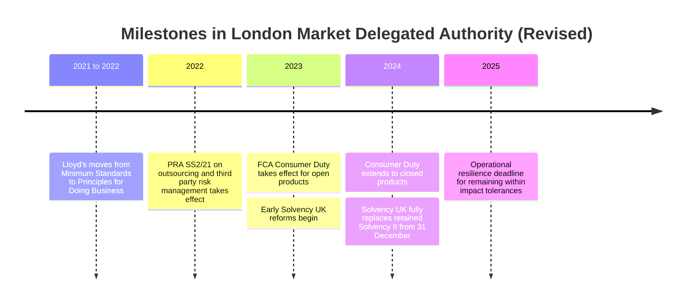

### 2.5.1 2021–2022: From minimum standards to principles

For more than a decade, Lloyd's had policed managing agents through **Minimum Standards**, a detailed checklist that included a dedicated delegated authority standard. From 2021, Lloyd's moved to **Principles for Doing Business**, with a principle-based, outcomes-focused approach to oversight. Delegated authority remains a core principle. The emphasis shifted from "have you completed these steps?" to "can you demonstrate that your delegated business is well-governed and producing good outcomes?"

A principles-based regime is harder to satisfy by compliance theatre and harder to automate naively. It expects managing agents to show **judgement**, supported by evidence that their oversight is effective.

### 2.5.2 2023–2024: Consumer Duty and Solvency UK

The FCA's **Consumer Duty** took effect on 31 July 2023 for open products and 31 July 2024 for closed products. It requires firms to deliver good outcomes for retail customers across four areas: products and services, price and value, consumer understanding, and consumer support. Under the FCA's product governance rules (PROD 4), managing agents and coverholders are often **co-manufacturers**. Responsibility for fair value cannot simply be delegated away.

This has sharp implications for delegated authority:

- **Fair value assessments** must account for the whole distribution chain, including coverholder commissions and fees
- **Claims outcomes**, including handling by coverholders or delegated claims administrators, are part of the value equation
- **Outcome monitoring** requires data on customer journeys, complaints, cancellations and claims, not just premium and loss figures

**Solvency UK** replaced the retained EU framework, with PRA Rulebook provisions fully in force from 31 December 2024. The outsourcing requirements broadly survive. The PRA's supervisory statement **SS2/21** (*Outsourcing and third party risk management*, applicable from March 2022) sets out detailed expectations on material outsourcing, including notification to the PRA, due diligence, contractual terms, and exit planning. The **operational resilience** framework, with its March 2025 deadline for remaining within impact tolerances, adds further expectations where delegated arrangements support important business services.

---

## 2.6 The Digital Turn (2020s)

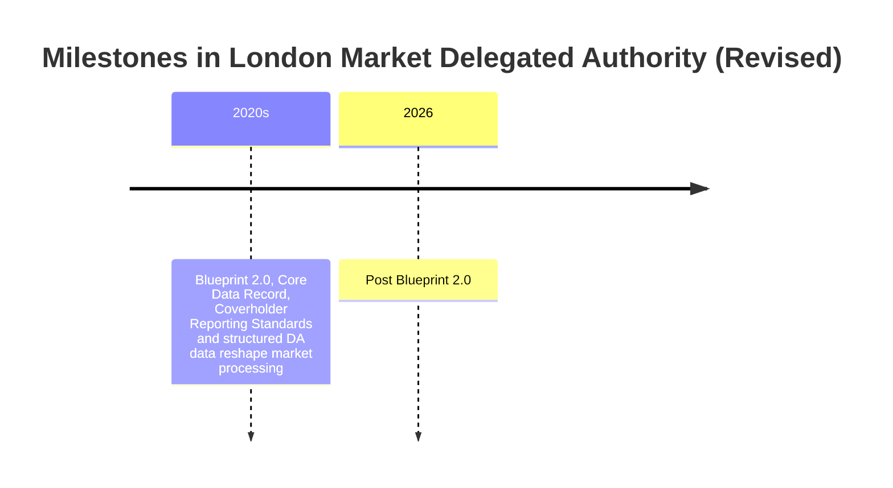

**Blueprint Two**, published by Lloyd's in November 2020 as part of the Future at Lloyd's programme and now delivered with the London Market Group, aims to digitise placement, accounting, settlement and claims. Its central artefact is the **Core Data Record (CDR)**, a structured representation of the contract data needed for downstream processing. Implementation has been phased and has experienced delays, so implementors should track current Lloyd's and LMG guidance rather than rely on original timelines.

For delegated authority, parallel initiatives have focused on data:

- **Coverholder Reporting Standards**, which define structured risk, premium and claims bordereaux fields
- **delegated data management tooling**, intended to ingest, validate and analyse bordereaux centrally
- growing use of **ACORD** and market data standards to make authority terms and bordereaux machine-readable

The direction is from ex post, periodic, document-based oversight towards near-real-time, data-driven oversight. In principle, the informational failures behind the LMX spiral and *Sphere Drake* become detectable. In practice, data quality, standards adoption and legacy systems remain significant constraints.

### 2.6.1 Post Blueprint 2.0

Several aspects of Blueprint 2.0 were withdrawn in 2026 and the future of the program remains unclear. Under the LMA, the DARE programme continues to deliver on a vision of improving Delegated Authority, with early versions of a Computable Binding Authority Agreement being the latest delivery in 2025/26.

## 2.7 Lessons

### 2.7.1 The worst losses flow from unchecked authority

From Harrison in 1923, to Gooda Walker in the 1980s, and EIU in 1997–98, where agents could commit capital without effective, timely supervision, catastrophic losses followed. We may draw several lessons from this:

1. **Unchecked authority is usually an information problem before it is a control problem.** In the LMX spiral, participants lacked a view of network exposure. In *Sphere Drake*, the principal lacked visibility into what its agent was writing and why. Controls cannot act on what cannot be seen.

2. **Numerical limits are necessary but not sufficient.** Some of the most damaging business was arguably written within the letter of the authority. *Sphere Drake* shows that authority is also bounded by **purpose** and good faith, which cannot be reduced to a line-size check.

3. **The lesson is not historical.** *Sphere Drake* post-dates R&R, and delegated authority failures continue to surface in regulatory enforcement and market remediation.

### 2.7.2 Oversight follows performance

Decile 10 does show Lloyd's intervening in poorly performing portfolios. Performance-triggered oversight is however, reactive: By the time loss ratios deteriorate, especially in long-tail classes, the exposure has already been written.

It is also vital to realise that conduct risk is not correlated with profitability. Under Consumer Duty, a binder can be highly profitable, precisely because it delivers **poor value**: high commissions, low claims ratios, poor claims handling. The FCA's scrutiny of products with very low claims ratios illustrates this. A monitoring system tuned only to underwriting performance will miss these cases entirely.

A more complete formulation is: **oversight must follow both performance and outcomes, and should be proportionate to risk rather than triggered only by loss.**

### 2.7.3 Responsibility cannot be delegated

Across Solvency II, Solvency UK, SS2/21, PROD 4 and the Consumer Duty, one principle is constant: **A firm can delegate tasks, but not responsibility.** The managing agent remains accountable for the coverholder's decisions, the insurer for its outsourced functions, and the co-manufacturer for customer outcomes. Senior managers under the Senior Managers and Certification Regime, are personally accountable for the effectiveness of those arrangements.

---

## 2.8 Implications for Modern Operations and Systems Implementors

The following principles translate this history into practical guidance for those building computable contracts, smart binding authorities, or digital oversight systems.

### 2.8.1 Legal contracts govern

The UK Jurisdiction Taskforce's 2019 *Legal Statement on Cryptoassets and Smart Contracts* and the Law Commission's 2021 advice on smart legal contracts both concluded that English law can accommodate contracts expressed partly or wholly in code. In the London Market however, the **binding authority wording** remains the legal instrument, typically an LMA model form supplemented by the MRC. Implementors should:

- treat any executable representation as a faithful **implementation** of the wording, with a clear, documented mapping between clauses and rules
- define which prevails in case of conflict, almost always the natural-language wording
- version-control both together, so that every rule applied to a risk can be traced to the contract terms in force at that moment

### 2.8.2 Apparent Authority arises from coduct

A system can block a coverholder from binding a risk outside its parameters, but **apparent authority** arises from the principal's conduct towards third parties, not from an agent's software. If a coverholder issues a certificate outside its limits and the policyholder reasonably relies on it, the insurer may be bound regardless of what the system permitted. Conversely, *Sphere Drake* shows that a counterparty with knowledge of an agent's misconduct, may be unable to rely on contracts the agent had technical capacity to conclude. Systems must therefore:

- **prevent** out-of-authority binding where possible (hard stops on class, territory, limits, aggregates)
- **detect and escalate** anything that escapes prevention, because legal exposure may already exist
- **record knowledge**: who saw what, when, and what they did. In *Sphere Drake*, knowledge was legally dispositive

### 2.8.3 Encode purpose and appetite as well as limits

Numerical parameters are the easy part: maximum sums insured, gross premium income caps, excluded classes, territorial scope. The harder, more valuable goal, is encoding **indicators of appetite drift**:

- concentration by risk type, geography, or producing broker
- unusual patterns of commission or fees relative to premium
- premium rates diverging from the managing agent's own pricing
- reinsurance or onward cessions that could loop risk back

These cannot always be expressed as hard rules. They are candidates for **monitoring and referral triggers** that require human judgement, consistent with a principles-based regime.

### 2.8.4 Design for referral, suspension, and termination

Binding authorities have always contained referral clauses, cancellation rights, and termination provisions. A computable implementation must make these **operationally real**:

- referrals routed to identified, authorised individuals, with service levels and audit trails
- the ability to **suspend** authority rapidly and verifiably, for example when Lloyd's withdraws coverholder approval or a managing agent invokes termination
- run-off logic for in-force business, claims authority and premium remittance after termination

The history of agency failures is partly a history of authorities that could not be stopped quickly enough.

### 2.8.5 Make bordereaux a by-product of binding

Traditional bordereaux were compiled after the fact, often manually, and arrived late. Where risks are bound through structured systems, bordereaux-equivalent data should be **generated at the point of binding**, aligned with Coverholder Reporting Standards, and CDR structures. This reduces the likelihood of reconciliation errors, enables near-real-time aggregate monitoring, and provides evidence for regulators that oversight is **timely**, which SS2/21, Solvency UK, and Lloyd's principles all expect.

### 2.8.6 Capture conduct data

To satisfy the Consumer Duty and PROD 4, systems for retail-facing delegated business must capture:

- the full distribution chain and remuneration at each point, to support fair value assessments
- claims outcomes, including acceptance rates, declinature reasons, and settlement times, especially where claims are also delegated
- complaints, cancellations and customer vulnerability indicators
- evidence of customer communications and their testing for understanding

A system that reports only premium and losses, could leave managing agents unable to answer the FCA's questions.

### 2.8.7 Map every link in the chain to its regulatory regime

Structures such as LIC, where business passes through multiple entities and jurisdictions, require systems that know **which rules apply to which link**. The key regimes are summarised below.

| Link in the chain | Principal regimes to consider |
|---|---|
| Managing agent granting authority (UK) | PRA Rulebook (Solvency UK), SS2/21, operational resilience; FCA Handbook incl. PROD 4 and Consumer Duty; SM&CR; Lloyd's Principles and requirements |
| Coverholder (UK) | FCA authorisation and conduct rules; CASS 5 and risk transfer arrangements for client money; Lloyd's coverholder approval |
| Coverholder (overseas) | Local licensing and conduct law (e.g. US surplus lines, state licensing); Lloyd's territorial requirements; trust fund rules |
| LIC and EEA business | Belgian law, NBB and FSMA supervision; EU Solvency II outsourcing rules; IDD |
| All links | UK GDPR/EU GDPR, including rules on automated decision-making (Article 22); sanctions; anti-money laundering where applicable; Insurance Act 2015 or Consumer Insurance (Disclosure and Representations) Act 2012 on disclosure and knowledge |

### 2.8.8 Take automated decision-making seriously

Where computable authorities automatically accept, decline, or price risks for individuals, **Article 22 UK GDPR** restrictions on solely automated decisions with significant effects may be engaged, as may Consumer Duty expectations around foreseeable harm and fair treatment of vulnerable customers. Implementors should build in:

- lawful basis analysis and appropriate safeguards
- the ability for customers to obtain human intervention
- explainability sufficient for complaints handling and the Financial Ombudsman Service

### 2.8.9 Handle premium and money with historical humility

Retention and misappropriation of premium recur throughout the history of delegated authority agreements, from early agency failures to the pools of the 1990s. Systems should:

- make the **risk transfer** status of premium held by intermediaries explicit, since it determines who bears the loss if an intermediary fails
- reconcile premium bound against premium remitted continuously
- flag delays and anomalies automatically

### 2.8.10 Evidence, evidence, evidence

Lloyd's, the PRA, and the FCA, now expect firms to demonstrate effective oversight. In practice this means being able to show not just that controls exist, but that they work, and problems are identified and acted upon. The strongest design principle is therefore auditability:

- immutable logs of authority terms, rule versions, decisions and overrides
- linkage between each bound risk and the authority terms in force
- records of referrals, escalations, audit findings and remediation

---

## 3. Market Architecture

### 3.1 Participants

| Participant | Role in delegated authority |
|---|---|
| **Lloyd's managing agent** | Manages one or more syndicates. Grants binding authorities, approves coverholders (with Lloyd's), and remains fully accountable to Lloyd's and to the PRA and FCA for delegated business. |
| **Syndicate** | An annual venture backed by members' capital. It is not a legal entity. Contracts are entered into by the managing agent on behalf of the members, whose liability is several. |
| **Society of Lloyd's / Corporation** | Sets and enforces market standards through byelaws, requirements and oversight. Approves coverholders, maintains licences, and operates central infrastructure including the Central Fund. |
| **Lloyd's Insurance Company S.A. (LIC)** | Brussels-based insurer that writes EEA risks. It delegates underwriting to managing agents and, through them, to coverholders. |
| **Company market insurer** | A UK or overseas insurer, typically a member of the International Underwriting Association (IUA). It grants authority directly under its own governance framework. |
| **Coverholder / MGA** | The delegate that underwrites and administers business on the capacity provider's behalf. |
| **Service company** | A coverholder owned by a managing agent or its group. It is used to write business locally, for example through overseas offices. |
| **Lloyd's broker / wholesale broker** | Places the binding authority with capacity providers. May administer premium and data flows, and may itself act as coverholder. |
| **Producing (retail) broker** | Acts for the policyholder and sources individual risks to the coverholder. |
| **Third Party Administrator (TPA)** | Handles claims under delegated claims authority. |
| **Coverholder auditor** | Independent firm that performs periodic audits against the agreement and regulatory requirements. |
| **Velonetic** | Central processing provider for Lloyd's and the IUA company market, formerly Xchanging/DXC. |
| **Trade bodies** | LMA (managing agents), IUA (company market), LIIBA (brokers), MGAA (MGAs), and the London Market Group (the cross-market body). |
| **Regulators** | PRA and FCA in the UK; the NBB and FSMA in Belgium for LIC; and local regulators in each territory where risks are written. |

### 3.2 Ecosystem Overview

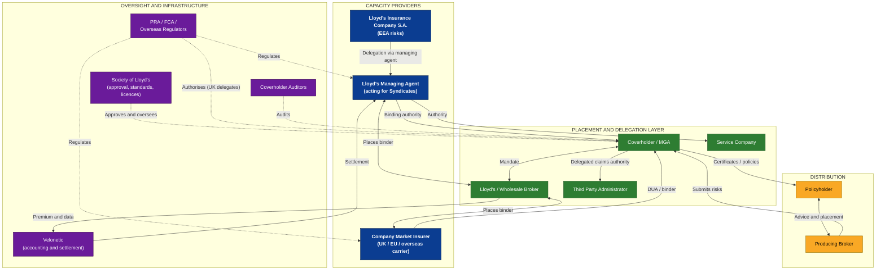

---

## 4. Forms of Delegated Arrangement

### 4.1 The Spectrum of Authority

Delegation varies in degree. The same coverholder may hold full authority for one class of business and prior-submit arrangements for another.

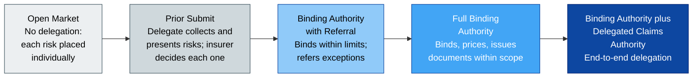

### 4.2 Arrangement Types

| Arrangement | Delegate | Nature of authority | Typical use |
|---|---|---|---|
| **Binding authority** | Coverholder / MGA | Authority to accept risks within defined parameters and to issue documentation. | Small commercial, personal lines, specialist SME, programme business. |
| **Prior submit arrangement** | Coverholder or intermediary | No binding authority; each risk is referred for acceptance. Lloyd's may still require coverholder approval where documentation is issued. | New relationships; higher-hazard risks. |
| **Lineslip** | Lead underwriter(s) within the market | A slip leader binds declarations on behalf of following markets. | Recurring similar risks from a single broker. |
| **Consortium** | Consortium leader (a managing agent) | The leader underwrites on behalf of participating syndicates. | Specialist lines needing concentrated expertise. |
| **Broker facility** | Lead or panel within the market, or broker as coverholder | Pre-agreed capacity follows lead decisions, sometimes algorithmically. | Portfolio placements for a broker's clients. |
| **Service company arrangement** | Managing agent's own subsidiary | The group entity is approved as coverholder. | Overseas distribution offices. |
| **Delegated claims authority (DCA)** | Coverholder or TPA | Authority to handle and settle claims within financial limits. | Most binders with meaningful claim frequency. |
| **Fronting with delegation** | MGA, with the fronting carrier as the issuing insurer | The fronting insurer issues policies; risk is reinsured to London capacity. | Territories or lines where London capacity lacks direct licences. |

### 4.3 Open Market Correspondents

Lloyd's recognises Open Market Correspondents (OMCs). These are overseas intermediaries that place open-market business through a Lloyd's broker without holding binding authority. OMCs are registered with Lloyd's but are not coverholders. Since OMCs cannot bind, the conduct obligations attaching to coverholders do not apply to them in the same form.

---

# Part II — The Legal Framework

## 5. The Law of Agency

A binding authority creates a principal–agent relationship under English law, which governs most London market binders. Agency principles determine when the insurer is bound, what duties the delegate owes, and what remedies are available.

### 5.1 Sources of Authority

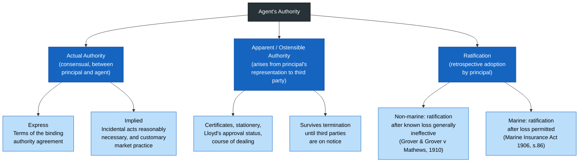

**Actual authority** is defined by the agreement. Carefully drafted limits define its boundaries. Those limits typically include:

- classes of business
- territories
- sums insured
- rates and deductibles
- wordings
- aggregate premium income

Implied authority fills the gaps necessary to perform the express mandate. Market custom may extend it, but only if the custom is notorious, certain, and reasonable.

**Apparent authority** arises where the principal represents to a third party that the agent has authority and the third party relies on that representation (*Freeman & Lockyer v Buckhurst Park Properties (Mangal) Ltd* [1964] 2 QB 480). In delegated authority, such representations can arise from:

- the issuance of certificates bearing the insurer's name
- the coverholder's publicly listed Lloyd's approval status
- the course of dealing

The consequence is significant. An insurer may be bound to a policyholder in respect of a risk the coverholder had no actual authority to accept, leaving the insurer to its remedies against the coverholder.

**Ratification** allows the principal to adopt an unauthorised act. For non-marine insurance, English authority holds that a principal cannot ratify a contract after it has learned of a loss. Section 86 of the Marine Insurance Act 1906 permits ratification after loss in marine insurance. Capacity providers should therefore exercise caution before accepting unauthorised business as a matter of commercial accommodation.

### 5.2 Duties of the Delegate

As agent, the coverholder owes the capacity provider duties imposed by law and supplemented by contract.

| Duty | Content |
|---|---|
| **Obedience** | To act within, and in accordance with, the authority conferred. |
| **Care and skill** | To underwrite, administer and handle claims with the competence of a reasonable agent in the market. |
| **Fiduciary loyalty** | To avoid conflicts of interest, make no secret profit, and not prefer its own or a third party's interests. |
| **Account** | To keep proper records and account for premium, claims funds and documents. |
| **Personal performance** | Not to sub-delegate discretionary functions without consent (*delegatus non potest delegare*). |
| **Confidentiality** | To protect the principal's confidential information and data. |

### 5.3 Dual Agency and Conflicts

A coverholder frequently acts for the insurer when binding, and in some structures for the insured when arranging cover. A broker holding a binding authority is the clearest example of this. English law tolerates dual agency only with informed consent and effective management of conflicts. FCA rules on conflicts (SYSC 10) apply to UK-authorised firms, and Lloyd's requires coverholders to manage conflicts actively.

Where the coverholder also owns or controls producing brokers, claims adjusters, or premium finance providers, the potential for undisclosed remuneration and biased decision-making increases. Agreements should require disclosure and written approval of all such relationships.

### 5.4 Imputation of Knowledge

Section 5 of the **Insurance Act 2015** provides that an insurer knows something only if it is known to one or more individuals who participate on the insurer's behalf in the decision whether to take the risk, and on what terms. The individual may be an employee, an agent, or an employee of the insurer's agent.

Coverholder underwriters therefore fall within this provision. Information known to them at binding is attributed to the insurer, who cannot later rely on non-disclosure of matters its delegate knew.

Under the **Consumer Insurance (Disclosure and Representations) Act 2012**, Schedule 2, an intermediary is treated as the insurer's agent in three cases:

1. where it is the insurer's appointed representative
2. where it collects information from the consumer with the insurer's express authority
3. where it enters into the contract as the insurer's agent with express authority

Coverholders binding consumer business therefore act for the insurer. A consumer's misrepresentation made through a coverholder is assessed accordingly.

### 5.5 Termination of Authority

Actual authority ends in accordance with the agreement, whether by expiry, notice or immediate termination for cause. Apparent authority can persist until third parties are on notice. Termination protocols should therefore include:

- recall of certificates and stationery
- revocation of system access
- notice to producing brokers
- publication of amended status on Lloyd's systems
- clear arrangements for renewals, cancellations, and mid-term adjustments during run-off

---

## 6. The Binding Authority Contract

### 6.1 Contractual Architecture

A London market binding authority is generally documented in layers.

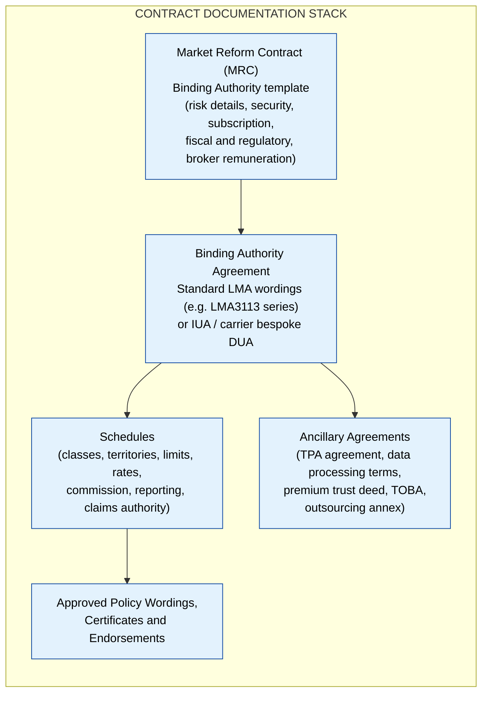

**The MRC** records the placement: the parties, period, subscription, security, and the regulatory and fiscal information required for processing. It follows market contract certainty principles, under which all terms are agreed and documented before inception.

**The agreement** sets out the common terms of the relationship. At Lloyd's, the LMA standard binding authority wordings are widely used and are designed to embed Lloyd's requirements. In the company market, insurers often use IUA-derived or proprietary DUAs.

**The schedules** define the precise scope of authority.

### 6.2 Essential Terms

| Clause area | Content and purpose |
|---|---|
| **Parties and security** | Identification of the coverholder, capacity providers and their several proportions. At Lloyd's, the several liability of syndicate members must be clearly stated. |
| **Period** | Ordinarily twelve months. Provision for extensions and for business bound in the last days of the period. |
| **Classes and risk codes** | Authorised classes defined precisely, linked to Lloyd's risk codes or carrier line-of-business codes. |
| **Territorial scope** | Where risks may be located, where insureds may be domiciled, and where business may be written. Must correspond with licences. |
| **Limits** | Maximum sums insured or limits per risk, per location and per event. Gross premium income limit, with tolerance and notification thresholds. Aggregate or catastrophe exposure limits. |
| **Pricing and terms** | Minimum rates, rating guides or approved rating models, deductibles, and the conditions for any deviation. |
| **Wordings** | Approved forms only. Amendments require written consent. |
| **Referrals** | Categories of risk that must be referred before binding, and the timeframe for responses. |
| **Exclusions and prohibited business** | Classes, trades, territories or insureds excluded, including sanctions-related prohibitions. |
| **Commission and remuneration** | Base commission, profit commission formula, fees, and restrictions on additional remuneration. |
| **Premium handling** | Collection, trust or risk-transfer status, settlement terms, and credit control. |
| **Reporting** | Bordereaux frequency, format (for example, Lloyd's Coverholder Reporting Standards), deadlines and data quality obligations. |
| **Claims** | Delegated claims authority limits, notification thresholds, loss funds, TPA appointment, and claims reporting. |
| **Complaints** | Handling obligations, escalation, and ombudsman access for eligible complainants. |
| **Regulatory compliance** | Licensing, conduct rules, Consumer Duty, product governance, financial crime, sanctions and data protection. |
| **Audit and inspection** | Rights of access to premises, systems, records and staff, for the capacity provider, its auditors, Lloyd's and regulators. |
| **Sub-delegation** | Generally prohibited without prior written consent. Where permitted, subject to equivalent terms and full visibility. |
| **Conflicts** | Disclosure and approval of related-party arrangements. |
| **Business continuity and exit** | Continuity plans, data portability, and step-in or transfer rights. |
| **Termination** | Expiry, notice, and termination for cause (such as breach, insolvency, change of control or regulatory action), together with run-off obligations. |
| **Governing law and dispute resolution** | Typically English law with English courts or London arbitration. Service of suit provisions where required by local law. |

### 6.3 Relationship Between Binder and Underlying Policies

A binding authority governs the relationship between insurer and coverholder. Each policy or certificate issued under it is a separate contract of insurance between the insurer and the policyholder. This has several consequences:

- a breach of the binder by the coverholder does not by itself avoid policies validly issued within apparent authority
- policy wordings must stand independently and comply with local law
- premium paid by the policyholder to the coverholder may, depending on the risk-transfer terms, constitute payment to the insurer

---

## 7. Other Statutory and Legal Acts

| Instrument | Relevance to delegated authority |
|---|---|
| **Marine Insurance Act 1906** | Governs marine business written under binders. Section 86 addresses ratification. |
| **Insurance Act 2015** | Duty of fair presentation for non-consumer risks bound by coverholders; imputation of knowledge (s.5); proportionate remedies; warranties and terms not relevant to the actual loss (ss.10–11). The binder itself is an agency contract rather than a contract of insurance, so the statutory duty does not directly govern its placement. Agreements therefore usually include express disclosure and information obligations. |
| **Enterprise Act 2016** | Inserted s.13A into the Insurance Act 2015, implying a term requiring claims to be paid within a reasonable time. Delegated claims handling performance bears directly on this exposure. |
| **Consumer Insurance (Disclosure and Representations) Act 2012** | Consumer duty to take reasonable care not to misrepresent. Schedule 2 determines agency status. |
| **Contracts (Rights of Third Parties) Act 1999** | Usually excluded in binding authority agreements to prevent policyholders or others enforcing binder terms. |
| **Consumer Rights Act 2015** | Fairness and transparency of consumer policy terms issued under delegated authority. |
| **Limitation Act 1980** | Governs time limits for claims against coverholders for breach of contract or duty. |

---

## 8. Disputes and Liability

### 8.1 Recurrent Dispute Types

1. **Exceeding authority**: binding outside class, territory, limit or rate parameters
2. **Premium retention or misapplication**: late remittance, commingling, or insolvency with premium unpaid
3. **Claims mishandling**: settlements beyond authority, inadequate reserving, or leakage
4. **Profit commission calculations**: disputes over incurred-but-not-reported (IBNR) allowances, the treatment of large losses, and the timing of calculation
5. **Run-off obligations**: the scope of continuing duties after termination and the remuneration for them
6. **Data and documentation failures**: missing records that prevent the insurer from establishing its exposure
7. **Conflict and remuneration issues**: undisclosed income from related parties

### 8.2 Remedies Available to the Capacity Provider

- Damages for breach of contract and breach of duty, measured by the loss caused. For unauthorised business, this is frequently the net loss on the business written
- An account of profits and equitable compensation for breach of fiduciary duty
- Injunctive relief to preserve premium, records or data
- Termination and suspension of authority
- Set-off against commission and profit commission
- Recovery under the coverholder's professional indemnity (errors and omissions) insurance. Capacity providers should require this cover to be maintained at adequate limits, with evidence of renewal

### 8.3 Dispute Resolution Forum

Most London market binders select English law. Disputes are resolved in the Commercial Court or through arbitration. Overseas coverholders may be subject to mandatory local law in certain respects, particularly consumer protection and licensing. Service of suit clauses may give policyholders access to local courts in relation to underlying policies.

---

# Part III — The Regulatory Framework

## 9. Regulatory Map

```mermaid
flowchart TB
    subgraph UK["UNITED KINGDOM"]
        direction TB
        PRA["Prudential Regulation Authority<br/>Solvency UK, Outsourcing,<br/>SS2/21, Operational Resilience,<br/>SM&CR (dual-regulated firms)"]
        FCA["Financial Conduct Authority<br/>PRIN and Consumer Duty, PROD 4,<br/>ICOBS, CASS 5, SYSC, DISP, SM&CR"]
        LLO["Society of Lloyd's<br/>Lloyd's Acts 1871-1982, Byelaws,<br/>Principles, DA requirements,<br/>coverholder approval"]
    end

    subgraph EU["EUROPEAN ECONOMIC AREA"]
        NBB["NBB and FSMA (Belgium)<br/>Lloyd's Insurance Company S.A."]
        EUN["National Competent Authorities<br/>(company market EU subsidiaries)"]
    end

    subgraph INTL["OTHER TERRITORIES"]
        US["US State Regulators<br/>Surplus lines, MGA and<br/>producer licensing, NAIC IID"]
        CA["Canada<br/>OSFI and provincial regulators"]
        AU["Australia<br/>APRA, ASIC, AFSL,<br/>Design and Distribution Obligations"]
        OT["Other local regulators<br/>(see Lloyd's Crystal)"]
    end

    PRA --> MA["Managing Agents<br/>and UK Insurers"]
    FCA --> MA
    LLO --> MA
    FCA --> UKCH["UK Coverholders / MGAs<br/>(FCA authorised or ARs)"]
    LLO --> ALLCH["All Lloyd's Coverholders"]
    NBB --> LICN["LIC and EEA<br/>Coverholders via LIC"]
    US --> USCH["US Coverholders"]
    CA --> CACH["Canadian Coverholders"]
    AU --> AUCH["Australian Coverholders"]
    EUN --> EUCH["EU MGAs"]

    classDef uk fill:#1a237e,color:#fff,stroke:#000
    classDef eu fill:#004d40,color:#fff,stroke:#000
    classDef intl fill:#bf360c,color:#fff,stroke:#000
    classDef ent fill:#fafafa,color:#000,stroke:#616161
    class PRA,FCA,LLO uk
    class NBB,EUN eu
    class US,CA,AU,OT intl
    class MA,UKCH,ALLCH,LICN,USCH,CACH,AUCH,EUCH ent
```

---

## 10. UK Prudential Regulation (PRA)

### 10.1 Solvency UK and Governance

UK insurers and Lloyd's managing agents must maintain an effective system of governance. This includes risk management, internal control, compliance, internal audit and actuarial functions. Delegated underwriting and claims handling sit within this system.

The firm remains fully responsible for discharging its regulatory obligations regardless of delegation. The PRA Rulebook's Outsourcing requirements and Conditions Governing Business apply, as do the governance expectations inherited from the Solvency II framework and retained under Solvency UK.

### 10.2 Outsourcing and Third-Party Risk Management

PRA Supervisory Statement **SS2/21** (*Outsourcing and third party risk management*) sets out expectations applying to insurers, including Lloyd's managing agents.

Delegated underwriting and delegated claims handling are generally treated as outsourcing. Where they are material to the firm, they will frequently constitute **critical or important functions**. This carries the following expectations:

- documented, risk-based due diligence before entering the arrangement
- written agreements that include audit, access, and information rights for the firm and the PRA
- notification to the PRA of material outsourcing arrangements
- sub-outsourcing controls
- business continuity and exit planning, including stressed exit scenarios
- ongoing monitoring proportionate to materiality

### 10.3 Operational Resilience

Under PRA SS1/21 and the corresponding FCA rules, firms must:

- identify their important business services
- set impact tolerances for disruption
- map the people, processes, technology and third parties supporting those services

Where coverholders or TPAs deliver policyholder-facing services (such as claims handling or policy servicing), they fall within this mapping. Firms were required to be able to remain within impact tolerances by 31 March 2025.

### 10.4 Senior Managers and Certification Regime

Under SM&CR, accountability for delegated authority oversight should be allocated clearly to a Senior Manager. This is usually the individual responsible for underwriting or for outsourcing. The allocation should be reflected in the firm's responsibilities map. Individuals within the firm who oversee delegated portfolios may be certification function holders.

### 10.5 Prudential Risk Considerations

The PRA's supervisory focus on delegated authority centres on several risks:

- underwriting and reserving risk arising from limited visibility and data lags
- aggregation and catastrophe exposure accumulating across coverholders
- rapid growth of MGA-sourced portfolios without commensurate oversight capability
- counterparty and operational risk where premium is held by delegates

---

## 11. UK Conduct Regulation (FCA)

### 11.1 Authorisation of UK Delegates

A UK coverholder carrying on insurance distribution activities must be FCA-authorised with the relevant permissions, or must be an appointed representative of an authorised principal. Appointed representative arrangements for MGAs are subject to enhanced principal oversight requirements introduced in 2022.

### 11.2 Principles and the Consumer Duty

For retail customer business, the **Consumer Duty** (Principle 12 and PRIN 2A) applies. This requires firms to act to deliver good outcomes for retail customers and applies to every firm in the distribution chain that can determine or materially influence retail customer outcomes. 

In a delegated arrangement, this usually includes the capacity provider, the coverholder, any TPA, and the producing broker. Each firm is responsible for its own conduct and for the outcomes it can influence. Delegation does not transfer the capacity provider's obligations.

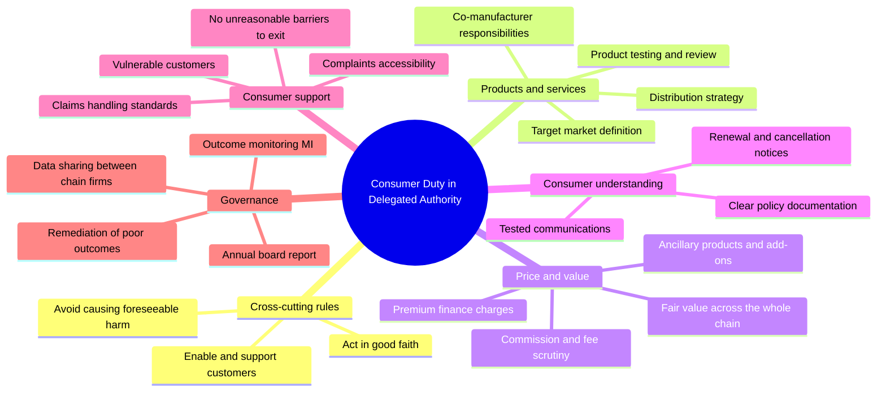

The practical demands on delegated arrangements are considerable:

- **Data sharing.** Capacity providers need outcome data to discharge their obligations, and coverholders frequently hold most of it. Binders should require the provision of Consumer Duty management information, including claims acceptance rates, claims timescales, complaints root causes, cancellation rates and outcomes for vulnerable customers.
- **Board reporting.** Each firm's board must review and approve an annual report on customer outcomes. Delegated portfolios must be visible in the capacity provider's report.
- **Remediation.** Where poor outcomes are identified, firms must act, including by providing redress. The allocation of remediation cost between capacity provider and delegate should be addressed in the agreement.

### 11.3 Product Governance (PROD 4)

PROD 4 sets product oversight and governance requirements for insurance products. A firm that designs, or materially contributes to the design of, a product is a manufacturer. Where a coverholder or MGA has autonomy over pricing, wordings or target market, it will typically be a **co-manufacturer** with the capacity provider.

PROD 4 requires co-manufacturers to record their respective responsibilities in a written agreement. This allocation should cover:

- target market identification and review
- product testing, including scenario analysis
- fair value assessment methodology, frequency and data inputs
- distribution strategy and oversight of distributors
- product review triggers and outcomes
- decision rights on product changes and withdrawal

Distributors that do not manufacture must obtain product information from the manufacturers, distribute within the target market, and report sales outside it.

### 11.4 Fair Value and Remuneration in the Distribution Chain

The FCA has repeatedly identified long delegated distribution chains as a source of poor value, particularly where several intermediaries each take remuneration. Its supervisory work on fair value in general insurance has emphasised several concerns:

- high aggregate commissions relative to claims paid
- limited insight by manufacturers into distributor remuneration
- products with low claims ratios and high cancellation or complaint rates
- ancillary fees and premium finance charges that are not tested for value

A fair value assessment for a delegated product must therefore consider total remuneration across the chain. The following chart illustrates how a premium might be distributed in a retail product written under a binding authority. The figures are for illustration only.

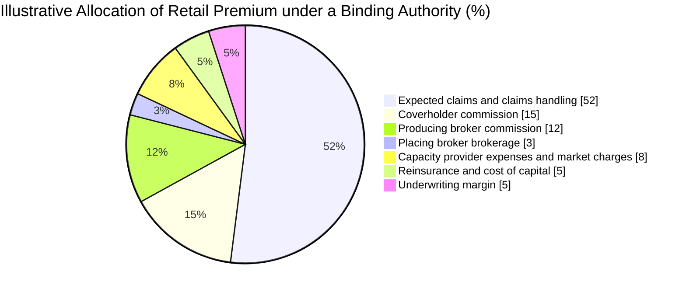

Where distribution costs absorb a large share of premium and claims value is low, the manufacturer must be able to justify the product's value to the target market. If it cannot, it must act, for example by repricing, redesigning, restricting distribution or withdrawing the product.

### 11.5 Conduct of Business (ICOBS) and Claims Handling

ICOBS applies to UK general insurance business and sets conduct standards for insurers and intermediaries. The principal requirements relevant to delegated authority are:

| ICOBS area | Delegated authority implication |
|---|---|
| **Demands and needs** (ICOBS 5) | The coverholder or producing broker must specify the customer's demands and needs and ensure the product is consistent with them. |
| **Product information** (ICOBS 6) | The Insurance Product Information Document (IPID) and other pre-contract information must be provided, generally by the distributor using manufacturer content. |
| **Cancellation** (ICOBS 7) | Statutory cancellation rights for consumers must be honoured, and refunds processed within the required periods. |
| **Claims handling** (ICOBS 8) | Claims must be handled promptly and fairly. The insurer must not unreasonably reject a claim. These obligations remain the insurer's when claims handling is delegated. |
| **Pricing practices** (ICOBS 6B) | For relevant home and motor products, renewal prices must not exceed the equivalent new business price. This affects coverholder rating tools and renewal processes. |

### 11.6 Client Money and Risk Transfer (CASS 5)

The status of premium held by a coverholder determines who bears the risk if the coverholder fails. CASS 5 governs client money held by UK insurance intermediaries.

Under a **risk transfer** agreement, the insurer agrees that premium received by the intermediary is treated as received by the insurer. It also agrees that claims and return premiums are treated as paid to the customer only when they actually reach the customer. Money held under risk transfer is insurer money. The customer is protected from coverholder insolvency, and the insurer bears the credit risk.

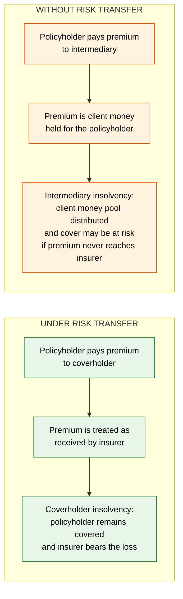

Binding authorities almost invariably include risk transfer for premium collected by the coverholder. Capacity providers therefore require:

- segregation of insurer money from the coverholder's own funds
- appropriate trust or fiduciary account status where local law requires it
- timely settlement against agreed due dates
- controls over the use of insurer money, including prohibitions on investment or on funding operating expenses
- regular reconciliation and audit of accounts

A UK intermediary may hold both client money and insurer money. CASS 5 permits co-mingling in a statutory trust account in certain circumstances, subject to insurer consent and specific protections.

### 11.7 Complaints (DISP)

Policyholders of delegated business must have access to an effective complaints process and, where eligible, to the Financial Ombudsman Service.

For Lloyd's business, DISP 1.11 sets specific rules. Managing agents are responsible for complaints relating to their syndicates. Lloyd's operates a central complaints function that reviews complaints unresolved at managing agent level and is the gateway to the Ombudsman for Lloyd's policyholders.

Coverholders may be granted delegated complaints authority. Where they are, the binder must specify:

- which complaints may be handled by the coverholder and which must be referred
- response timescales consistent with DISP
- the content of final response letters, including ombudsman referral rights;
- complaints reporting, including root cause analysis
- the treatment of complaints about the coverholder's own conduct

Overseas policyholders may have access to local dispute resolution schemes. Lloyd's publishes territory-specific complaints requirements.

### 11.8 Systems and Controls, Outsourcing and Conflicts (SYSC)

SYSC requires firms to maintain adequate systems and controls. SYSC 8 contains outsourcing requirements and guidance, which complement the PRA's framework for dual-regulated firms. SYSC 10 requires firms to identify, prevent or manage conflicts of interest.

For delegated authority, the following controls are material:

- conflicts arising where a coverholder is affiliated with producing brokers, claims service providers or premium finance firms
- conflicts arising where a coverholder places business with multiple capacity providers and allocates risks between them
- inducements and non-monetary benefits that could influence placement decisions
- remuneration structures that could encourage volume over quality

### 11.9 The Appointed Representative Regime

Many UK MGAs operate as appointed representatives (ARs) of an authorised principal, which may be an insurer or a regulatory hosting firm. Since December 2022, principals must meet enhanced requirements. They must:

- assess the AR's fitness and financial position before appointment and regularly thereafter
- provide AR-level data to the FCA, including revenue and complaints
- conduct annual reviews of each AR
- be able to terminate the relationship promptly and in an orderly way

Where a capacity provider relies on a hosted MGA, it should assess the host's oversight capability in addition to the MGA's own controls.

---

## 12. The Lloyd's Regulatory Framework

### 12.1 Legal Basis

The Lloyd's Acts 1871 to 1982 establish the Society and confer powers on the Council of Lloyd's to make byelaws regulating the market. Byelaws and the requirements issued under them bind managing agents, members and Lloyd's brokers. Coverholders are bound contractually and through the approval conditions to which they submit.

The Lloyd's regime operates within the statutory framework. Managing agents are authorised and regulated by both the PRA and the FCA. The Society is itself authorised and is subject to supervision of its market oversight functions.

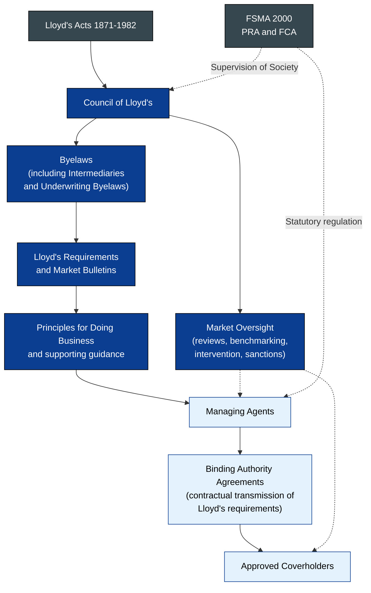

### 12.2 Principles-Based Oversight

Lloyd's has replaced its prescriptive Minimum Standards with a principles-based framework, the **Principles for Doing Business**. Managing agents are assessed against these principles, including a principle addressing delegated authority. Lloyd's grades performance against each principle, and the grades inform the intensity of its oversight.

Under this approach, managing agents that demonstrate mature delegated authority controls and sustainable performance receive lighter-touch oversight and greater autonomy. Examples include the ability to approve certain changes without Lloyd's involvement. Managing agents with weaker assessments face closer scrutiny, additional reporting and, in severe cases, restrictions on new delegated business.

The delegated authority principle expects a managing agent to:

1. set a delegated authority strategy and risk appetite approved by its board
2. select delegates through proportionate due diligence
3. document arrangements in terms that meet Lloyd's and regulatory requirements
4. monitor performance, conduct, data and controls continuously
5. audit delegates on a risk-based cycle and act on findings
6. ensure good customer outcomes across the distribution chain
7. manage exits and run-off in an orderly way

### 12.3 Coverholder Approval

A distinctive feature of Lloyd's is the central approval of coverholders. No entity may bind risks on behalf of Lloyd's syndicates unless the Society has approved it as a coverholder. Approval is sought by a sponsoring managing agent through **Atlas**, Lloyd's delegated authority approval platform.

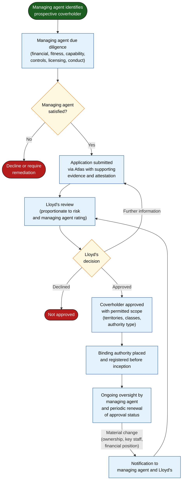

Approval attaches to the coverholder entity and to the scope for which it is approved. Once approved, a coverholder may hold binding authorities from several managing agents. Each managing agent must nevertheless conduct and document its own due diligence and oversight. The existence of another managing agent's relationship does not substitute for this.

Lloyd's also maintains approval requirements for service companies and for coverholders operating in specific territories. Some local regimes require additional registration, for example with a local Lloyd's office or regulator.

### 12.4 Lloyd's Requirements Applicable to Binding Authorities

Lloyd's requirements for delegated business include:

- **Registration.** Binding authorities must be registered with Lloyd's and must meet contract certainty standards at inception.
- **Standard terms.** Agreements must include clauses giving effect to Lloyd's requirements, including audit and access rights for Lloyd's. The LMA standard wordings are designed for this purpose.
- **Documentation.** Certificates and policies issued by coverholders must meet Lloyd's documentation requirements, including security details and complaints information. Territory-specific requirements apply.
- **Reporting.** Risk, premium and claims bordereaux must comply with the Lloyd's Coverholder Reporting Standards or an agreed equivalent.
- **Licensing.** Business may be written only where Lloyd's holds the necessary licences or eligibility. The binder must reflect the permitted territories.
- **Claims.** Delegated claims authority to a coverholder or TPA must satisfy Lloyd's requirements for claims delegation, including approval of the TPA and appropriate limits.
- **Tax.** Taxes and levies applicable to each risk must be identified, collected and reported.

### 12.5 Crystal and Territorial Information

Lloyd's publishes regulatory and tax information for each territory through **Crystal**. For each country or state, Crystal sets out:

- Lloyd's licensing or eligibility status
- whether local coverholders may bind, and on what conditions
- documentation and language requirements
- applicable taxes and how they are settled and
- local complaints, data and conduct rules

Crystal is the first point of reference when defining a binder's territorial scope. Any divergence between the binder and Crystal should be resolved before inception.

### 12.6 Lloyd's Oversight and Intervention

Lloyd's oversight of delegated authority takes several forms:

- thematic reviews of classes, territories or practices
- benchmarking of managing agents' performance and controls
- review of syndicate business plans, including planned delegated premium and growth
- reviews of individual coverholders or portfolios where concerns arise
- enforcement action, which may result in fines, restrictions or the withdrawal of coverholder approval

Lloyd's performance oversight has historically targeted delegated portfolios in unprofitable classes. Managing agents should expect their delegated authority strategy to be tested against syndicate business forecasts and against realised results.

---

## 13. The Company Market Framework

### 13.1 Structural Differences from Lloyd's

Company market insurers grant delegated authority under their own governance frameworks, subject to PRA and FCA regulation. There is no central approval of MGAs equivalent to Lloyd's coverholder approval.

| Dimension | Lloyd's | Company market |
|---|---|---|
| **Approval of delegate** | Central approval by Lloyd's, sponsored by a managing agent. | Insurer's own approval process. No central register. |
| **Market standards** | Lloyd's byelaws, requirements and principles. | Insurer's policies, guided by IUA standards and regulatory expectations. |
| **Licensing footprint** | Lloyd's licences and eligibilities, published through Crystal. | Insurer's own licences, branches and subsidiaries, or fronting arrangements. |
| **Security** | Several liability of syndicate members, backed by the Lloyd's Chain of Security. | The insurer's balance sheet and credit rating. |
| **Contract documentation** | LMA binding authority wordings and MRC. | IUA or proprietary DUAs, often using MRC. |
| **Processing** | Velonetic, including DA SATS. | Velonetic for IUA-processed business, supported by LIMOSS; direct insurer processing for business outside central systems. |
| **Oversight intensity** | Managing agent plus Lloyd's oversight. | Insurer oversight, with PRA and FCA supervision. |

### 13.2 The Role of the IUA

The International Underwriting Association represents company market insurers in London. It develops model clauses, market guidance and data standards, and it works with the LMA and the London Market Group on cross-market initiatives. LIMOSS, owned by the IUA, provides operational and technology services to company market insurers, including support for processing and market modernisation.

### 13.3 Mixed Placements

Many binders are subscribed by both Lloyd's syndicates and company market insurers. In a mixed placement, each capacity provider remains separately responsible for its own oversight. Practical coordination is achieved through:

- common documentation, with Lloyd's-specific requirements applying to Lloyd's participants
- lead and follow arrangements for oversight activities, including audit, where the agreement provides for them
- shared bordereaux, delivered in a format acceptable to all participants
- clear allocation of claims agreement responsibilities

Followers must not rely uncritically on the leader. Each capacity provider must be able to demonstrate its own assessment of the delegate and its own monitoring of performance.

### 13.4 Fronting and Hybrid Structures

In fronting arrangements, a licensed insurer issues policies and cedes most or all of the risk to reinsurers, frequently including London capacity. The MGA holds delegated authority from the fronting insurer.

Fronting creates layered oversight obligations:

- the fronting insurer remains the regulated risk carrier and must oversee the MGA
- reinsurers oversee the fronting insurer's controls and, contractually, the MGA's performance
- policyholders look to the fronting insurer for claims payment, so reinsurance collateral and counterparty security are material

Regulators in several jurisdictions have increased scrutiny of fronting insurers that retain little risk and have limited oversight capability.

---

## 14. Cross-Cutting Legal and Regulatory Obligations

### 14.1 Sanctions

Capacity providers and delegates must comply with the sanctions regimes applicable to them. These include those administered by the UK's Office of Financial Sanctions Implementation, the US Office of Foreign Assets Control, the EU, and local authorities. Obligations arise at several points:

- screening of insureds, beneficiaries, and in some classes vessels, cargo and counterparties, at binding and on material change
- screening of claimants and payees before claims payment
- sanctions exclusion clauses in policy wordings
- reporting of frozen assets and suspected breaches

A coverholder's sanctions failure is attributable to the capacity provider in practice, and frequently in law. Binders should specify screening standards, frequency, lists used, escalation routes and record-keeping.

### 14.2 Financial Crime and Anti-Bribery

Under the Bribery Act 2010, section 7, a commercial organisation is liable for failing to prevent bribery by persons associated with it, which may include agents such as coverholders. The only defence is to demonstrate adequate procedures. Capacity providers should therefore assess coverholders' anti-bribery controls, particularly in higher-risk territories.

Fraud risk arises in claims, in premium handling and in application data. Coverholders should operate fraud detection controls proportionate to the class, and capacity providers should verify them through audit.

### 14.3 Data Protection

Delegated authority involves large volumes of personal data, some of it special category data. Under UK GDPR, EU GDPR and local laws, the parties must determine their respective roles.

| Scenario | Typical characterisation |
|---|---|
| Coverholder underwriting and servicing under its own processes | Coverholder and capacity provider are frequently independent controllers, and in some circumstances joint controllers. |
| TPA handling claims strictly on the capacity provider's instructions | TPA is commonly a processor for the capacity provider, or for the coverholder where the coverholder appoints it. |
| Coverholder using policyholder data for its own marketing | Coverholder is controller for that purpose. |

The characterisation must be analysed for each arrangement and documented. The London market has developed shared resources, including the London Market Core Uses Information Notice, to support transparency to data subjects. Cross-border transfers of data from overseas coverholders to London, and the reverse, require appropriate transfer mechanisms.

### 14.4 Competition Law

Delegated authority arrangements can raise competition law issues where capacity providers share commercially sensitive information, for example through common pricing tools or joint oversight, or where arrangements restrict delegates from dealing with other markets. Joint audit and oversight initiatives should be structured to share only information necessary for their purpose.

---

# Part IV — The Operating Model and Lifecycle

## 15. The Lifecycle of a Delegated Arrangement

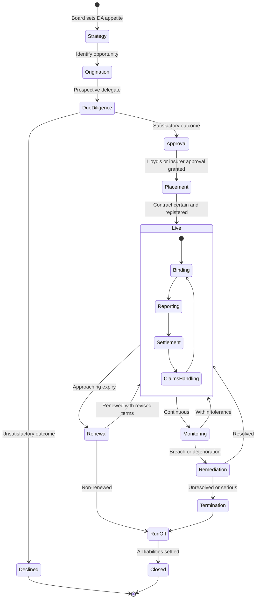

Each phase generates obligations, records and controls, which are addressed in the chapters that follow.

---

## 16. Strategy, Origination and Due Diligence

### 16.1 Delegated Authority Strategy

A capacity provider's board should approve a delegated authority strategy that defines:

- the classes, territories and customer segments in which delegation is appropriate
- the target share of premium written through delegation
- the types of delegate acceptable, including start-up MGAs, established MGAs, brokers holding authority and service companies
- the degree of authority acceptable for each type, including delegated claims authority
- concentration limits, including maximum premium or exposure per delegate
- the oversight resources required to support the strategy

Growth in delegated premium should not outpace growth in oversight capability. Regulators and Lloyd's scrutinise this relationship closely.

### 16.2 Due Diligence

Due diligence should be proportionate to the proposed authority, the delegate's track record and the risk of the business.

| Area | Principal enquiries |
|---|---|
| **Ownership and control** | Ultimate beneficial owners, group structure, private equity or other investor involvement, and related parties. |
| **Fitness and propriety** | Integrity, competence and regulatory history of directors and key underwriters. Criminal, credit and sanctions checks. |
| **Financial standing** | Audited accounts, capital, liquidity, dependence on a single capacity provider, and the ability to sustain run-off obligations. |
| **Regulatory status** | Authorisation or licence status in each relevant jurisdiction, and regulatory correspondence. |
| **Underwriting capability** | Experience of the underwriting team, underwriting guidelines, rating methodology, and historical performance with loss data. |
| **Claims capability** | Claims staff experience, procedures, reserving practice, and TPA arrangements. |
| **Operations and systems** | Policy administration, rating engines, data quality, cyber security and business continuity. |
| **Financial controls** | Premium handling, bank account structures, reconciliation and credit control. |
| **Conduct** | Product governance, fair value, complaints handling, vulnerable customer treatment and training. |
| **Financial crime** | Sanctions screening, anti-bribery and anti-fraud controls. |
| **Data protection** | Data governance, controller or processor role, and security certifications. |
| **Insurance** | Professional indemnity, crime and cyber cover held by the delegate. |

Due diligence should include a site visit or a structured remote review where a visit is impracticable. For start-up MGAs, the absence of a track record places greater weight on the experience of individuals, the credibility of the business plan, and the strength of initial restrictions such as lower limits and wider referral requirements.

### 16.3 Pre-Bind Audit

For new delegates, many capacity providers commission a pre-bind audit to verify the controls described during due diligence. The findings inform the conditions of the first-year agreement.

---

## 17. Placement and Documentation

### 17.1 Contract Certainty

London market contract certainty principles require all terms to be agreed and documented before inception. For binding authorities, this means that:

- the MRC and agreement are finalised and signed by all participants before inception;
- schedules, limits, rates, wordings and commission are fully specified;
- the coverholder's approval status covers the authorised scope; and
- the binder is registered with Lloyd's and the central processing systems.

Business bound under an agreement that is not contract certain exposes the capacity provider to disputes over the terms of its authority.

### 17.2 Placement Flow

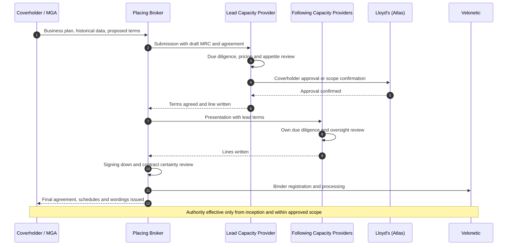

### 17.3 Binder Identifiers and Sections

Each binder is identified by a Unique Market Reference (UMR). A binder may contain several **sections**, each with its own class, territory, limits, capacity providers and reporting requirements. The UMR and section identifiers are the keys that link risks, premium and claims in bordereaux to the correct contract and capacity providers.

---

## 18. Underwriting Under Authority

### 18.1 Binding Within Authority

The coverholder's underwriting process should apply the binder's parameters systematically. Mature coverholders embed them in the policy administration and rating systems, so that risks outside authority cannot be bound without referral.

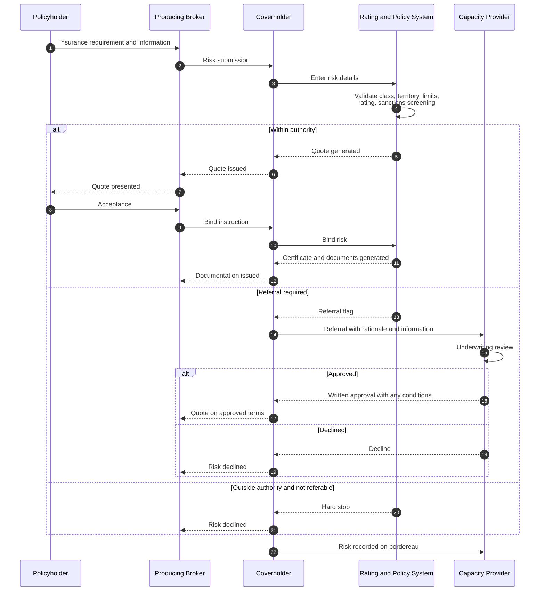

### 18.2 Referral Management

Referral provisions are the principal real-time control over risks near the boundary of authority. An effective referral process requires:

- precise referral triggers stated in the binder, such as sums insured above a threshold, specified occupancies, adverse loss history, rate deviations and non-standard wordings
- a documented request, including the information needed for the decision
- a recorded response from an authorised individual at the capacity provider
- agreed response times, so that referrals do not become a commercial barrier
- reporting of referrals and outcomes, including referrals that should have been made and were not

Capacity providers should analyse referral data. A high volume of approved referrals may indicate that the authority is drawn too narrowly. A low volume, combined with risks close to limits, may indicate avoidance.

### 18.3 Pricing and Rating Tools

Many binders now require the use of rating tools, either provided by the capacity provider or built by the coverholder and approved by it. Governance of rating tools should cover:

- ownership of the model and its assumptions
- change control, including testing and approval of rate changes
- access controls to prevent unauthorised overrides
- monitoring of rate adequacy and rate change against plan
- compliance with pricing rules such as ICOBS 6B

### 18.4 Documentation Issuance

Certificates, policies and endorsements must use approved wordings and must meet the documentation requirements of Lloyd's or the insurer and of the local jurisdiction. A Lloyd's certificate must identify the syndicates or LIC as insurer, and it must include the prescribed complaints and security information for the territory.

Mid-term adjustments and cancellations must also fall within authority. Backdating of cover, the reinstatement of lapsed policies and changes after a known loss require particular control.

---

## 19. Premium and Money Flows

### 19.1 End-to-End Premium Flow

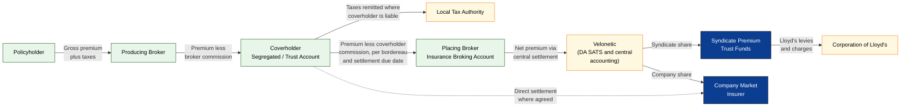

### 19.2 Settlement Terms and Credit Control

Binders typically require premium to be settled within an agreed period after the end of each reporting month. Settlement due dates recorded in the MRC are used to monitor credit control across the market.

Capacity providers should monitor:

- aged premium debt by coverholder
- differences between premium reported on bordereaux and cash received
- reconciliation of written, signed and settled premium
- delays attributable to the coverholder, the broker or the processing system

Persistent late settlement is a strong early indicator of financial stress at a coverholder and warrants escalation.

### 19.3 Claims Funds

Where delegated claims authority includes payment, the capacity provider provides a **loss fund**. This is an account held by the coverholder or TPA from which claims are paid and which is replenished on presentation of paid claims bordereaux. Loss funds must be held in segregated accounts, reconciled regularly, and audited.

---

## 20. Taxation

Tax obligations in delegated business are complex because risks are written across multiple jurisdictions and each jurisdiction imposes its own premium taxes, levies and reporting.

| Tax type | Illustrative examples | Key considerations |
|---|---|---|
| **Insurance premium taxes** | UK Insurance Premium Tax; European premium taxes; Australian stamp duty. | Rate and liability depend on location of risk. The insurer is typically liable; collection is frequently delegated. |
| **Surplus lines taxes** | US state surplus lines taxes and stamping fees. | Usually the obligation of the licensed surplus lines broker. Filing through state stamping offices. |
| **Excise and federal taxes** | US Federal Excise Tax on premiums paid to foreign insurers. | Lloyd's operates specific arrangements for Lloyd's business. Company market insurers must assess their own position. |
| **Parafiscal levies** | Fire brigade charges; terrorism and natural catastrophe pool contributions; guarantee fund levies. | Frequently overlooked. They vary by class and territory. |
| **Indirect taxes on services** | VAT or equivalent on coverholder fees in some jurisdictions. | Affects the treatment of commission and fees. |

For Lloyd's business, Crystal provides tax information by territory, and Lloyd's operates centralised arrangements for the settlement of certain taxes. The binder must allocate responsibility for tax calculation, collection, remittance and reporting. Tax data must be captured accurately on premium bordereaux.

---

## 21. Bordereaux, Data and Reporting

### 21.1 The Function of Bordereaux

Bordereaux are periodic schedules through which the delegate reports its activity to the capacity provider. The principal types are:

- **risk bordereaux**, recording each risk bound, with its exposure characteristics
- **premium bordereaux**, recording premium, taxes, commission and amounts due
- **claims bordereaux**, recording claims notified, reserves, payments and recoveries
- supplementary reports, such as referrals, complaints, cancellations and Consumer Duty data

Bordereaux are the primary source of data for the capacity provider's underwriting monitoring, reserving, exposure management, regulatory reporting, tax and financial accounting. Weaknesses in bordereaux data propagate through all of these functions.

### 21.2 Reporting Standards

The **Lloyd's Coverholder Reporting Standards** define the fields, formats and validation rules for risk, premium and claims bordereaux. They are widely used in the company market as well. Additional standards and templates apply to specific classes and territories.

### 21.3 Data Flow

```mermaid
flowchart TB
    subgraph SRC["DELEGATE SYSTEMS"]
        PAS["Policy Administration<br/>and Rating System"]
        CMS["Claims Management<br/>System (coverholder or TPA)"]
        FIN["Finance and<br/>Accounts System"]
    end

    subgraph TRANS["SUBMISSION AND VALIDATION"]
        BDX["Bordereau Production<br/>(risk, premium, claims)"]
        PLAT["Market or third-party<br/>DA platform<br/>(including DA SATS)"]
        VAL{"Validation<br/>against standards<br/>and contract terms"}
        REJ["Rejection with<br/>exception report"]
    end

    subgraph CAP["CAPACITY PROVIDER"]
        DWH["Delegated Authority<br/>Data Store"]
        UW["Underwriting<br/>Performance MI"]
        RES["Reserving and<br/>Actuarial"]
        EXP["Exposure Management<br/>and Catastrophe Modelling"]
        ACC["Finance, Tax<br/>and Credit Control"]
        CMP["Compliance and<br/>Consumer Duty MI"]
    end

    subgraph EXT["EXTERNAL REPORTING"]
        LLR["Lloyd's Returns"]
        REGR["Regulatory Returns"]
        TAXR["Tax Filings"]
    end

    PAS --> BDX
    CMS --> BDX
    FIN --> BDX
    BDX --> PLAT --> VAL
    VAL -->|"Fail"| REJ --> BDX
    VAL -->|"Pass"| DWH
    DWH --> UW
    DWH --> RES
    DWH --> EXP
    DWH --> ACC
    DWH --> CMP
    RES --> LLR
    ACC --> LLR
    ACC --> TAXR
    CMP --> REGR
    RES --> REGR

    classDef src fill:#e8f5e9,stroke:#1b5e20,color:#000
    classDef trans fill:#fff8e1,stroke:#f57f17,color:#000
    classDef cap fill:#e3f2fd,stroke:#0d47a1,color:#000
    classDef ext fill:#f3e5f5,stroke:#6a1b9a,color:#000
    class PAS,CMS,FIN src
    class BDX,PLAT,VAL,REJ trans
    class DWH,UW,RES,EXP,ACC,CMP cap
    class LLR,REGR,TAXR ext
```

### 21.4 Conceptual Data Model

The following model shows the core entities and relationships that delegated authority data must support.

```mermaid
erDiagram
    CAPACITY_PROVIDER ||--o{ PARTICIPATION : writes
    BINDING_AUTHORITY ||--o{ PARTICIPATION : "is subscribed by"
    COVERHOLDER ||--o{ BINDING_AUTHORITY : holds
    BINDING_AUTHORITY ||--|{ SECTION : contains
    SECTION ||--o{ RISK : "authorises"
    RISK ||--|{ PREMIUM_TRANSACTION : generates
    RISK ||--o{ CLAIM : "may give rise to"
    CLAIM ||--|{ CLAIM_MOVEMENT : records
    SECTION ||--o{ REFERRAL : "may require"
    COVERHOLDER ||--o{ AUDIT : "is subject to"
    AUDIT ||--o{ FINDING : produces
    CLAIM }o--o| TPA : "handled by"

    BINDING_AUTHORITY {
        string UMR PK
        date inception
        date expiry
        decimal gpi_limit
    }
    SECTION {
        string section_id PK
        string risk_code
        string territory
        decimal max_limit
    }
    RISK {
        string certificate_ref PK
        string insured_name
        string location
        decimal sum_insured
        date risk_inception
    }
    PREMIUM_TRANSACTION {
        string transaction_id PK
        decimal gross_premium
        decimal commission
        decimal tax
        date settlement_due
    }
    CLAIM {
        string claim_ref PK
        date loss_date
        string status
        decimal outstanding
    }
    CLAIM_MOVEMENT {
        string movement_id PK
        decimal paid
        decimal reserve_change
    }
    PARTICIPATION {
        string participation_id PK
        decimal signed_line
    }
```

### 21.5 Data Quality

Common data quality failures include:

- missing or inconsistent identifiers linking risks, premium and claims
- inaccurate location data, which undermines catastrophe modelling
- incorrect risk coding or class allocation
- premium reported without corresponding risk records, or the reverse
- late submission, creating lags in reserving and exposure monitoring
- manual transformation of data between systems, introducing errors

Capacity providers should measure data quality systematically, with metrics for timeliness, completeness and accuracy. They should feed the results into coverholder performance ratings and remuneration where the agreement permits. Data quality obligations should be contractual and enforceable.

---

## 22. Claims Under Delegated Authority

### 22.1 Models of Claims Delegation

| Model | Description | Typical use |
|---|---|---|
| **No claims authority** | All claims notified to the capacity provider for handling. | Low-frequency, high-severity classes. |
| **Notification and administration only** | Delegate records and acknowledges claims but has no settlement authority. | Transitional or higher-risk arrangements. |
| **Delegated claims authority to coverholder** | Coverholder settles claims within financial limits. | High-frequency, low-severity classes where the coverholder has capability. |
| **Delegated claims authority to TPA** | An independent TPA settles claims within limits. | Where the coverholder lacks claims capability, or where independence is required. |

Separating underwriting and claims functions, by using an independent TPA or by structural separation within the coverholder, reduces the risk that claims decisions are influenced by underwriting or profit commission interests.

### 22.2 Claims Handling Flow

```mermaid
sequenceDiagram
    autonumber
    participant PH as Policyholder / Claimant
    participant TPA as Coverholder or TPA
    participant LF as Loss Fund
    participant CP as Capacity Provider Claims
    participant EXP as Loss Adjuster / Expert

    PH->>TPA: First notification of loss
    TPA->>TPA: Coverage check, sanctions screening,<br/>fraud indicators, initial reserve
    alt Within delegated claims authority
        TPA->>EXP: Appoint adjuster where required
        EXP-->>TPA: Report and quantum
        TPA->>TPA: Coverage decision and settlement
        TPA->>LF: Payment request
        LF-->>PH: Claim payment
        TPA->>CP: Reported on claims bordereau
        CP->>LF: Replenishment against paid bordereau
    else Above authority or referral trigger
        TPA->>CP: Referral with file and recommendation
        CP->>CP: Claims review and agreement
        CP-->>TPA: Instructions and settlement authority
        TPA-->>PH: Decision communicated
    end
    Note over TPA,CP: Complaints, litigation, coverage disputes<br/>and suspected fraud are escalated per agreement
```

### 22.3 Claims Authority Terms

A delegated claims authority agreement should specify:

- financial limits per claim, both for settlement and for reserve setting
- referral triggers, such as coverage disputes, litigation, suspected fraud, catastrophe events, complaints, and claims involving vulnerable customers
- reserving philosophy and the timeframe for initial and subsequent reserves
- service standards for acknowledgement, contact, decision and payment
- authority to appoint adjusters, experts and lawyers, and the fee scales that apply
- recoveries and subrogation
- the operation and replenishment of loss funds
- claims reporting, including the claims bordereau and file audit access

At Lloyd's, the managing agent must be satisfied that the claims handler meets Lloyd's requirements. The applicable market claims lead and agreement arrangements determine which capacity providers must agree claims above the delegated limit.

### 22.4 Catastrophe Events

Catastrophe events test delegated claims arrangements severely. Capacity providers should agree in advance:

- surge capacity at the coverholder or TPA
- temporary adjustments to authority limits and service standards
- arrangements for the appointment of adjusters across the market
- loss fund increases
- event reporting frequency and format

### 22.5 Reserving Implications

Claims data reported through bordereaux reaches the capacity provider with a lag. Capacity providers should understand the delegate's reserving philosophy and verify its consistency through file review and actuarial analysis. Inadequate case reserving at the delegate, if undetected, leads to reserve deterioration at the capacity provider and can distort profit commission calculations.

---

## 23. Complaints Operations

Complaints handling is frequently delegated alongside underwriting and claims. The operational requirements are:

- recognition of expressions of dissatisfaction as complaints, whether written or oral
- recording in a complaints log with root cause classification
- acknowledgement and final response within regulatory timescales
- referral to the capacity provider of complaints outside delegated authority
- escalation routes to Lloyd's complaints or to the insurer's complaints function
- reporting to the capacity provider, supporting its regulatory complaints returns and Consumer Duty monitoring

Complaints data is among the most valuable conduct indicators available to the capacity provider. It should be analysed alongside claims outcomes and cancellation data.

---

# Part V — Oversight and Governance

## 24. Governance Structures

### 24.1 Governance Architecture

```mermaid
flowchart TB
    BOARD["Board of Managing Agent / Insurer"] --> UWC["Underwriting Committee"]
    BOARD --> RC["Risk Committee"]
    BOARD --> AC["Audit Committee"]
    UWC --> DAC["Delegated Authority<br/>Oversight Committee"]
    RC --> DAC
    DAC --> DAT["Delegated Authority Team<br/>(DA managers, analysts)"]
    DAC --> CU["Class Underwriters"]
    DAC --> CL["Claims Function"]
    DAC --> FC["Finance and Credit Control"]
    DAC --> CO["Compliance"]
    DAT --> EXT["External Coverholder Auditors"]
    AC --> IA["Internal Audit"]
    IA -.->|"Independent assurance<br/>over DA framework"| DAC

    SMF["Accountable Senior Manager<br/>(SM&CR)"] -.-> DAC

    classDef board fill:#263238,color:#fff,stroke:#000
    classDef com fill:#0b3d91,color:#fff,stroke:#000
    classDef func fill:#e3f2fd,color:#000,stroke:#0b3d91
    classDef ind fill:#f3e5f5,color:#000,stroke:#6a1b9a
    class BOARD board
    class UWC,RC,AC,DAC com
    class DAT,CU,CL,FC,CO,EXT func
    class IA,SMF ind
```

The oversight committee typically approves new delegates, reviews performance and audit findings, approves remediation plans, and decides on non-renewal and termination. Its terms of reference should specify decision rights, quorum, escalation routes and reporting to the board.

### 24.2 Three Lines of Defence

```mermaid
flowchart BT
    subgraph L1["FIRST LINE"]
        direction TB
        A1["Class underwriters:<br/>appetite, pricing, referrals"]
        A2["DA team:<br/>bordereaux, monitoring,<br/>audit management"]
        A3["Claims:<br/>DCA oversight, file review"]
        A4["Delegate's own controls"]
    end
    subgraph L2["SECOND LINE"]
        direction TB
        B1["Risk management:<br/>DA risk appetite,<br/>concentration monitoring"]
        B2["Compliance:<br/>conduct, Consumer Duty,<br/>regulatory requirements"]
        B3["Actuarial:<br/>reserving, pricing adequacy"]
    end
    subgraph L3["THIRD LINE"]
        direction TB
        C1["Internal audit:<br/>assurance over the<br/>DA framework"]
    end
    L1 -->|"Reporting and challenge"| L2
    L2 -->|"Assurance"| L3
    L3 -->|"Independent reporting"| BRD["Audit Committee and Board"]

    classDef l1 fill:#e8f5e9,stroke:#1b5e20,color:#000
    classDef l2 fill:#fff8e1,stroke:#f57f17,color:#000
    classDef l3 fill:#fce4ec,stroke:#880e4f,color:#000
    class A1,A2,A3,A4 l1
    class B1,B2,B3 l2
    class C1 l3
```

External coverholder audits are commissioned by the first line. They supplement the capacity provider's own oversight but do not replace second and third line assurance over the framework as a whole.

---

## 25. Performance Management and Management Information

### 25.1 Key Indicators

| Category | Indicators |
|---|---|
| **Underwriting performance** | Written and earned premium against plan; loss ratios (paid, incurred, ultimate); rate change; average premium; retention. |
| **Authority compliance** | Premium income against limit; risks outside authority; referral breaches; unapproved wordings. |
| **Data** | Bordereau timeliness; validation failure rates; completeness of mandatory fields; reconciliation differences. |
| **Financial** | Aged debt; settlement against due date; loss fund reconciliation. |
| **Claims** | Claims frequency and severity; time to acknowledgement, decision and settlement; reopened claims; reserve development; leakage findings. |
| **Conduct** | Complaints volume and root cause; ombudsman outcomes; claims acceptance rate; cancellations; vulnerable customer outcomes. |
| **Audit** | Audit rating; number and severity of open findings; timeliness of remediation. |
| **Exposure** | Aggregate exposure by zone and peril; event scenario losses; concentration by delegate. |

### 25.2 Risk-Based Prioritisation

Combining performance and control indicators produces a view of where oversight effort should be directed.

```mermaid
quadrantChart
    title Coverholder Oversight Prioritisation
    x-axis Weak Controls --> Strong Controls
    y-axis Poor Performance --> Strong Performance
    quadrant-1 Maintain and consider growth
    quadrant-2 Remediate controls urgently
    quadrant-3 Restructure or exit
    quadrant-4 Review pricing and appetite
    Coverholder A: [0.82, 0.78]
    Coverholder B: [0.25, 0.72]
    Coverholder C: [0.18, 0.22]
    Coverholder D: [0.74, 0.30]
    Coverholder E: [0.55, 0.55]
    Coverholder F: [0.35, 0.40]
```

Coverholders showing strong results but weak controls warrant particular attention. Favourable results may reflect favourable conditions rather than disciplined underwriting, and control weaknesses can produce sudden losses, conduct failures or financial crime.

### 25.3 Annual Oversight Cycle

```mermaid
gantt
    title Illustrative Oversight Cycle for a Binder Incepting 1 January
    dateFormat YYYY-MM-DD
    axisFormat %b %Y
    section Inception
    Binder live                                :milestone, m1, 2025-01-01, 0d
    First bordereaux review                    :a1, 2025-02-01, 30d
    section Monitoring
    Monthly bordereaux and MI                  :a2, 2025-02-01, 334d
    Quarterly performance review               :a3, 2025-04-01, 15d
    Mid-year performance review                :a4, 2025-07-01, 20d
    Quarterly performance review               :a5, 2025-10-01, 15d
    section Assurance
    Coverholder audit fieldwork                :b1, 2025-05-01, 30d
    Audit findings remediation                 :b2, after b1, 90d
    Claims file review                         :b3, 2025-08-01, 20d
    section Renewal
    Renewal information and pricing            :c1, 2025-09-15, 45d
    Oversight committee renewal decision       :milestone, m2, 2025-11-15, 0d
    Documentation and contract certainty       :c2, 2025-11-15, 45d
    Renewal inception                          :milestone, m3, 2026-01-01, 0d
```

---

## 26. Coverholder Audit

### 26.1 Purpose and Frequency

Audit provides independent verification that the delegate operates in accordance with the agreement and with regulatory requirements. Frequency should be risk-based. New, large, poorly rated or high-risk delegates are typically audited annually or more frequently. Well-established, low-risk delegates may be audited less often, subject to the capacity provider's framework and Lloyd's expectations.

### 26.2 Audit Scope

The London market has developed common coverholder audit standards and scope documents, used by both Lloyd's and company market participants. A standard scope covers:

- governance, management and financial standing
- compliance with the binding authority terms
- underwriting processes, including referrals and rating
- documentation issuance
- premium handling, bank accounts and reconciliation
- bordereaux accuracy, reconciled to source systems
- claims handling, where delegated
- complaints handling
- regulatory compliance, including conduct and Consumer Duty
- financial crime and sanctions controls
- data protection and information security
- business continuity

Audit scope can be extended with class-specific or territory-specific modules, and it can be focused on areas of known concern.

### 26.3 Audit Process

```mermaid
flowchart TB
    PLAN["Risk-based audit plan<br/>approved by DA committee"] --> SCOPE["Scope defined<br/>(standard plus focus areas)"]
    SCOPE --> APPT["Auditor appointed<br/>(independence and<br/>competence confirmed)"]
    APPT --> FIELD["Fieldwork<br/>(on-site or remote, sampling,<br/>interviews, system testing)"]
    FIELD --> DRAFT["Draft report with findings<br/>rated by severity"]
    DRAFT --> RESP["Delegate management<br/>responses and action plans"]
    RESP --> FINAL["Final report issued<br/>to capacity providers"]
    FINAL --> ASSESS{"Capacity provider<br/>assessment"}
    ASSESS -->|"Satisfactory"| TRACK["Track actions to closure"]
    ASSESS -->|"Serious findings"| ESC["Escalate to<br/>DA committee"]
    ESC --> REM["Formal remediation plan,<br/>restrictions or termination"]
    TRACK --> EVID["Evidence of closure<br/>verified"]
    REM --> EVID
    EVID --> RATE["Update delegate<br/>risk rating"]
    RATE --> PLAN

    classDef p fill:#e3f2fd,stroke:#0d47a1,color:#000
    classDef d fill:#fff8e1,stroke:#f57f17,color:#000
    classDef e fill:#ffebee,stroke:#b71c1c,color:#000
    class PLAN,SCOPE,APPT,FIELD,DRAFT,RESP,FINAL,TRACK,EVID,RATE p
    class ASSESS d
    class ESC,REM e
```

### 26.4 Audit Quality

The value of audit depends on the auditor's independence, competence and access. Capacity providers should:

- evaluate auditors against defined criteria and review a sample of their work
- avoid arrangements in which the delegate selects and pays the auditor without capacity provider involvement
- require sampling that is sufficient to draw conclusions
- ensure audit findings are acted upon, with overdue actions escalated

Where several capacity providers participate on a binder, a single audit may be commissioned to serve all of them. Each must still review the report and determine its own response.

---

## 27. Breach Management, Remediation and Termination

### 27.1 Breach Classification

| Severity | Examples | Typical response |
|---|---|---|
| **Minor** | Isolated late bordereau; minor data errors. | Recorded; addressed through routine monitoring. |
| **Moderate** | Repeated data failures; referral breaches without loss; late settlement. | Formal notice; remediation plan with deadlines. |
| **Serious** | Binding outside authority; material premium retention; conduct failures causing customer detriment. | Escalation to oversight committee; restriction of authority; consideration of termination; regulatory notification where required. |
| **Critical** | Fraud; misappropriation of funds; sanctions breaches; regulatory action against the delegate; insolvency. | Immediate suspension or termination; protective steps over premium, data and records; notification to Lloyd's, regulators and law enforcement as appropriate. |

### 27.2 Remediation Tools

Capacity providers have a range of tools short of termination:

- reduction of limits or premium income
- extension of referral requirements
- removal of delegated claims authority, transferring claims to a TPA
- increased reporting frequency
- additional audits or on-site monitoring
- changes to commission or profit commission terms at renewal
- conditions on key personnel or systems.

### 27.3 Regulatory Notifications

Capacity providers may be required to notify the PRA, the FCA, Lloyd's or overseas regulators of material events involving delegates. These include significant breaches, fraud, conduct failures affecting customers, and changes to material outsourcing arrangements. Notification obligations should be mapped in advance so that decisions are made promptly.

---

## 28. Run-Off and Exit

### 28.1 Exit Scenarios

Exit may be planned, as in non-renewal or orderly transfer, or stressed, as in coverholder insolvency, fraud or regulatory intervention. PRA expectations require stressed exit plans for material outsourcing arrangements.

### 28.2 Run-Off Process

```mermaid
flowchart TB
    TRIG(["Exit trigger:<br/>non-renewal, termination<br/>or insolvency"]) --> NOTE["Formal notice issued<br/>per agreement"]
    NOTE --> AUTH["Authority to bind<br/>ceases or is restricted<br/>to run-off activities"]
    AUTH --> COMMS["Notice to producing brokers,<br/>Lloyd's status updated,<br/>certificates and system access<br/>withdrawn"]
    COMMS --> POL{"Treatment of<br/>in-force policies"}
    POL -->|"Run to expiry"| EXP["Policies serviced to expiry<br/>by delegate or replacement"]
    POL -->|"Transfer"| TRF["Transfer to replacement<br/>coverholder or carrier"]
    POL -->|"Cancellation"| CAN["Cancellation where<br/>contractually and legally<br/>permitted, with customer<br/>protection"]
    EXP --> CLM["Claims handling transferred<br/>or continued under<br/>run-off agreement"]
    TRF --> CLM
    CAN --> CLM
    CLM --> FUND["Premium and loss funds<br/>reconciled and recovered"]
    FUND --> DATA["Data and records<br/>transferred and verified"]
    DATA --> PC["Final profit commission<br/>and accounts settled"]
    PC --> CLOSE(["Arrangement closed<br/>when all liabilities<br/>discharged"])

    classDef t fill:#b71c1c,color:#fff,stroke:#000
    classDef p fill:#e3f2fd,color:#000,stroke:#0d47a1
    classDef d fill:#fff8e1,color:#000,stroke:#f57f17
    classDef c fill:#1b5e20,color:#fff,stroke:#000
    class TRIG t
    class NOTE,AUTH,COMMS,EXP,TRF,CAN,CLM,FUND,DATA,PC p
    class POL d
    class CLOSE c
```

### 28.3 Exit Readiness

Exit is far easier when prepared in advance. Agreements should provide for:

- ownership of, and access to, policy and claims data in usable formats
- continuation of claims handling for a defined period and at defined remuneration
- step-in rights, including the right to appoint a replacement administrator
- cooperation obligations during transition
- retention of records for the required periods
- treatment of renewal rights, which are often commercially contentious

Customer outcomes must be protected during exit. Under the Consumer Duty, disruption to claims handling or policy servicing that causes foreseeable harm is a regulatory concern regardless of the commercial reasons for exit.

---

## 29. Remuneration and Incentive Alignment

### 29.1 Remuneration Components

| Component | Description | Incentive effect |
|---|---|---|
| **Base commission** | Percentage of gross premium. | Rewards volume. Must cover the delegate's acquisition and administration costs. |
| **Sliding scale commission** | Commission varies inversely with loss ratio within a defined range. | Links remuneration to results in the current period. |
| **Profit commission** | Share of profit calculated after a defined period. | Aligns the delegate's interest with long-term portfolio profitability. |
| **Fees** | Policy fees, administration fees and claims handling fees. | Must be disclosed, authorised and assessed for fair value. |
| **Claims handling remuneration** | Fixed or per-claim fees for delegated claims handling. | Structure affects handling behaviour, for example incentives to close claims quickly or to prolong them. |

### 29.2 Profit Commission Design *(continued)*

A profit commission clause should define:

- the calculation basis, whether per underwriting year or on a cumulative multi-year basis
- the income included, typically earned premium net of taxes and brokerage
- the deductions, including paid claims, outstanding claims, IBNR, claims handling expenses, coverholder commission and a management expense allowance for the capacity provider
- the treatment of large or catastrophe losses, whether capped, excluded or included in full
- the carry-forward of deficits from prior years
- the timing of the first calculation, which should allow for claims development appropriate to the class (commonly 24 to 36 months after the end of the underwriting year for short-tail business, and longer for casualty)
- subsequent recalculations and the mechanism for clawback of overpayments
- the authority that determines IBNR, and the dispute resolution procedure for disagreements over it
- the effect of termination, breach or fraud on entitlement

```mermaid
flowchart TB
    EP["Earned premium<br/>net of taxes and brokerage"] --> LESS1["Less: paid claims"]
    LESS1 --> LESS2["Less: outstanding claims<br/>and IBNR"]
    LESS2 --> LESS3["Less: coverholder commission<br/>and fees"]
    LESS3 --> LESS4["Less: capacity provider<br/>management expense allowance"]
    LESS4 --> LESS5["Less: deficits carried<br/>forward from prior years"]
    LESS5 --> RES{"Result"}
    RES -->|"Profit"| PC["Profit commission payable<br/>at agreed percentage"]
    RES -->|"Loss"| CF["Deficit carried forward<br/>to next calculation"]
    PC --> RECALC["Periodic recalculation<br/>as claims develop"]
    CF --> RECALC
    RECALC -->|"Deterioration"| CLAW["Clawback or offset against<br/>future commission"]
    RECALC -->|"Improvement"| ADD["Additional profit<br/>commission payable"]

    classDef in fill:#e8f5e9,stroke:#1b5e20,color:#000
    classDef calc fill:#e3f2fd,stroke:#0d47a1,color:#000
    classDef dec fill:#fff8e1,stroke:#f57f17,color:#000
    classDef out fill:#f3e5f5,stroke:#6a1b9a,color:#000
    class EP in
    class LESS1,LESS2,LESS3,LESS4,LESS5,RECALC calc
    class RES dec
    class PC,CF,CLAW,ADD out
```

The following worked example illustrates a single-year calculation. The figures are hypothetical.

| Item | Amount (£) |
|---|---|
| Earned premium, net of taxes and brokerage | 10,000,000 |
| Less incurred claims, including IBNR | (5,500,000) |
| Less coverholder commission at 25% | (2,500,000) |
| Less management expense allowance at 7.5% | (750,000) |
| Less deficit brought forward | (0) |
| **Profit** | **1,250,000** |
| **Profit commission at 20%** | **250,000** |

Profit commission paid on immature results is a recurring source of loss. If early calculations understate claims, the capacity provider pays commission on profit that never materialises and may be unable to recover it, particularly where the delegate has limited financial resources or has been sold. Clawback rights are only as valuable as the delegate's capacity to pay. Some capacity providers therefore retain a portion of profit commission until results mature.

### 29.3 Sliding Scale Commission

Sliding scale commission adjusts the delegate's commission according to the loss ratio, within a floor and ceiling. It provides a more immediate link between remuneration and results than profit commission.

```mermaid
xychart-beta
    title "Illustrative Sliding Scale Commission"
    x-axis "Loss ratio (%)" [40, 45, 50, 55, 60, 65, 70]
    y-axis "Commission (%)" 10 --> 30
    line [27.5, 27.5, 25, 22.5, 20, 17.5, 17.5]
```

In this illustration, commission falls by 2.5 percentage points for each 5-point increase in loss ratio between 45% and 65%, with a ceiling of 27.5% and a floor of 17.5%. The provisional commission is paid at inception and adjusted as the loss ratio develops.

### 29.4 Governance of Remuneration

Remuneration terms should be subject to the following controls:

- approval of all remuneration, including fees charged directly to policyholders, as part of the binder
- disclosure of any remuneration received from third parties in connection with the business, including from adjusters, premium finance providers and affiliated brokers
- inclusion of total distribution remuneration in fair value assessments for retail products
- actuarial review of IBNR used in profit commission calculations
- periodic assessment of whether remuneration structures encourage volume at the expense of underwriting quality or customer outcomes

---

# Part VI — Market Infrastructure, Data and Technology

## 30. Central Market Services

### 30.1 Processing Infrastructure

The London market operates shared infrastructure for accounting, settlement and data. For delegated authority, the principal services are:

| Service | Function |
|---|---|
| **Velonetic** | Central processing for Lloyd's and IUA company market business, including premium and claims accounting, settlement and signing. |
| **DA SATS** | Lloyd's market service for the submission, validation and processing of delegated authority bordereaux, and for the settlement of premium against them. |
| **Atlas** | Lloyd's platform for coverholder approval and the maintenance of coverholder records. |
| **DCOM** | Lloyd's Delegated Contract Management service, used to register binding authority contracts and their sections. |
| **Crystal** | Lloyd's regulatory and tax reference for each territory. |
| **Lloyd's Market Return systems** | Channels through which managing agents submit syndicate data to Lloyd's, incorporating delegated business. |

### 30.2 Infrastructure Interactions

```mermaid
flowchart LR
    subgraph DEL["DELEGATE"]
        CHS["Coverholder systems"]
    end

    subgraph BRK["BROKER"]
        BS["Broker systems"]
    end

    subgraph LLOYDS["LLOYD'S SERVICES"]
        ATL["Atlas<br/>Coverholder approval"]
        DCM["DCOM<br/>Contract registration"]
        CRY["Crystal<br/>Territory reference"]
    end

    subgraph PROC["CENTRAL PROCESSING"]
        DAS["DA SATS<br/>Bordereaux and settlement"]
        VEL["Velonetic<br/>Accounting and signing"]
    end

    subgraph CP["CAPACITY PROVIDERS"]
        MAS["Managing agent systems"]
        INS["Company insurer systems"]
    end

    CHS -->|"Bordereaux"| DAS
    BS -->|"Binder registration"| DCM
    BS -->|"Premium and claims<br/>submissions"| VEL
    DCM --> DAS
    ATL --> DCM
    CRY -.->|"Reference data"| CHS
    CRY -.->|"Reference data"| MAS
    DAS --> VEL
    VEL -->|"Signed and settled<br/>transactions"| MAS
    VEL -->|"Signed and settled<br/>transactions"| INS
    DAS -->|"Validated data"| MAS

    classDef del fill:#e8f5e9,stroke:#1b5e20,color:#000
    classDef brk fill:#fff8e1,stroke:#f57f17,color:#000
    classDef ll fill:#0b3d91,stroke:#000,color:#fff
    classDef proc fill:#6a1b9a,stroke:#000,color:#fff
    classDef cp fill:#e3f2fd,stroke:#0d47a1,color:#000
    class CHS del
    class BS brk
    class ATL,DCM,CRY ll
    class DAS,VEL proc
    class MAS,INS cp
```

Many capacity providers supplement central services with third-party delegated authority platforms. These ingest bordereaux in varied formats, map them to a common data model, apply validation rules derived from contract terms, and provide performance dashboards. Such platforms reduce manual effort but introduce their own data governance and outsourcing considerations.

---

## 31. Blueprint Two and Digital Delegated Authority

### 31.1 Objectives

Blueprint Two is the London market's programme to digitise placement, accounting, settlement and claims. It is sponsored by Lloyd's and the London Market Group and applies across Lloyd's and the IUA company market. Its central instrument is the **Core Data Record (CDR)**, a structured data set that captures the key contractual, regulatory, tax and accounting information for each contract, replacing the re-keying of data from documents.

Implementation timelines have been revised several times. Participants should consult current Lloyd's and LMG publications for scope and dates.

### 31.2 Implications for Delegated Authority

Blueprint Two affects delegated authority in several ways:

- **Digital contracts.** Binding authority contracts are captured as structured data, allowing contract terms to drive automated validation of bordereaux.
- **Structured bordereaux.** The market is moving from spreadsheet bordereaux towards standardised, machine-readable data, with increasing adoption of ACORD-aligned standards.
- **Earlier validation.** Data errors can be identified at submission, reducing downstream correction.
- **Faster settlement.** Structured data supports more timely premium and claims settlement.
- **Transparency.** Consistent data across capacity providers enables better portfolio analysis and oversight.

```mermaid
flowchart TB
    subgraph CUR["LEGACY MODEL"]
        direction TB
        L1["Contract as document"] --> L2["Manual extraction<br/>of terms"]
        L2 --> L3["Spreadsheet bordereaux<br/>in varied formats"]
        L3 --> L4["Manual mapping<br/>and reconciliation"]
        L4 --> L5["Delayed and<br/>inconsistent MI"]
    end

    subgraph FUT["DIGITAL MODEL"]
        direction TB
        F1["Contract as structured data<br/>(Core Data Record)"] --> F2["Terms available as<br/>validation rules"]
        F2 --> F3["Standardised bordereau<br/>data at source"]
        F3 --> F4["Automated validation<br/>against contract"]
        F4 --> F5["Timely portfolio MI<br/>and exception alerts"]
    end

    CUR ==>|"Market modernisation"| FUT

    classDef cur fill:#ffebee,stroke:#b71c1c,color:#000
    classDef fut fill:#e8f5e9,stroke:#1b5e20,color:#000
    class L1,L2,L3,L4,L5 cur
    class F1,F2,F3,F4,F5 fut
```

### 31.3 Data Standards

| Standard | Scope |
|---|---|
| **Lloyd's Coverholder Reporting Standards** | Field definitions and formats for risk, premium and claims bordereaux. |
| **ACORD standards** | Global insurance data standards, including those adopted for London market messaging and delegated authority data. |
| **Lloyd's risk codes** | Classification of business for regulatory, reserving and reporting purposes. |
| **Territory and tax codes** | Identification of risk location and applicable taxes, aligned with Crystal. |

Standards deliver value only when applied at source. Capacity providers should require delegates to capture data in standardised form within their own systems, rather than transforming it at the point of reporting.

---

## 32. Technology Architecture of a Delegated Authority Operation

The following diagram presents a reference architecture linking the delegate, the capacity provider and market services.

```mermaid
flowchart TB
    subgraph DEL["DELEGATE LAYER"]
        direction LR
        POR["Broker portal<br/>and APIs"]
        RAT["Rating engine<br/>(approved models)"]
        PAS["Policy administration"]
        SAN["Sanctions and<br/>fraud screening"]
        CLM["Claims system"]
        FINS["Finance and<br/>trust accounting"]
    end

    subgraph INT["INTEGRATION LAYER"]
        direction LR
        API["API gateway"]
        BDX["Bordereau generation<br/>to market standard"]
    end

    subgraph CAPL["CAPACITY PROVIDER LAYER"]
        direction LR
        DAP["DA data platform<br/>and validation engine"]
        CTR["Contract repository<br/>(terms as rules)"]
        MI["Performance and<br/>conduct dashboards"]
        CAT["Exposure and<br/>catastrophe models"]
        ACT["Actuarial and<br/>reserving"]
        GRC["Governance, risk<br/>and audit tracking"]
    end

    POR --> RAT --> PAS
    PAS --> SAN
    PAS --> CLM
    PAS --> FINS
    PAS --> BDX
    CLM --> BDX
    FINS --> BDX
    RAT <-->|"Real-time referral<br/>and appetite checks"| API
    API <--> CTR
    BDX --> DAP
    CTR --> DAP
    DAP --> MI
    DAP --> CAT
    DAP --> ACT
    MI --> GRC

    classDef del fill:#e8f5e9,stroke:#1b5e20,color:#000
    classDef int fill:#fff8e1,stroke:#f57f17,color:#000
    classDef cap fill:#e3f2fd,stroke:#0d47a1,color:#000
    class POR,RAT,PAS,SAN,CLM,FINS del
    class API,BDX int
    class DAP,CTR,MI,CAT,ACT,GRC cap
```

The most significant architectural development is the move from periodic reporting to real-time integration. Where a capacity provider exposes appetite rules, pricing parameters or accumulation checks through APIs, authority limits can be enforced at the point of binding. Oversight then shifts from detecting breaches after the event to preventing them.

---

## 33. Algorithmic Underwriting, Artificial Intelligence and Automation

### 33.1 Applications

Automation now features throughout the delegated authority lifecycle:

- algorithmic rating and automated binding within coverholder systems
- algorithmic follow facilities, in which capacity follows a lead according to predefined rules
- automated bordereau ingestion, mapping and validation
- machine learning models for claims triage, fraud detection and reserving
- AI-assisted review of submissions, wordings and audit evidence

### 33.2 Governance Requirements

Where a delegate uses automated decision-making on the capacity provider's behalf, the capacity provider remains accountable for the outcomes. Governance should address:

| Area | Requirement |
|---|---|
| **Model approval** | Models used to price or accept risks are approved by the capacity provider before use and after material change. |
| **Transparency** | The capacity provider understands the model's inputs, logic and limitations sufficiently to oversee it. |
| **Performance monitoring** | Model outputs are monitored against actual results, with triggers for review. |
| **Fairness** | Models are tested for discriminatory or unfair outcomes, including through proxy variables. This is relevant to the Consumer Duty, the Equality Act 2010, and pricing rules. |
| **Data protection** | Automated decisions with legal or similarly significant effects on individuals comply with UK GDPR requirements on automated decision-making. |
| **Human oversight** | Referral routes exist for cases the model is unsuited to decide. |
| **Change control** | Model changes are versioned, tested and recorded. |

Regulatory expectations continue to develop. In the UK, the FCA and PRA apply existing frameworks, including the Consumer Duty, SM&CR and model risk expectations, to AI. The EU AI Act classifies AI systems used for risk assessment and pricing in life and health insurance for natural persons as high-risk, which is relevant to LIC and to company market EU subsidiaries writing such business through delegates.

---

# Part VII — International Dimensions

## 34. Licensing Principles

A delegated arrangement must be lawful in every jurisdiction in which it operates. Three questions must be answered for each territory:

1. May the capacity provider insure risks located there, and on what basis?
2. May the delegate carry on its activities there, and does it hold the required licences?
3. What local requirements apply to documentation, taxes, conduct, data and complaints?

```mermaid
flowchart TB
    START(["Proposed territory<br/>for delegated business"]) --> Q1{"Is the capacity provider<br/>licensed, eligible or otherwise<br/>permitted to write the class<br/>in the territory?"}
    Q1 -->|"No"| ALT{"Alternative structure<br/>available?"}
    ALT -->|"Fronting or<br/>reinsurance"| FRT["Local licensed insurer<br/>issues policy; London<br/>capacity reinsures"]
    ALT -->|"None"| STOP(["Do not write"])
    Q1 -->|"Yes"| Q2{"May a local delegate bind<br/>on the capacity provider's<br/>behalf under local law?"}
    Q2 -->|"No"| PS["Prior submit or<br/>open market only"]
    Q2 -->|"Yes"| Q3{"Does the delegate hold<br/>required local licences<br/>and approvals?"}
    Q3 -->|"No"| LIC["Obtain licences before<br/>authority is granted"]
    LIC --> Q3
    Q3 -->|"Yes"| Q4["Confirm documentation, tax,<br/>conduct, complaints and<br/>data requirements"]
    Q4 --> BIND(["Territory included in<br/>binder scope"])

    classDef s fill:#1b5e20,color:#fff,stroke:#000
    classDef x fill:#b71c1c,color:#fff,stroke:#000
    classDef q fill:#fff8e1,color:#000,stroke:#f57f17
    classDef p fill:#e3f2fd,color:#000,stroke:#0d47a1
    class START,BIND s
    class STOP x
    class Q1,Q2,Q3,ALT q
    class FRT,PS,LIC,Q4 p
```

For Lloyd's business, Crystal answers the first and much of the third question. For company market insurers, the answers depend on the insurer's own licences, branches and subsidiaries, and require legal analysis for each territory.

---

## 35. United States

### 35.1 Market Position

The United States is the largest source of Lloyd's delegated premium, and a substantial source for the company market. Most business written by US coverholders is excess and surplus lines business, placed with non-admitted insurers.

Lloyd's is licensed as an admitted insurer in a small number of jurisdictions, including Illinois, Kentucky and the US Virgin Islands, and is an eligible surplus lines insurer in all other states and the District of Columbia. Lloyd's is also an accredited or trusteed reinsurer across the states. US-situs premiums are held in Lloyd's US trust funds, including the Lloyd's American Trust Fund, which provide security for US policyholders.

### 35.2 Surplus Lines Framework

The Nonadmitted and Reinsurance Reform Act 2010 (NRRA) allocates regulatory and tax authority over a surplus lines placement to the insured's **home state**. Surplus lines placements are generally subject to:

- placement by a licensed surplus lines broker in the home state
- a diligent search of the admitted market, subject to exemptions, including for exempt commercial purchasers
- disclosure to the insured that the insurer is non-admitted and that state guaranty funds do not apply
- payment of surplus lines premium tax and, in many states, stamping fees
- filing with the state stamping office or regulator

```mermaid
sequenceDiagram
    autonumber
    participant INS as US Insured
    participant RET as Retail Agent
    participant CH as Coverholder<br/>(surplus lines licensed)
    participant ADM as Admitted Market
    participant SLO as Home State Stamping<br/>Office / Regulator
    participant LL as Lloyd's Syndicates<br/>and US Trust Funds

    INS->>RET: Coverage request
    RET->>ADM: Approaches admitted market
    ADM-->>RET: Declined or unavailable
    RET->>CH: Submission with diligent<br/>search evidence where required
    CH->>CH: Underwrite within binding authority
    CH-->>RET: Quote with non-admitted disclosure
    RET-->>INS: Quote presented
    INS->>RET: Accept and pay premium
    RET->>CH: Bind instruction and premium
    CH-->>INS: Policy with Lloyd's security,<br/>service of suit and disclosures
    CH->>SLO: Surplus lines filing and<br/>tax remittance
    CH->>LL: Bordereau and net premium<br/>via placing broker
```

### 35.3 Coverholder Requirements

US coverholders are commonly licensed as surplus lines brokers, as producers in each state in which they operate, and in some states as MGAs under state MGA laws derived from the NAIC Managing General Agents Model Act. Those laws typically require a written contract with specified terms, insurer oversight, periodic on-site review, and notification to the regulator.

Additional US considerations include:

- **Service of suit.** Policies include service of suit clauses nominating a US process agent, which subjects insurers to US jurisdiction.
- **Federal Excise Tax.** Premiums paid to foreign insurers on US risks attract FET, at 4% for direct insurance and 1% for reinsurance, unless a treaty exemption applies. Lloyd's operates arrangements with the US Internal Revenue Service for the settlement of FET on Lloyd's business.
- **Sanctions.** OFAC requirements apply to US persons, including US coverholders.
- **Data privacy and cyber security.** State privacy laws and insurance data security laws modelled on the NAIC Insurance Data Security Model Law apply to coverholders handling US personal data.
- **Claims handling.** Unfair claims settlement practices laws and adjuster licensing requirements apply to delegated claims handlers.

### 35.4 Programme Business and Fronting

The US programme market relies heavily on MGAs holding authority from fronting carriers that cede most of the risk to reinsurers, including London capacity. London participants in such structures must assess the fronting carrier's financial strength and oversight capability, the collateral arrangements securing the reinsurance, and the MGA's controls.

---

## 36. Canada

Lloyd's is licensed in every Canadian province and territory and holds federal authorisation to insure risks in Canada through its Canadian operations. Lloyd's Canada supports coverholders and maintains local trust arrangements that secure Canadian policyholders.

Key features of the Canadian framework include:

- **Federal prudential oversight** by the Office of the Superintendent of Financial Institutions (OSFI) of foreign insurers operating in Canada. OSFI Guideline B-10 on third-party risk management applies to outsourcing, including delegated underwriting and claims.
- **Provincial conduct regulation**, including licensing of intermediaries and adjusters, and the fair treatment of customers.
- **Quebec**, where the Autorité des marchés financiers regulates distribution, and where the Charter of the French Language imposes documentation requirements.
- **Premium taxes** levied by each province and territory, with varying rates and filing obligations.

Company market insurers may write Canadian business through federally regulated Canadian branches or subsidiaries, or through fronting.

---

## 37. Australia

Lloyd's underwriters are authorised to carry on insurance business in Australia, and Lloyd's Australia supports the local coverholder community. Company market insurers typically operate through APRA-authorised branches or subsidiaries.

| Requirement | Summary |
|---|---|
| **Prudential regulation** | APRA prudential standards apply to authorised insurers. CPS 230 (Operational Risk Management), effective from 1 July 2025, governs material service providers, which includes many delegated underwriting and claims arrangements. |
| **Licensing** | Coverholders providing financial services to retail clients require an Australian Financial Services Licence or must act as authorised representatives of a licensee. |
| **Claims handling** | Since January 2022, claims handling and settling services have been financial services requiring appropriate licensing, following the Financial Services Royal Commission. |
| **Design and Distribution Obligations** | Issuers must make target market determinations for retail products. Distributors must act consistently with them and report complaints and significant dealings outside the target market. |
| **Codes and dispute resolution** | The General Insurance Code of Practice sets service standards. The Australian Financial Complaints Authority resolves eligible disputes. |
| **Taxes** | State and territory stamp duties, and in some states emergency services levies. |

---

## 38. The European Economic Area

### 38.1 Lloyd's Insurance Company S.A.

Following the United Kingdom's withdrawal from the EU, Lloyd's established LIC in Brussels to write non-life risks located in the EEA. LIC is authorised and supervised by the National Bank of Belgium for prudential matters and by the Belgian Financial Services and Markets Authority for conduct.

LIC is the insurer on EEA policies. It reinsures the business to the Lloyd's syndicates that underwrote it. Managing agents underwrite on LIC's behalf under outsourcing arrangements. Coverholders writing EEA risks bind for LIC and are subject to LIC's requirements alongside those of the managing agent.

```mermaid
flowchart TB
    PH["EEA Policyholder"] -->|"Policy issued<br/>by LIC"| CH["EEA Coverholder<br/>(IDD-registered intermediary)"]
    CH -->|"Binding authority<br/>granted by LIC"| LIC["Lloyd's Insurance Company S.A.<br/>Brussels"]
    LIC -->|"Underwriting<br/>outsourced to"| MA["Lloyd's Managing Agent"]
    MA -.->|"Oversees on LIC's behalf"| CH
    LIC -->|"Reinsurance of<br/>the business"| SYN["Lloyd's Syndicates"]
    NBB["National Bank of Belgium<br/>(prudential)"] -.-> LIC
    FSMA_BE["FSMA Belgium<br/>(conduct)"] -.-> LIC
    NCA["Host State Authorities<br/>(general good rules)"] -.-> CH

    classDef ph fill:#fff8e1,stroke:#f57f17,color:#000
    classDef ent fill:#e3f2fd,stroke:#0d47a1,color:#000
    classDef lic fill:#0b3d91,stroke:#000,color:#fff
    classDef reg fill:#004d40,stroke:#000,color:#fff
    class PH ph
    class CH,MA,SYN ent
    class LIC lic
    class NBB,FSMA_BE,NCA reg
```

### 38.2 EU Regulatory Requirements

Delegated business written by LIC or by company market EU subsidiaries is subject to:

- **Solvency II** governance and outsourcing requirements, supplemented by EIOPA guidelines on system of governance and on outsourcing;
- the **Insurance Distribution Directive**, which requires intermediaries to be registered and governs conduct, product oversight and governance, and remuneration disclosure;
- the **Digital Operational Resilience Act** (DORA), applicable from 17 January 2025, which imposes ICT risk management and ICT third-party risk requirements on EU insurers, including in respect of delegates' systems;
- host state **general good** rules, documentation language requirements and premium taxes; and
- **GDPR**, including restrictions on transfers of personal data outside the EEA.

EIOPA and national authorities have given increasing attention to cross-border business written through MGAs, particularly where the insurer's oversight is remote and the business is concentrated in a host state.

### 38.3 Company Market Structures

After Brexit, many London company market groups established EU insurance subsidiaries, commonly in Belgium, Ireland, Luxembourg, the Netherlands or Germany. These subsidiaries grant delegated authority directly or through branches, and frequently reinsure to the UK group entity. The subsidiary's own board and control functions must exercise genuine oversight of delegates. Supervisors have challenged structures in which EU entities operate as empty shells relying on UK staff.

---

## 39. Other Territories

| Region | Principal features |
|---|---|
| **Asia** | Lloyd's Asia in Singapore provides a platform for regional business. Hong Kong and other markets impose local licensing and intermediary requirements. Mainland China access is primarily through Lloyd's China for reinsurance. |
| **Middle East** | Lloyd's operates a platform in the Dubai International Financial Centre. Onshore risks in the region are commonly written through local fronting insurers with reinsurance to London. |
| **Latin America** | Direct insurance is largely restricted to locally licensed insurers. London capacity participates predominantly through reinsurance and fronting structures, with local MGAs operating under fronting carriers. |
| **Africa** | Local licensing and reinsurance cession requirements vary. Fronting is common. |
| **Other European non-EEA** | Switzerland and other territories have their own regimes. The UK itself remains the principal home of London market coverholders serving domestic business. |

Crystal should be consulted for each Lloyd's territory. Company market insurers should maintain equivalent territorial guidance for their own licences.

---

# Part VIII — Emerging Issues and Outlook

## 40. The Growth of the MGA Sector

### 40.1 Drivers

The MGA sector has grown rapidly in London and globally. Drivers include:

- the migration of underwriting talent from insurers to independent businesses
- private equity investment attracted by fee-based, capital-light revenue
- demand for specialist products in emerging risk classes such as cyber, renewable energy and parametric covers
- technology-led MGAs using data and automation to serve niches efficiently
- capacity providers seeking distribution without the fixed costs of building it

### 40.2 Capacity Structures

```mermaid
flowchart TB
    MGA["MGA"] --> S1["Single capacity provider<br/>binding authority"]
    MGA --> S2["Capacity panel<br/>(multiple Lloyd's and<br/>company market participants)"]
    MGA --> S3["Multi-year capacity<br/>commitment"]
    MGA --> S4["Fronting insurer plus<br/>reinsurance panel"]
    MGA --> S5["Group-owned carrier<br/>or Lloyd's syndicate"]
    MGA --> S6["Alternative capital:<br/>ILS, collateralised<br/>reinsurance"]

    S1 --> R1["Concentration risk<br/>for the MGA"]
    S2 --> R2["Coordination of<br/>oversight across panel"]
    S3 --> R3["Reduced flexibility<br/>for capacity provider"]
    S4 --> R4["Layered oversight and<br/>counterparty exposure"]
    S5 --> R5["Conflicts between<br/>distribution and<br/>risk carrier interests"]
    S6 --> R6["Collateral, basis risk<br/>and capital durability"]

    classDef m fill:#0b3d91,stroke:#000,color:#fff
    classDef s fill:#e3f2fd,stroke:#0d47a1,color:#000
    classDef r fill:#ffebee,stroke:#b71c1c,color:#000
    class MGA m
    class S1,S2,S3,S4,S5,S6 s
    class R1,R2,R3,R4,R5,R6 r
```

### 40.3 Supervisory Concerns

Regulators and rating agencies have identified recurring risks in MGA growth:

- misalignment of incentives where MGAs are valued on premium volume and fee income rather than underwriting profit
- concentration of MGA-sourced premium at insurers with limited oversight resource
- reliance on reinsurance or fronting with limited retention of risk by the licensed carrier
- changes of control through private equity transactions, with implications for strategy, remuneration and conflicts
- the sustainability of results through a full insurance cycle

Capacity providers should require notification of, and a right to review, changes of control. They should reassess due diligence when ownership changes, and they should test business plans against cyclical downturns.

### 40.4 Consolidation

Acquisitions and roll-ups of MGAs create large distribution groups holding authorities from many capacity providers. Such groups may achieve operational scale and stronger controls. They also increase the capacity provider's dependency on a single counterparty and can create conflicts where the group allocates business among capacity providers or its own carriers. Oversight should extend to the group level.

---

## 41. Climate and Catastrophe Exposure

Delegated portfolios can accumulate property catastrophe exposure that is invisible to the capacity provider until an event occurs, particularly where location data is poor. Climate change increases the frequency and severity of weather-related losses and alters their geographic distribution.

Capacity providers should:

- require accurate, geocoded location data and secondary modifiers for property risks
- set aggregate and modelled loss limits by peril and zone within binders
- monitor accumulations across all delegates and open market business
- consider climate trends in pricing and rating tool governance
- incorporate delegated portfolios into climate scenario analysis, consistent with PRA expectations on climate-related financial risks and with Lloyd's climate requirements

---

## 42. Cyber and Information Security

Coverholders and TPAs hold large volumes of personal and commercial data and operate systems that bind the capacity provider. A cyber incident at a delegate can cause data breaches, operational disruption to policyholders, and fraudulent binding or payment.

Capacity providers should require:

- baseline security controls, assessed through questionnaires, certifications or testing
- notification of security incidents within defined timescales
- restrictions on the storage and transfer of data
- business continuity and recovery arrangements for policy administration and claims systems
- inclusion of material delegates in operational resilience mapping and, for EU entities, in DORA ICT third-party registers

Delegates writing cyber insurance present a further consideration. The capacity provider must manage systemic cyber accumulation across its delegated cyber portfolio, consistent with Lloyd's requirements on state-backed cyber attack exclusions and cyber aggregation.

---

## 43. Conduct and Customer Outcomes

Conduct regulation is increasingly outcome-focused. The FCA's Consumer Duty, Australia's Design and Distribution Obligations, the EU's IDD product governance rules and Lloyd's own customer outcomes expectations share a common premise: the firm that manufactures a product must know how it performs for customers throughout the distribution chain.

For delegated authority, this means:

- outcome data is a contractual requirement alongside financial data
- fair value assessments encompass all remuneration in the chain
- claims handling performance is assessed for customer outcomes as well as cost
- the treatment of vulnerable customers is tested through audit and file review
- remediation of poor outcomes is prompt, funded and documented

Capacity providers that cannot obtain outcome data from a delegate cannot demonstrate compliance and should treat that deficiency as a control failure.

---

## 44. Outlook

Several developments are likely to shape delegated authority in the London Market over the coming years:

1. **Real-time oversight.** Structured data, digital contracts and API integration will shorten the interval between binding and visibility, allowing controls to operate at the point of decision.
2. **Differentiated oversight.** Lloyd's principles-based approach, and similar risk-based supervisory models, will reward capacity providers and delegates with mature controls through lighter-touch oversight and faster approvals.
3. **Scrutiny of the MGA model.** Regulators will continue to examine incentive alignment, fronting structures and the durability of capacity arrangements.
4. **Conduct accountability across the chain.** Outcome-based conduct rules will require deeper data sharing and clearer contractual allocation of responsibility.
5. **Automation governance.** As underwriting and claims decisions are automated, the governance of models will become a central component of delegated authority oversight.
6. **Operational resilience.** Delegates will be treated increasingly as critical components of the capacity provider's service delivery, with corresponding expectations for testing and exit planning.

The principles underlying sound delegation will remain constant. A capacity provider must select delegates with care, define authority precisely, monitor its exercise continuously, align incentives with long-term results and customer outcomes, and retain the ability to intervene and to exit.
