# Open-CBAA Architecture

A narrative walkthrough of how Open CBAA's ontologies fit together, how data gets into them, how the T-Box is used to author at design time, how the A-Box is hydrated at runtime, and how meaning attached to a contract becomes checks that run in the graph.

**Status.** This is a guide, not a specification. The ontologies it describes exist as static documents in [`ontology/`](../ontology/README.md), with shapes and the worked agreement of §5.3 as [data](../ontology/examples/ba-2026-001.ttl). LATTICE's layers and compilers exist. Compilation, runtime and coordination (§5 to §8) are designed but not built: the [plan](development/plan.md) sets the order.

---

## Contents

1. [The big picture](#1-the-big-picture)
2. [How data gets in](#2-how-data-gets-in)
3. [Design time: authoring with the T-Box](#3-design-time-authoring-with-the-t-box)
4. [The ontology, one relation at a time](#4-the-ontology-one-relation-at-a-time)
5. [Runtime: hydrating the A-Box](#5-runtime-hydrating-the-a-box)
6. [From expression to executable](#6-from-expression-to-executable)
7. [Following the data through a binder's year](#7-following-the-data-through-a-binders-year)
8. [Coordination between nodes](#8-coordination-between-nodes)
9. [What this adds to today's practice](#9-what-this-adds-to-todays-practice)
10. [Where things stand](#10-where-things-stand)

### Prefixes

| Prefix | Namespace | Source |
|---|---|---|
| `wim:` | wording structure: the LMA Wordings Information Model (WIM) | this repository, `ontology/wim` |
| `stm:` | meaning: statements, templates, bound statements | this repository, `ontology/statement` |
| `agr:` | agreements: versions, assembly, parties, amendments, lifecycle | this repository, `ontology/agreement` |
| `rsk:` | the case: bound policies and risks | this repository, `ontology/risk` |
| `lma:`, `act:` | provisional schemes: WIM typing, activities | this repository, `ontology/schemes` |
| `fnd:` | Foundation: identity, versions, time, evidence, derived artefacts | LATTICE |
| `voc:` | Vocabulary: scheme contracts, editions, scoped bindings | LATTICE |
| `qnt:` | Quantification: quantities, bounds, ranges, recurrences | LATTICE |
| `pty:` | Party: actors, roles, occupancies, participation | LATTICE |
| `elg:` | Eligibility: conditions, admission profiles, decisions | LATTICE |
| `ins:` | Instrument: provisions, obligations | LATTICE |
| `bhv:` | Behaviour: state spaces, triggers, guards, allowances | LATTICE |
| `srf:`, `mork:`, `exe:`, `dal:` | Surface, MORK, Executable, Persistence: compilation and data access | LATTICE |
| `prov:`, `skos:`, `sh:` | PROV-O, SKOS, SHACL | W3C |

---

## 1. The big picture

### 1.1 Two repositories, one stack

Open CBAA is an applied ontology. It adds the CBAA's structure and meaning on top of LATTICE,
a domain-neutral substrate that supplies the mechanisms: identity, vocabularies, quantities,
parties, conditions, lifecycles, and the compilers that turn declarations into executable
checks.

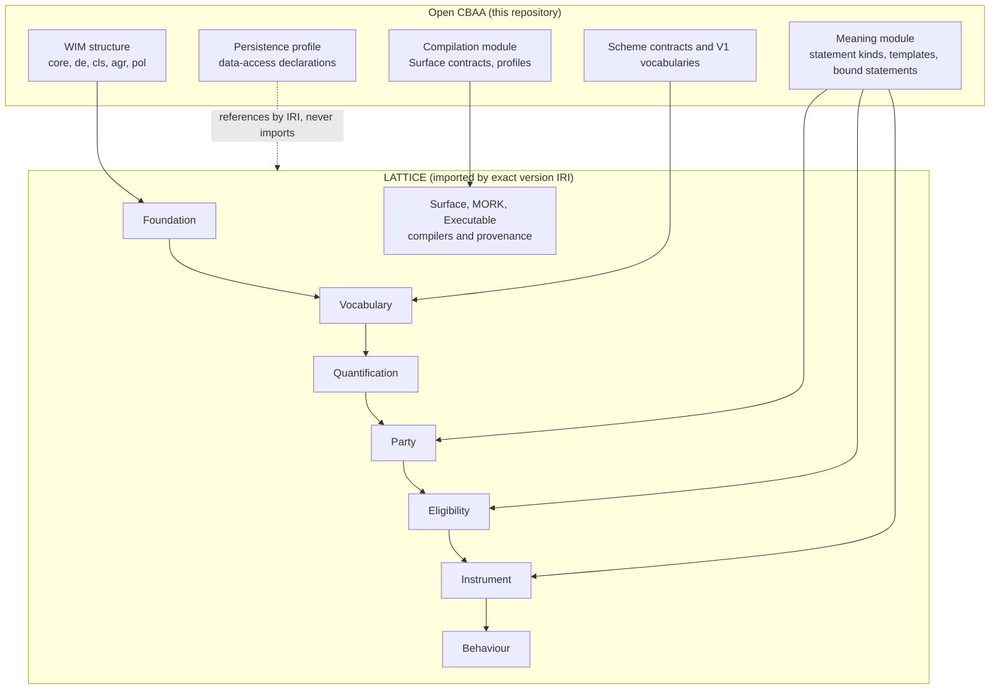

LATTICE is resolved through `ontology/catalog-v001.xml`, which maps each LATTICE version IRI to
its file at its release tag, so any ontology here opens in Protégé with its imports resolved.

### 1.2 T-Box and A-Box

The T-Box (the classes and properties) is deliberately thin. It holds what is structurally
different: the WIM's four levels, the statement kinds, the parameter structure. Everything
that changes often, or differs by market or deployment, lives in the A-Box as data: clause
classifications, perils, territories, agreement types, and every agreement itself
(design-spec DP1, DP2).

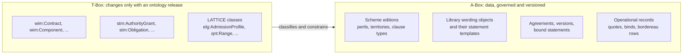

### 1.3 Seven planes

The A-Box is partitioned into planes by who writes them and how they change
(design-spec §8.1). Runtime reads only the compiled plane on hot paths. The rest keeps the full
detail that regulation and audit need.

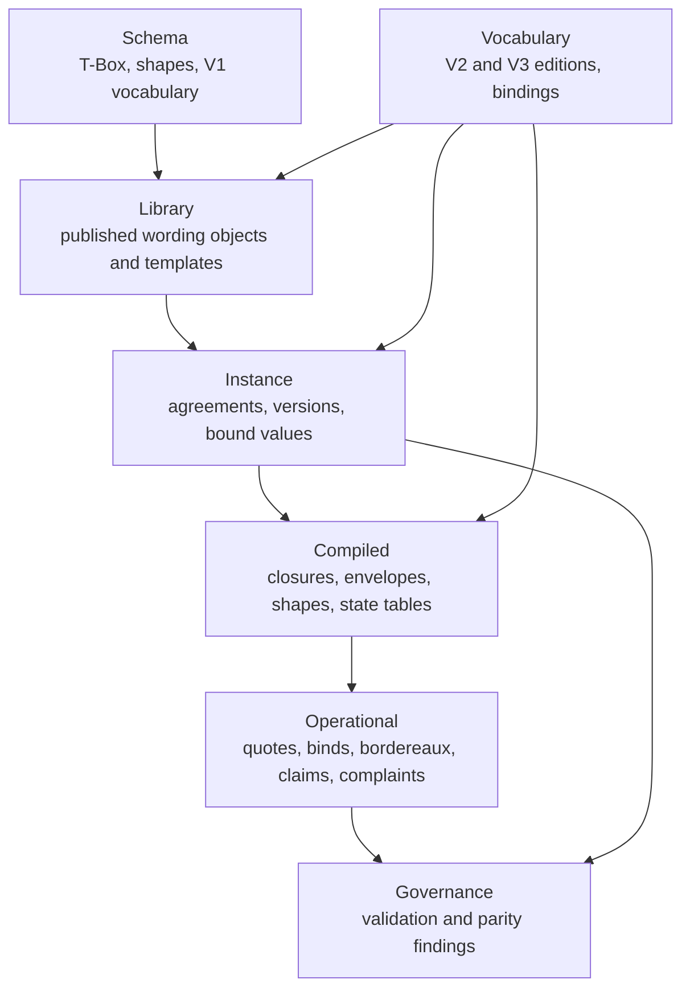

| Plane | Written by | Write pattern | Retention |
|---|---|---|---|
| Schema | ontology releases | versioned release | versioned |
| Vocabulary | scheme publishers | publication of editions | immutable editions |
| Library | the authoring tool | single writer, publication | immutable published versions |
| Instance | contract creators, amendment workflows | compare-and-set per agreement | full history |
| Operational | binding platforms, reporting, claims | append-only streams | per policy, erasable per subject |
| Compiled | compilers | regenerated from inputs | replaceable |
| Governance | validation runs | append | audit |

### 1.4 Three lifecycles

Three things change at different rates, and the design keeps them apart.

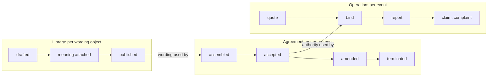

---

## 2. How data gets in

### 2.1 The sources

| Source | What arrives | Lands in | Route |
|---|---|---|---|
| LMA Wording Objects Library | wording objects: structure, text, variables, inclusion conditions | Library | structured publication, one named graph per object version |
| Market bodies (LMA, Lloyd's, ISO, ACORD) | scheme editions: perils, territories, risk codes, currencies | Vocabulary | edition publication, bound by scheme contracts |
| Deployments | V3 schemes extending V2 editions | Vocabulary | mapped into V2 with `skos:broadMatch` and `skos:exactMatch` |
| Meaning production | statement templates attached to wording | Library, after review | InsurLE compilation or LLM extraction, both reviewed (§2.3) |
| Contract Creators | an agreement: selected variants, variable values, parties | Instance | assembly in a contract builder, through the API |
| Binding platforms | quotes and binds, each a case | Operational | API calls, one event per case |
| Coverholders | bordereau rows | Operational | file upload mapped through MORK (§2.4) |
| Claims and complaints handlers | FNOLs, complaints | Operational | API calls |
| Reference data | exchange rates, calendars | Vocabulary, Operational | scheduled feeds |

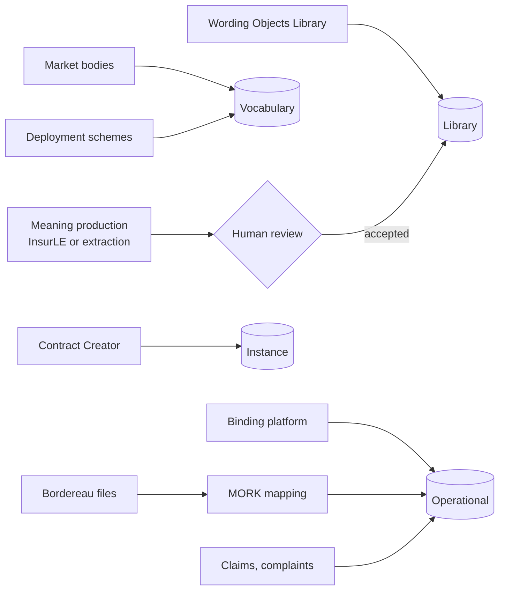

### 2.2 Library wording arrives structured

A published wording object already carries its WIM identity (`Cnn.X`, `SCnn.X.Y`), so its
structure is read, not guessed. Each paragraph becomes a WIM node, and the text inside it
becomes an ordered list of segments: plain text, a variable reference, or an object reference
(design-spec §7). Clause numbers are not stored. They are computed after inclusion is resolved
(DP10).

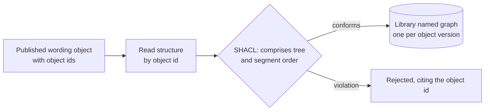

### 2.3 Meaning arrives as proposals

Meaning is attached once, to the library wording object version, as statement templates
(design-spec §3.4, §3.7). Two routes produce it, and a person accepts every proposal before
it becomes meaning.

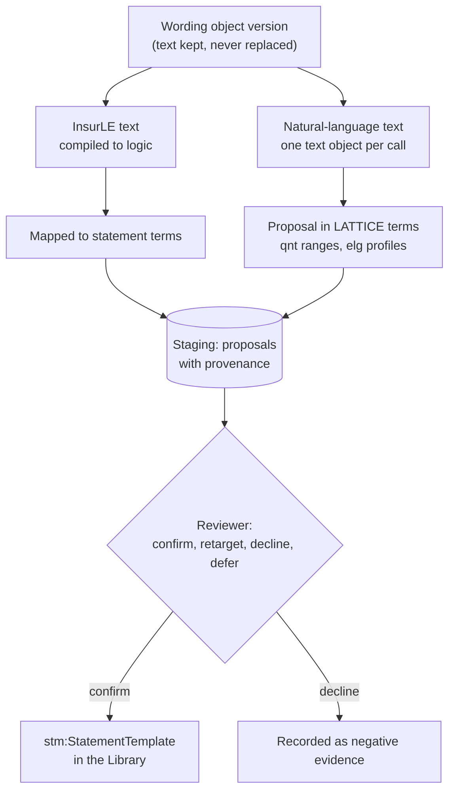

Reuse decides how much work each piece of text costs:

| Output | Reused by | Route | Review |
|---|---|---|---|
| Meaning template of a library wording | every agreement using the wording | MORK mapping, projected to statement templates | per item |
| An agreement's variable values | that agreement | already structured by assembly | none needed |
| A bespoke clause's meaning | that agreement | direct extraction to statements | per item |

### 2.4 Bordereaux arrive through mappings

A coverholder's bordereau layout is a source schema. MORK maps it to Open CBAA's case
properties once. The mapping is reviewed, then compiled to a deterministic transform, and
every later file in that layout runs through it without a model.

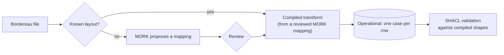

---

## 3. Design time: authoring with the T-Box

### 3.1 Class or concept

The T-Box gets a class only where instances need different properties, axioms or shapes. A
difference in classification alone is a SKOS concept (DP2). The WIM structure is kept as
classes. The clause and agreement type trees are concepts (design-spec §11).

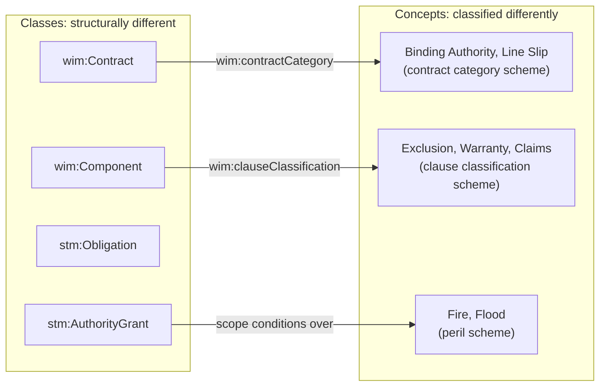

### 3.2 Authoring a wording object

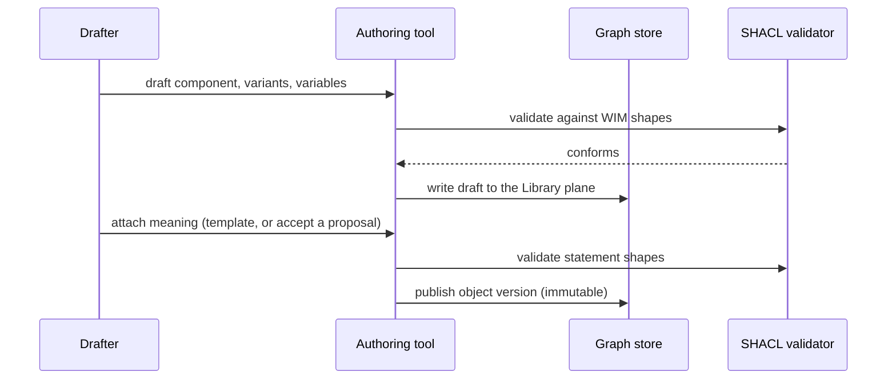

### 3.3 Checks the reasoner answers before anything runs

Because authority grants are data, generated OWL classes let a reasoner answer questions about
them with no instance data (integration spec §5.6).

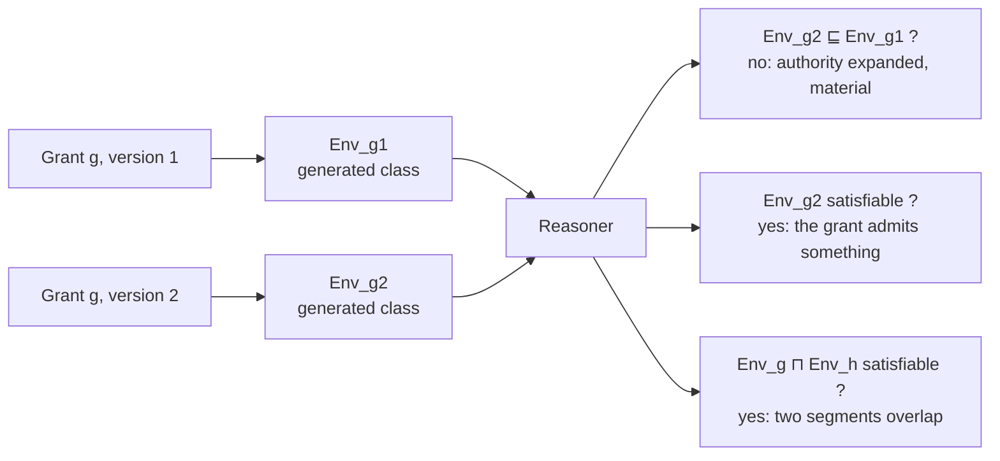

### 3.4 Governance checks

Governance runs over the union graph, not inside any one module. It checks that every
concept-valued property names a scheme contract (DP8), that deployment schemes map into the V2
editions they extend, that no dimension is left unconstrained by an empty set (DP9), and that
every compiled artefact traces to its inputs.

---

## 4. The ontology, one relation at a time

Each subsection shows one small group of related terms. Together they make up the data design.

### 4.1 The WIM structure

Four structural levels, joined by a transitive part-whole relation. Only direct edges are
asserted, and skip-level containment is entailed.

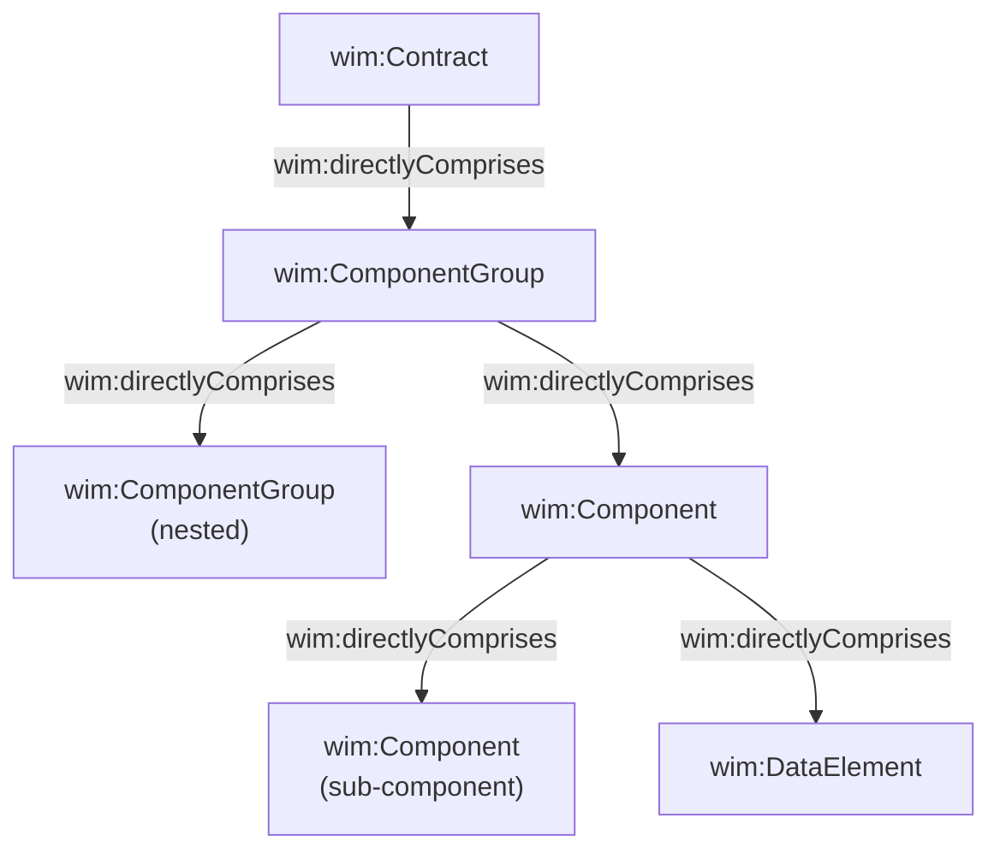

```text
directlyComprises ⊑ comprises           comprises is transitive
Contract       ⊑ ∀comprises.(ComponentGroup ⊔ Component ⊔ DataElement)
Component      ⊑ ∀comprises.(Component ⊔ DataElement)
DataElement    ⊑ ∀comprises.⊥
```

### 4.2 Data elements

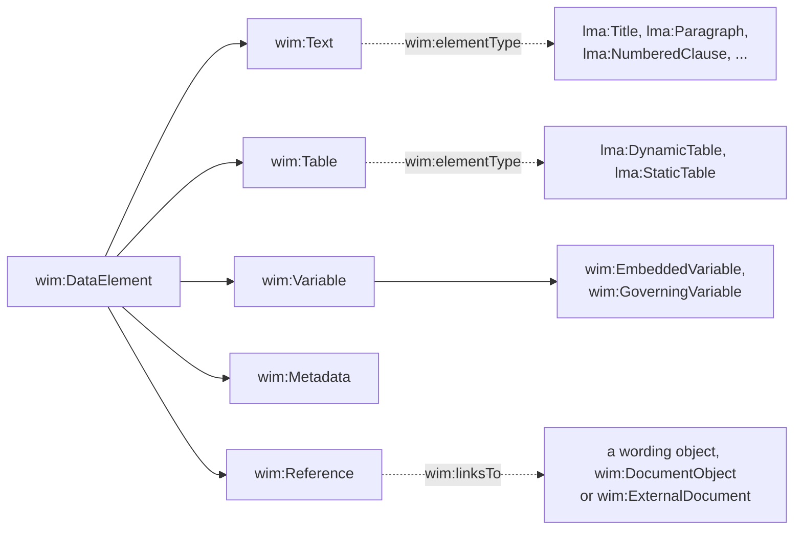

Solid arrows are subclasses. Text and table sub-types are concepts in the element type scheme,
since they differ only in classification.

### 4.3 Versions of a wording object

Each published version is immutable and sits in its own named graph. A new version supersedes
the old one, and agreements keep pointing at the version they were made with.

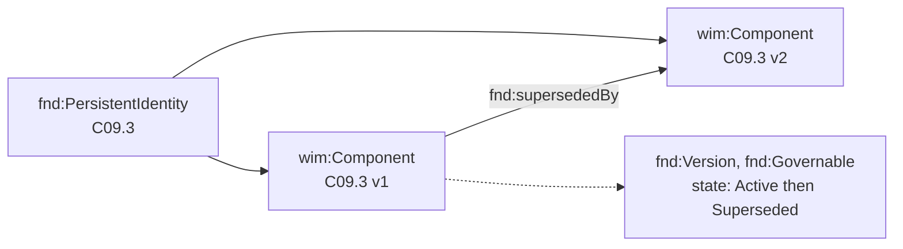

### 4.4 Variation slots and inclusion conditions

A slot holds a position in the structure. Its variants are alternatives, and exactly one is
included. Each variant is an ordinary wording object, `wim:variantOf` the slot and comprised by
the slot's parent. An inclusion condition decides, from the agreement's governing variables,
whether wording appears at all (design-spec §3.6).

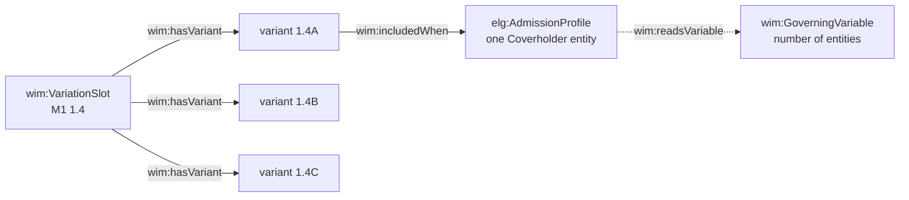

Inclusion conditions are evaluated once, at assembly and on amendment, by posing the
agreement's value for each governing variable as an `elg:Question`. They are never
evaluated per operational event, which is what the next relation, applicability, is for.

### 4.5 Text segments

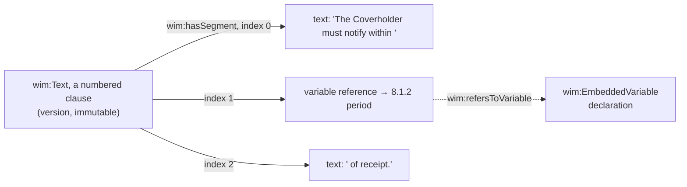

SHACL requires segment indices `0..n-1`, unique and contiguous, which gives closed-world
completeness without `rdf:List`.

### 4.6 Variables: declaration and value

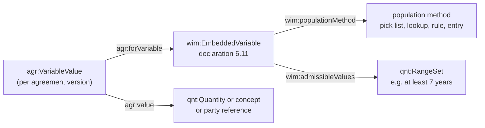

### 4.7 Statement kinds

A statement is the unit of attached meaning. Its kind fixes its parameter structure
(design-spec §3.3).

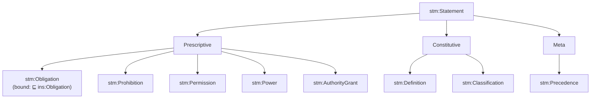

The kinds are pairwise disjoint. The prescriptive and constitutive split follows LegalRuleML.

### 4.8 Attachment: wording expresses meaning

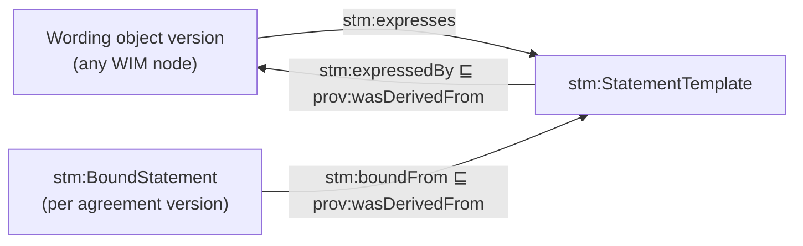

```text
StatementTemplate ⊓ BoundStatement ⊑ ⊥
BoundStatement    ⊑ =1 boundFrom.StatementTemplate
StatementTemplate ⊑ ∃expressedBy.WordingObject
```

A template names roles and variable declarations. A bound statement names role occupancies and
values. The meaning is extracted once per wording, and bound many times.

### 4.9 Parameters of an obligation

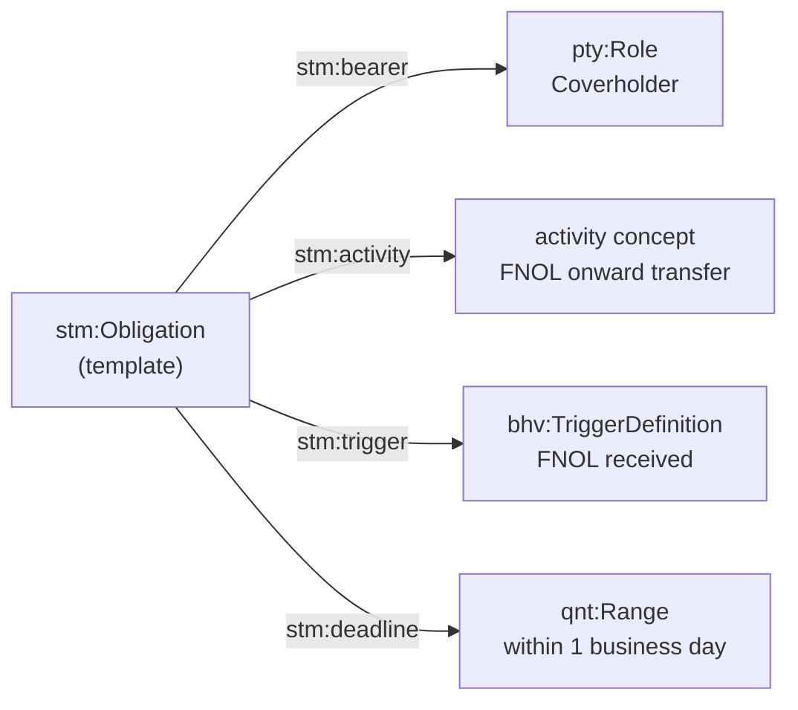

The deadline's value comes from the clause's variable through a `stm:ParameterBinding`. Once
bound, the obligation is an `ins:Obligation`, and `ins:obligor` and `ins:obligee` name the role
occupancies that owe and are owed.

### 4.10 Parameters of an authority grant

```mermaid
flowchart LR
    AG["stm:AuthorityGrant<br/>(template)"] -->|"stm:bearer"| R["pty:Role<br/>Coverholder"]
    AG -->|"stm:activity"| A["activity concept<br/>underwriting"]
    AG -->|"stm:hasParameterBinding"| P["scope parameters<br/>variable, case class, path"]
    AG -->|"stm:level"| L["qnt:OrdinalValue<br/>level of authority"]
```

```text
PrescriptiveStatement ⊓ StatementTemplate ⊑ =1 bearer.pty:Role ⊓ =1 activity.⊤
AuthorityGrant ⊓ BoundStatement ⊑ =1 scope.elg:AdmissionProfile
                                  ⊓ =1 bearerOccupancy.pty:RoleOccupancy
```

### 4.11 A grant's scope: one condition per dimension

```mermaid
flowchart TB
    P["elg:AdmissionProfile<br/>elg:AllRequired"] -->|"elg:hasCondition"| C1["contract type<br/>elg:SetMembership"]
    P -->|"elg:hasCondition"| C2["risk location<br/>elg:HierarchicalMatch"]
    P -->|"elg:hasCondition"| C3["sum insured<br/>elg:IntervalContainment"]
    C2 -->|"elg:requiredConcept"| FR["France"]
    C2 -->|"elg:excludedConcept"| CO["Corsica"]
    C2 -->|"elg:constrainedByContract"| SC["voc:SchemeContract<br/>territory"]
```

An exclusion beats an inclusion. A case valued strictly above an exclusion ("France", when
Corsica is excluded) is `Undetermined`, since it might or might not be in Corsica.

### 4.12 Where a condition reads its candidate

Conditions read the case's own properties through an evidence binding, rather than a
question object (LATTICE ADR-A91).

```mermaid
flowchart LR
    EB["elg:EvidenceBinding"] -->|"elg:bindsCondition"| C2["risk location condition"]
    EB -->|"elg:subjectClass"| RK["rsk:Risk<br/>(the case)"]
    EB -->|"elg:evidenceStep"| ST["elg:EvidenceStep<br/>index 0, forward"]
    ST -->|"elg:stepProperty"| RL["rsk:riskLocation"]
    EB -->|"elg:singleValued"| TRUE["true: one deemed<br/>location per risk"]
```

The case is the risk, because the CBAA's rules speak of where a risk "is deemed to be located",
one location per risk. A policy covering several risks gives several cases. The contract type
is read in two steps, the risk's policy and then its contract type, and both are single-valued.
The grant template's scope parameters carry these paths, and binding copies them into the
evidence bindings.

### 4.13 Amounts, bounds and currencies

```mermaid
flowchart LR
    RS["qnt:RangeSet"] -->|"qnt:hasRange"| R["qnt:Range"]
    R -->|"qnt:upperBound"| B["qnt:Bound<br/>closed"]
    B -->|"qnt:boundValue"| Q["qnt:Quantity<br/>5,000,000 GBP"]
    B -->|"qnt:alternativeBound"| B2["qnt:Bound<br/>5,750,000 EUR"]
    Q -->|"qnt:onSpace"| SP["qnt:ValueSpace<br/>money"]
```

A limit stated in several currencies is one bound per currency. Each case amount is read in
its own currency, never converted. A case in a currency with no stated limit is `Undetermined`.

### 4.14 Scheme contracts and editions

```mermaid
flowchart LR
    PROP["rsk:riskLocation"] -.->|"named by"| SC["voc:SchemeContract<br/>territory"]
    SB1["voc:SchemeBinding"] -->|"voc:forContract"| SC
    SB1 -->|"voc:bindsScheme"| E1["voc:ConceptScheme<br/>ISO 3166, 2026 edition"]
    SB1 -->|"voc:bindingScope"| BS["voc:BindingScope<br/>Lloyd's market"]
    SB1 -.-> TS["fnd:TemporalScope<br/>valid from 2026-01-01"]
```

The binding in force is resolved from an instant and a scope, never from the time of the
query. An agreement version records the bindings it was made under, so it keeps meaning what it
meant.

### 4.15 Parties and roles

```mermaid
flowchart LR
    RO["pty:RoleOccupancy"] -->|"pty:occupiedBy"| A["pty:Actor<br/>Harbour Underwriting Ltd"]
    RO -->|"pty:inRole"| R["pty:Role<br/>Coverholder"]
    AV["agreement version"] -->|"agr:hasOccupancy"| RO
    RO -.-> T["fnd:TemporallyScoped"]
```

### 4.16 Insurers and several liability

```mermaid
flowchart LR
    PG["pty:ParticipationGroup<br/>the insurers"] -->|"pty:hasCompositionRule"| SEV["pty:SeveralOnly"]
    GM1["pty:GroupMembership<br/>pty:share 60%"] -->|"pty:memberOf"| PG
    GM2["pty:GroupMembership<br/>pty:share 40%"] -->|"pty:memberOf"| PG
    GM1 -->|"pty:memberOccupancy"| O1["Lead Insurer A's occupancy"]
    GM2 -->|"pty:memberOccupancy"| O2["Follow Insurer B's occupancy"]
```

### 4.17 Delegation

```mermaid
flowchart LR
    D["pty:Delegation"] -->|"pty:delegatesFrom"| RO1["occupancy: Coverholder<br/>(accountable)"]
    D -->|"pty:delegatesTo"| RO2["occupancy: Broker<br/>(performing)"]
    D -.-> T["fnd:TemporallyScoped"]
```

The broker performing Coverholder activities (M4 4.4) is a delegation, and the Coverholder
stays accountable.

### 4.18 Agreement identity, versions and amendments

```mermaid
flowchart LR
    ID["fnd:PersistentIdentity<br/>(opaque surrogate)"] --> V1["agreement version 1<br/>accepted"]
    ID --> V2["agreement version 2<br/>after amendment"]
    V1 -->|"fnd:supersededBy"| V2
    AM["agr:Amendment"] -->|"produces"| V2
    UMR["UMR<br/>claimed key, unique per market"] -.-> ID
```

An amendment that changes the Coverholder legal entity, the Lead Insurer or the broker number
ends the agreement and mints a new identity, rather than a new version (M3 3.9.1).

### 4.19 Lifecycles

```mermaid
stateDiagram-v2
    [*] --> Active: accepted
    Active --> Suspended: insolvency of any party<br/>(external stimulus, immediate)
    Active --> NoticeServed: notice served<br/>(manual activation)
    NoticeServed --> Terminated: notice period expires<br/>(scheduled trigger)
    Suspended --> Active: rectified in time
    Suspended --> Terminated: rectification period expires
    Terminated --> RunOff
    RunOff --> Closed: every policy expired and every claim resolved<br/>(derived trigger)
```

Each transition is a `bhv:TransitionDefinition` with a trigger, and a guard that is an
`elg:AdmissionProfile`. State gates evaluation of a case, but never takes part in comparing
authority envelopes (DP6).

### 4.20 Aggregate limits

```mermaid
flowchart LR
    AD["bhv:AllowanceDefinition<br/>GWP limit, per year of account"] --> AA["bhv:AllowanceAccount<br/>agreement, segment, period"]
    EV["bind event<br/>premium 12,000 GBP"] -->|"consumes"| AA
    AA -->|"crosses 80%"| TH["threshold event<br/>notification (M5 SoUA row 47)"]
```

### 4.21 Provenance

```mermaid
flowchart RL
    DEC["decision on a case"] -->|"prov:wasDerivedFrom"| ART["compiled artefact"]
    ART -->|"prov:wasDerivedFrom"| BS["bound statement"]
    BS -->|"stm:boundFrom"| TP["statement template"]
    TP -->|"stm:expressedBy"| W["wording object version"]
    ART -->|"prov:wasDerivedFrom"| ED["scheme edition"]
```

---

## 5. Runtime: hydrating the A-Box

### 5.1 One named graph per aggregate

```mermaid
flowchart TB
    subgraph Library
        L1[("C05.2 v3")]
        L2[("C09.3 v2")]
    end
    subgraph Instance
        A1[("agreement version<br/>BA-2026-001 v1")]
        A2[("agreement version<br/>BA-2026-001 v2")]
        ROW["version row:<br/>head = v2, sequence 2"]
    end
    subgraph Operational
        S1[("case stream<br/>BA-2026-001")]
        P1[("per-subject graph<br/>complainant")]
    end
    A1 & A2 -. "uses" .-> L1
    S1 -. "judged under" .-> A2
```

An accepted agreement version is immutable. The version row, kept apart from the payload, is
the only thing updated, by compare-and-set. People sit in their own graphs, so erasure drops a
graph.

### 5.2 Assembling an agreement version

```mermaid
sequenceDiagram
    participant CC as Contract Creator
    participant API as HTTP API
    participant G as Graph store
    participant Q as Message broker
    participant C as Compiler worker
    CC->>API: governing variables, selections, parties
    API->>G: read library templates and inclusion conditions
    API->>API: resolve inclusion, bind variables, bind statements
    API->>G: write agreement version graph (compare-and-set on version row)
    API->>Q: command.compile (agreement version, input hash)
    Q->>C: deliver
    C->>G: read version, pinned editions
    C->>G: write compiled artefacts with provenance
    C->>Q: event.compiled (agreement version, artefact hashes)
```

### 5.3 A worked agreement, piece by piece

The agreement: Harbour Underwriting Ltd is the Coverholder. Lead Insurer A takes 60% and Follow
Insurer B 40%, with a broker. The grant covers insurance, risks in France except Corsica, and
sums insured up to GBP 5,000,000 or EUR 5,750,000. The whole agreement, with its library
wording, an amendment and the four cases below, is
[ontology/examples/ba-2026-001.ttl](../ontology/examples/ba-2026-001.ttl).

**The agreement and its parties**

```mermaid
flowchart LR
    V["ex:BA-2026-001-v1<br/>agr:AgreementVersion"] -->|"agr:hasOccupancy"| RO1["Harbour Underwriting<br/>as Coverholder"]
    V -->|"agr:hasOccupancy"| RO2["Lead Insurer A"]
    V -->|"agr:hasOccupancy"| RO3["Follow Insurer B"]
    V -->|"agr:hasOccupancy"| RO4["the Broker"]
```

**The bound grant**

```mermaid
flowchart LR
    BG["ex:grant-uw<br/>stm:BoundStatement, stm:AuthorityGrant"] -->|"stm:boundFrom"| TP["template on C05.2 v3"]
    BG -->|"stm:bearerOccupancy"| RO1["Harbour as Coverholder"]
    BG -->|"stm:scope"| P["ex:scope-uw<br/>elg:AdmissionProfile"]
```

**The scope, bound to this agreement's values**

```mermaid
flowchart LR
    P["ex:scope-uw"] --> C1["contract type ∈ {Insurance}"]
    P --> C2["risk location: France,<br/>excluding Corsica"]
    P --> C3["sum insured ≤ 5,000,000 GBP<br/>or ≤ 5,750,000 EUR"]
```

**The pinned editions**

```mermaid
flowchart LR
    V["ex:BA-2026-001-v1"] -->|"voc:resolvedUnder"| B1["territory binding<br/>ISO 3166, 2026 edition"]
    V -->|"voc:resolvedUnder"| B2["contract type binding"]
```

**Four cases arrive**

```mermaid
flowchart LR
    R1["risk: Lyon<br/>3,000,000 GBP"] --> OK["Permitted"]
    R2["risk: Ajaccio, Corsica<br/>1,000,000 GBP"] --> NO["Denied<br/>excluded location"]
    R3["risk: 'France'<br/>2,000,000 GBP"] --> U1["Undetermined<br/>above an exclusion"]
    R4["risk: Nice<br/>2,000,000 USD"] --> U2["Undetermined<br/>no limit in USD"]
```

**One decision record**

```mermaid
flowchart LR
    D["elg:EligibilityDecision"] -->|"elg:decisionValue"| UV["elg:Undetermined"]
    D -->|"for case"| R3["risk: 'France'"]
    D -->|"diagnostic"| DG["exe:AboveExclusion"]
    D -->|"prov:wasDerivedFrom"| ART["compiled scope query"]
```

### 5.4 Time on every record

| Time | Recorded on | Why |
|---|---|---|
| transaction time | every write | reproduce what the graph said at any moment |
| valid time | agreement versions, amendments, surviving statements | an amendment can take effect retrospectively (M3 3.20) |
| agreed date | amendments | when the parties agreed it |
| operational date | amendments | when it is implemented before its legal effect (M3 3.22) |

A case is judged by the agreement version valid when it was bound, not by the version in force
when the question is asked.

---

## 6. From expression to executable

### 6.1 One intermediate representation, several outputs

Every compiled form comes from the same intermediate representation (IR), so a grant cannot
mean one thing at bind time and another in a bordereau check (LATTICE ADR-A24).

```mermaid
flowchart LR
    P["elg:AdmissionProfile<br/>+ evidence bindings<br/>+ pinned editions"] --> IR["Shared IR<br/>interval, concept and profile plans"]
    IR --> SP["SPARQL<br/>runtime decision query"]
    IR --> SH["SHACL<br/>bordereau shapes"]
    IR --> SW["SWRL<br/>positive-only rules"]
    IR --> OW["OWL<br/>design-time classes"]
    IR --> SF["Surface<br/>runtime envelope table"]
    SP & SH & SW & OW & SF --> PV["exe: plans and fnd:DerivedArtefact<br/>provenance, input hashes"]
```

### 6.2 The IR for one condition

```text
ConceptPlan  risk location
  strategy   HierarchicalMatch
  required   France
  excluded   Corsica
  scheme     ISO 3166, 2026 edition (resolved from the pinned binding)
  expansion  France → Permitted, Île-de-France → Permitted, ...,
             Corsica → Denied, Haute-Corse → Denied, Europe → Undetermined, ...
  evidence   subject rsk:Risk, path rsk:riskLocation, single-valued
```

### 6.3 SPARQL: the runtime decision

The SPARQL query is the reference evaluation. It returns one row per case with a decision and,
for every `Undetermined`, the reason.

```text
case            decision        diagnostic
risk-lyon       Permitted
risk-ajaccio    Denied
risk-france     Undetermined    exe:AboveExclusion
risk-nice-usd   Undetermined    exe:NoBoundInUnit
risk-no-loc     Undetermined    exe:MissingCandidate
```

A profile combines its conditions by strong Kleene logic: under `elg:AllRequired`, one `Denied`
gives `Denied`, otherwise one `Undetermined` gives `Undetermined`.

### 6.4 SHACL: validating bordereau rows

```mermaid
flowchart LR
    SH["sh:NodeShape<br/>target: rsk:Risk"] -->|"sh:sparql"| Q["containment check<br/>from the IR"]
    ROW["bordereau row as rsk:Risk"] --> V{"SHACL engine"}
    SH --> V
    V -->|"conforms"| OK["accepted"]
    V -->|"violation"| REP["report: focus node, message,<br/>generating plan → grant → wording"]
```

A violation cites the plan that generated the shape, and through provenance the grant and
wording it came from.

### 6.5 SWRL: positive facts only

SWRL rules derive only what positive facts support: a case is `permittedUnder` a condition, or
`deniedUnder` it when an enumerated denied concept is present. They never derive `Undetermined`
and never reason from absence (LATTICE ADR-A24). They serve deployments that run a rule engine
and want those facts materialised.

### 6.6 OWL: classes for design-time questions

```text
Env_g ≡ rsk:Risk
        ⊓ ≤1 ofPolicy ⊓ ∃ofPolicy.(≤1 contractType ⊓ ∃contractType.{Insurance})
        ⊓ ≤1 riskLocation ⊓ ∃riskLocation.(Within(France) ⊓ ¬Within(Corsica))
        ⊓ ≤1 sumInsured ⊓ ∃sumInsured.( (∃qnt:inUnit.{GBP} ⊓ ∃qnt:numericValue.owl:real[≤ 5000000])
                                      ⊔ (∃qnt:inUnit.{EUR} ⊓ ∃qnt:numericValue.owl:real[≤ 5750000]) )

Within(c): the class of territory concepts at c or below
   {c} ⊑ Within(c)        Within(d) ⊑ Within(c) when d skos:broader c
```

These classes are never used to decide a case. They answer questions about grants: did an
amendment expand authority, does a segment admit anything, do two segments overlap. The answer
is recorded as an `exe:DesignTimeCheck`.

### 6.7 Surface: the runtime envelope table

For the point of bind, where a query must be fast, Surface restates reachable values locally:
the territory closure for the pinned edition, and the grant's parameters flattened onto one
row per dimension.

```text
agreement version     dimension      admitted                excluded
BA-2026-001-v1        contractType   Insurance
BA-2026-001-v1        riskLocation   FR and descendants      FR-20R and descendants
BA-2026-001-v1        sumInsured     ≤ 5000000 GBP | ≤ 5750000 EUR
```

### 6.8 Staleness and regeneration

```mermaid
flowchart LR
    IN1["agreement version graph<br/>hash h1"] --> RS["srf:ReadSetEntry<br/>per input"]
    IN2["territory edition<br/>hash h2"] --> RS
    RS --> ART["compiled artefact"]
    CH{"any current hash<br/>differs from the read set?"} -->|"yes"| REG["regenerate"]
    CH -->|"no"| KEEP["artefact is current"]
    ART --> CH
```

A new scheme edition regenerates the closures and every envelope that used them. A new
agreement version regenerates that agreement's artefacts only.

---

## 7. Following the data through a binder's year

Each subsection follows one event through the A-Box, and says what it adds to today's practice.

### 7.1 Bind

```mermaid
sequenceDiagram
    participant BP as Binding platform
    participant API as HTTP API
    participant G as Graph store
    BP->>API: quote: risk in 'France', 2,000,000 GBP
    API->>G: write case to the Operational plane
    API->>G: run the compiled decision query for the version in force
    G-->>API: Undetermined, exe:AboveExclusion
    API-->>BP: refer: location known only as France,<br/>Corsica is excluded (C05.2 v3, row 12)
    BP->>API: location refined: Lyon
    API->>G: re-evaluate
    G-->>API: Permitted
```

Today a missing or coarse location either passes silently or fails. Here it becomes a referral
that names what is missing and which clause needs it.

### 7.2 Report

```mermaid
flowchart LR
    F["monthly bordereau"] --> X["compiled layout transform"]
    X --> CASES["cases in the Operational plane"]
    CASES --> SH{"SHACL, compiled shapes"}
    SH --> REP["report per row, citing the clause"]
    CASES --> ACC["allowance account<br/>GWP for the year"]
    ACC -->|"crosses threshold"| EVT["notification event"]
```

Today, out-of-authority business is found when a bordereau is reviewed, weeks after binding.
Here the bordereau confirms what was already checked at bind, and the aggregate limit is live
state.

### 7.3 Amend

```mermaid
sequenceDiagram
    participant U as Underwriter
    participant API as HTTP API
    participant Q as Message broker
    participant C as Compiler
    participant R as Reasoner
    participant G as Graph store
    U->>API: propose: add Belgium, lower a sub-limit, remove a peril
    API->>G: write proposed version v2 (not yet in force)
    API->>Q: command.compile v2
    Q->>C: compile v2
    C->>G: write Env_g for v2
    C->>Q: event.compiled v2
    Q->>R: command.check subsumption v2 against v1
    R->>G: Env_g2 ⊑ Env_g1 ? no: territory grew
    R->>Q: event.checked: material, expansion in territory
    Q-->>U: approval required from the managing agent (M3 3.9.1)
```

Risks bound before the amendment's effective date are still judged by v1. Nothing is
reinterpreted retrospectively.

### 7.4 Audit

```mermaid
flowchart LR
    Q["Why was risk-lyon accepted?"] --> D["decision: Permitted"]
    D --> A["compiled query, input hashes"]
    A --> B["bound grant in v1"]
    B --> T["template on C05.2 v3"]
    A --> E["territory edition 2026"]
    B --> P["accepted by Lead Insurer A<br/>on 2026-01-15"]
```

The audit question is a SPARQL query over PROV-O links, answered with the versions and dates
that applied.

### 7.5 Obligations with deadlines

```mermaid
sequenceDiagram
    participant CL as Claimant
    participant API as HTTP API
    participant G as Graph store
    participant T as Scheduler
    CL->>API: first notification of loss
    API->>G: record FNOL occurrence (Operational)
    API->>G: instantiate obligation: onward transfer<br/>due 1 business day after receipt
    API->>T: schedule deadline (calendar resolved from the binding)
    T-->>API: deadline reached, no transfer recorded
    API->>G: record breach occurrence, obligation state: overdue
```

The deadline counts business days against the calendar the agreement's scheme binding names,
so "1 business day" means what it means in that jurisdiction.

---

## 8. Coordination between nodes

The design is technology-neutral (AP3). What follows names roles, not products.

### 8.1 Components

```mermaid
flowchart TB
    CL["Clients<br/>contract builders, binding platforms, portals"] --> API["HTTP API"]
    API --> G[("RDF graph store<br/>named graphs per aggregate")]
    API --> MB{{"AMQP broker"}}
    MB --> W1["Compiler workers"]
    MB --> W2["Validation workers"]
    MB --> W3["Evaluation workers"]
    MB --> W4["Reasoner workers"]
    MB --> W5["Ingestion workers<br/>bordereaux, meaning proposals"]
    W1 & W2 & W3 & W4 & W5 --> G
    W1 & W2 & W3 & W4 & W5 --> MB
    MB --> N["Notifier<br/>pushes results to clients"]
```

The HTTP API answers synchronous questions over the graph: the state of an agreement, a
decision on one case. Anything that takes longer, fans out, or must happen in order runs as
work over AMQP.

### 8.2 Why a message broker

- **Out of band.** Compilation, reasoning and bulk validation take longer than a request should.
- **Durable.** A command survives a crashed worker, and is redelivered.
- **Ordered where it matters.** Work for one agreement is routed by agreement, so its steps run
  in order.
- **Replayable.** Commands are recorded in the Operational plane before they are published, so
  a scenario can be replayed from the log.

### 8.3 Exchanges and routing keys

```text
exchange: cbaa.commands (topic)
  command.compile.agreement-version      agreement version, input hash
  command.check.materiality              proposed version, prior version
  command.validate.bordereau             file, agreement version
  command.ingest.meaning                 wording object version

exchange: cbaa.events (topic)
  event.written.<plane>.<aggregate>      after any committed write
  event.compiled.agreement-version       artefact IRIs and hashes
  event.checked.materiality              verdict, dimension
  event.validated.bordereau              report IRI
  event.result.<operation id>            outcome for a waiting client
```

### 8.4 Compile, then validate

A bordereau for an agreement version can only be validated against shapes compiled from that
version. If they are missing or stale, the validator does not guess. It asks for them, and
resumes when they are in the A-Box.

```mermaid
sequenceDiagram
    participant API as HTTP API
    participant MB as AMQP broker
    participant V as Validation worker
    participant C as Compiler worker
    participant G as Graph store
    API->>MB: command.validate.bordereau (v2, file)
    MB->>V: deliver
    V->>G: are v2's shapes compiled from its current input hash?
    G-->>V: no
    V->>G: record a waiting validation (process record)
    V->>MB: command.compile.agreement-version (v2, input hash)
    MB->>C: deliver
    C->>G: compile, write shapes and provenance
    C->>MB: event.compiled.agreement-version (v2, hashes)
    MB->>V: deliver
    V->>G: find waiting validations for v2, load shapes
    V->>G: validate rows, write report
    V->>MB: event.validated.bordereau, event.result.<op id>
```

The compile command carries the input hash, so two validators asking for the same compilation
produce one result: a compiler that finds the artefact already current acknowledges and
republishes the event.

### 8.5 Declared order

Compilations that depend on each other declare it in the graph, as a
`mork:dependsOnMapping` DAG. A worker takes the next compilation only when everything it
depends on is compiled and current.

```mermaid
flowchart LR
    C1["territory closure<br/>for the pinned edition"] --> C3["grant envelope"]
    C2["contract-type closure"] --> C3
    C3 --> C4["bordereau shapes"]
    C3 --> C5["decision query"]
    C3 --> C6["design-time classes"]
```

### 8.6 Consistency rules

```text
┌──────────────────────────────────────────────────────────────────────┐
│ The graph store is the source of truth.                              │
│ The broker carries notifications and work, never state.              │
├──────────────────────────────────────────────────────────────────────┤
│ • every command has an idempotency key, and consumers ignore repeats  │
│ • commands are recorded before they are published                     │
│ • writes to an agreement use compare-and-set on its version row       │
│ • every event can be re-derived by a query. A client that misses a    │
│   push polls the operation's status                                   │
│ • failed messages go to a dead-letter queue, never silently dropped   │
└──────────────────────────────────────────────────────────────────────┘
```

### 8.7 Scaling out

```mermaid
flowchart LR
    MB{{"broker"}} -->|"agreement A"| Q1["queue partition 1"]
    MB -->|"agreement B"| Q2["queue partition 2"]
    Q1 --> W1a["worker"]
    Q2 --> W2a["worker"]
    Q2 --> W2b["worker"]
```

Work is partitioned by agreement, so one agreement's steps stay ordered while different
agreements run in parallel on as many nodes as needed.

---

## 9. What this adds to today's practice

| Today | With this design | Where |
|---|---|---|
| Each system re-encodes the binder by hand, and the copies drift | one source of meaning, compiled into every form, all citing the clause | §6.1 |
| Out-of-authority risks found in bordereau review | checked at bind, against the version in force | §7.1 |
| Missing data passes or fails silently | `Undetermined` with a named reason, which becomes a referral | §6.3 |
| Nested, regulatory territory rules applied by hand | hierarchy-aware matching over a pinned edition, with exclusions | §4.11 |
| Endorsements read by a person to judge materiality | a reasoner proves whether authority expanded | §7.3 |
| Overlapping arrangements found in a dispute | overlap checked before binding | §3.3 |
| Limits in several currencies converted ad hoc | each currency read in its own unit, no silent conversion | §4.13 |
| Aggregate limits tracked in spreadsheets | an allowance account with threshold events | §4.20 |
| "What did the binder allow on that day?" reconstructed from documents | versions and editions are time-scoped, so any decision can be replayed | §5.4 |
| Audit by sampling | the audit question is a provenance query | §7.4 |
| Deadlines kept in diaries | obligations with triggers and business-day deadlines | §7.5 |

---

## 10. Where things stand

| Part | State |
|---|---|
| Wording structure (`wim`), with typing reclassified into provisional schemes (`lma`) | authored as static ontologies with shapes (plan step 3) |
| LATTICE layers and compilers (SPARQL, SHACL, SWRL, OWL, Surface) | built upstream, released by tag |
| Import resolution | `ontology/catalog-v001.xml`, generated from LATTICE's release register |
| Meaning, agreements and the case (`stm`, `agr`, `rsk`) | authored as static ontologies with shapes and the worked agreement of §5.3 (plan step 4). Decisions D17 to D26 await ratification |
| Scheme contracts and vocabularies | authored. Deployment editions (territories, perils, currencies) are bound per market, not shipped |
| Compilation and persistence modules | designed, not authored (plan step 5) |
| Lifecycles | M12 declared on Behaviour. The others designed, not authored (plan step 6) |
| HTTP API, broker, workers | outside this repository (AP1). See the [proof-of-concept notes](discovery/poc-ideas.md) |
| Meaning production (InsurLE, extraction) | outside this repository. See design-spec §3.7 and LATTICE's ingestion vision |

Open questions that affect this picture are listed in the integration specification's §10
(I7 to I10) and the [plan](development/plan.md).
