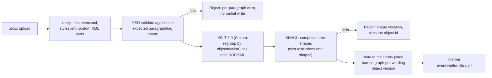
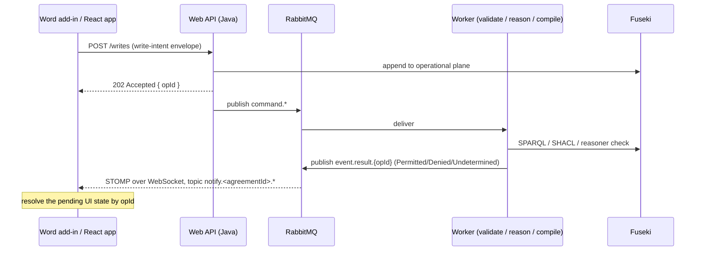
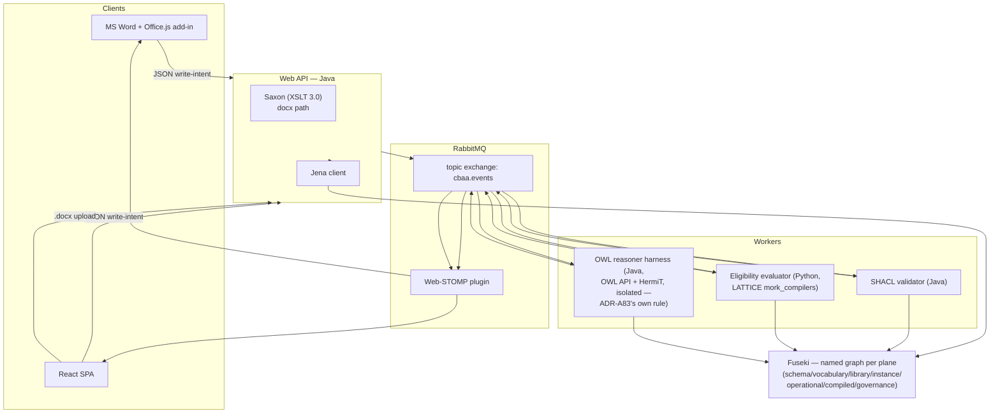

# Proof-of-Concept Architecture — Discovery Notes

Status: discovery, 2026-09-25. Companion to [the vision and demo ideation](../design/ideation.md),
whose acts and minimum slice (§5) this design exists to make real, and to the
[discovery illustration](index.html), whose six acts currently run on scripted data.

This is a planning artefact, not a specification. Nothing here is decided until it appears in
the decisions table at the end.

## 1. Scope and Repository

AP1 says this repository holds no reference implementation. That stands until you amend it.
So: the prototype's code lives in a new repository, not here. The relationship mirrors the one
this repository already has with LATTICE — the prototype repository imports this repository's
ontology sources (a pinned submodule, the way this repository pins LATTICE), never the reverse.
That keeps AP2 intact: the ontological layers govern the software, not the other way round.

One thing needs your sign-off before any of this starts: whether AP1's wording gets a carve-out
for a POC repository, or stays as written with the POC simply understood to sit outside its
scope. I'd rather you settle that than have me redefine a principle you set.

## 2. Goals and Non-Goals

**Goal.** Make three of the six acts in the walkthrough real, over one M5 example, replacing the
scripted transitions in [index.html](index.html) with data computed by an actual graph, a real
SHACL/SPARQL evaluation, and a real OWL reasoner:

- **Act 2, Bind** — four risks evaluated against a real `AuthorityGrant`, not a `data-status`
  attribute.
- **Act 4, Amend** — materiality decided by an actual subsumption check between two compiled
  envelope classes, not a scripted verdict.
- **Act 5, Audit** — a provenance chain read by a real query, not a hand-written array.

This is the ideation note's own minimum slice (§5). Acts 1, 3 and 6 (Assemble, Report,
Obligations) are stretch goals: worth having, not required to prove the thesis.

**Non-goals for a first cut.** A general contract-authoring platform (the ideation note already
rejects that, §3). Full statement-kind coverage — one `AuthorityGrant` per demo risk is enough.
Behaviour lifecycles and state machines. Production authentication and multi-tenancy. Automated
extraction of meaning — InsurLE compilation and LLM extraction are the long-term routes
(design-spec §3.7), developed outside this repository and this POC. The POC keeps their landing
place open (§5.4): every statement it holds could have arrived as a reviewed suggestion.

## 3. Two Planes This Design Must Not Conflate

The design specification already separates wording from meaning (§3, DP3) and the demo's own
account of validation depends on both being ingested through different routes:

| | Wording ingestion | Meaning attachment |
|---|---|---|
| Produces | `wim:Contract` / `ComponentGroup` / `Component` / `DataElement` graph, `Text` content | `AuthorityGrant`, `Obligation` and other statements |
| Route | `.docx` → XSLT → RDF (§4) | the Word add-in, or an internal tool, writing directly (§5). Later, suggestions from InsurLE compilation or LLM extraction, reviewed in the same tools (§5.4) |
| Runs | once per published wording object version | once per statement, bound per agreement version |
| Automatic? | yes, from a well-formed document | no — a person authors it, or accepts a proposal (design-spec §3.7) |

The docx pipeline in §4 fills the **library plane** with structure. It does not, and should not,
guess that a SoUA table row is an `AuthorityGrant` with a territory and a limit. A silent
inference would put a claim about authority into the graph with nobody having asserted it.
Meaning arrives through its own route, authored or proposed and then accepted by a person
(design-spec §3.7).

The two planes still meet. The structure §4 produces is what extraction needs: one text object
at a time, with its variables and object id, rather than a whole document. So the wording
pipeline is also the chunking step of the future ingestion route.

## 4. Ingesting Wording: OOXML → XSLT → RDF

The proposal is sound, with one precondition that needs stating up front.

### 4.1 What a `.docx` actually is

A ZIP archive holding, among other parts, `word/document.xml` (the body), `word/styles.xml`
(paragraph and character styles), and `word/numbering.xml` (list definitions). Unzipping and
running XSLT over `document.xml` is exactly the right shape of tool for a known, fixed
structure — XSLT's `xsl:for-each-group` handles the regrouping from a flat sequence of
paragraphs into the nested `comprises` tree in one pass, and Saxon-HE (open source, a Java
library) gives XSLT 3.0, so the transform can run embedded in the same JVM as the rest of the
Java backend (§6.2) with no separate service.

### 4.2 The precondition: numbering is not identity

The CBAA drafts number clauses using Word's native multilevel list numbering
(`numbering.xml` plus a list-level reference on each paragraph). That number is computed by
Word, not stored as text, so an XSLT template matching on visible text such as `"5.15.10"` will
not find it in `document.xml` — it would have to resolve the numbering definition itself, which
is fragile and duplicates work Word already recorded, poorly, elsewhere.

This is also already a decided principle, DP10: *identity is not position*. Clause numbers are
display, computed after inclusion is resolved, and object identity is the WIM object id and its
version. The docx source needs the same discipline applied one step earlier: **the object id
(`Cnn.X`, `SCnn.X.Y`) and its WIM class must be carried as an explicit, machine-readable tag on
each paragraph, not derived from the numbering that renders it.**

Recommended mechanism: a **custom XML part** per structural node (Word supports arbitrary
XML parts bound to a range via content controls, read and written through
`document.customXmlParts` — reachable from Office.js, see §5.1), carrying `{ objectId,
wimClass, includes: boolean }`. Two ways to get there:

1. A one-time migration pass over the existing CBAA drafts, scripted, that reads the current
   numbering and stamps each paragraph with its computed id and class once.
2. Going forward, an authoring add-in (a lighter sibling of the write add-in in §5) that
   stamps new paragraphs as they're drafted, so migration is a one-off cost, not a standing one.

Do this before writing the XSLT, not after. Without it, the transform is matching on the wrong
thing and every drafting change that shifts a number would look like a structural change to the
graph, which is precisely what DP10 exists to prevent.

### 4.3 Pipeline stages



Two validation gates, both synchronous and both fast enough to run inline in the HTTP request,
because they operate on one document, not the whole store:

- **Structural pre-check** (an XSD, or an XSLT assertion pass) over the unzipped XML, before the
  RDF transform runs, so a missing tag fails with "paragraph 14 has no `wimClass`", not a
  malformed graph three steps downstream.
- **SHACL**, immediately after the transform, checking the same constraints `ontology/wim` already
  states as OWL restrictions (a `Component` may not comprise a `ComponentGroup`, and so on).
  Cheap over one document's data, so no reason to defer it to a worker.

### 4.4 Structural mapping (illustrative, using the ontology's actual terms)

| Word construct | WIM term | Note |
|---|---|---|
| custom-XML-tagged range, `wimClass: ComponentGroup` | `wim:ComponentGroup` | nestable — a Module or an Endorsement, per the tag |
| custom-XML-tagged range, `wimClass: Component` | `wim:Component` | |
| a numbered paragraph | `data-element:NumberedClauseText` | subclass of `Text` |
| a nested sub-paragraph | `data-element:NestedClauseText` | |
| a heading-styled paragraph | `data-element:Title` | |
| a Word table, `wimClass: DynamicTable` vs `StaticTable` | `data-element:DynamicTable` / `data-element:StaticTable` | the tag disambiguates, not the OOXML table shape |
| a merge field or content control bound to a governing variable | `data-element:GoverningVariable` or `EmbeddedVariable` | per the tag |
| direct containment between adjacent tagged ranges | `wim:directlyComprises` | asserted; `comprises`'s transitive closure is left to the reasoner or materialised at load, per the store's choice (§6.3) |

Everything else in `document.xml` — run-level formatting, track changes, comments — is dropped.
None of it is WIM structure.

### 4.5 What this does not decide

Whether the transform's output IRIs are minted from the object id directly
(`.../wol/M5/C05.2`) or from a separate surrogate with the object id as a claimed key (the
identity pattern design-spec §8.3 already uses for agreements) is open — recommend the surrogate
pattern for consistency, since a wording object's id, like the UMR, can in principle be
corrected without changing what the object is. Not urgent for a POC with one example document.

## 5. Writing Meaning: the Word Add-in

### 5.1 Office.js, not VSTO

VSTO add-ins are Windows-only, need a signed installer, and are a legacy model Microsoft is
moving away from. An Office.js task pane add-in is cross-platform (Windows, Mac, Word on the
web), sideloadable from a manifest with no install step — a real advantage for a demo that needs
to run on whatever machine is in the room — and its Word JavaScript API already reaches content
controls and custom XML parts, which is all §4.2's tagging needs. Recommend Office.js unless a
specific requirement surfaces that only VSTO's deeper COM object model can satisfy; none has so
far.

### 5.2 A shared write-intent envelope

Both write paths — the add-in's JSON and, later, any other client — should normalize to the same
shape before anything downstream sees them, so validation, persistence and eventing have exactly
one code path regardless of origin:

```json
{
  "opId": "b3f1…",
  "actor": "urn:cbaa:demo-actor:lead-underwriter",
  "subject": "urn:cbaa:wol:M5:C05.2:row12",
  "operation": "attach-statement",
  "payload": {
    "kind": "AuthorityGrant",
    "scope": { "territory": ["fr"], "excluding": ["fr-20r"] },
    "limit": { "amount": 5000000, "currency": "GBP" }
  },
  "timestamp": "2026-09-25T10:03:00Z"
}
```

The HTTP API's job is to turn either a `.docx` upload or one of these envelopes into the same
internal command before anything touches Jena or RabbitMQ. That's a routing decision on
content type (`multipart/form-data` with a `.docx` part vs `application/json`), not two services.

### 5.3 Post-write round trip

This is the real design question in the brief, and it deserves a named pattern rather than an ad
hoc callback:

1. The API accepts the envelope, assigns it `opId` if the client didn't, and returns
   **`202 Accepted`** immediately with `{ opId }`. It does not wait for validation.
2. The command is persisted to the **operational plane** first, append-only, before anything
   else happens — design-spec §8.1's own rule for this plane. This is the record a demo reset
   replays from (§9).
3. The command is published to RabbitMQ (§6.4). Workers pick it up, validate, and (if it
   passes) write the result into the instance or compiled plane.
4. Each worker publishes a result event carrying the same `opId`, routed to a topic scoped by
   the agreement — `notify.<agreementId>.*` — which the browser or the add-in is already
   subscribed to over STOMP (§6.5).
5. The client matches the incoming event to the `opId` it's holding a pending UI state for
   (a spinner, a "checking…" badge — the same visual language Act 2 already uses for `pending`)
   and resolves it to `Permitted` / `Denied` / `Undetermined`, with the reason, exactly as
   rendered today.
6. **The socket is not the source of truth.** If it drops mid-demo, the client's fallback is to
   poll `GET /ops/{opId}` — the same status any worker would have published, held in the
   operational plane regardless of whether the socket delivered it. Never build a code path that
   only works if the WebSocket stayed open.



### 5.4 Suggestions and review

Extraction is not built in the POC. Its landing place is, cheaply, because it reuses §5.2 and
§5.3:

- A `suggest-statement` envelope carries a proposed statement, in the same payload shape as
  `attach-statement`, plus its provenance: the text object version, the producing activity
  (InsurLE compilation or LLM extraction), and the model and packaged ontology used.
- Suggestions are kept apart from statements (where is design-spec I10). The original text is
  never modified.
- The add-in shows a suggestion beside its source text. `accept-suggestion` turns it into a
  statement and records the review as an activity by the reviewer. `reject-suggestion` records
  the rejection. Both are ordinary write intents, so they reach the operational plane and replay
  like any other write.

For the demo's optional prelude (ideation §5), the suggestion is prepared in advance.

## 6. Backend Architecture



### 6.1 Web API (Java)

Owns: docx unzip and XSLT (embedded Saxon-HE, no separate service, §4.3), the write-intent
normalization (§5.2), and all Jena access for reads (SPARQL queries backing the React app's
views — the Act 5 chain, the Act 2 risk list). It does not run SHACL, the Eligibility IR, or the
OWL reasoner inline. Those are workers (§6.4), for the same reason LATTICE keeps its own
reasoning behind ADR-A83's test-only harness rather than as a product dependency: reasoning
latency should never sit on a request thread, and isolating it is already the pattern the
ontology this POC implements was designed against.

### 6.2 Graph store: Fuseki, not embedded TDB2

Recommend a standalone Fuseki instance over an embedded TDB2 dataset inside the Java process,
for two reasons specific to this design:

- The Python workers (§6.4) need to read and write the same graph the Java API does. A shared
  SPARQL endpoint over HTTP is a clean seam between the two languages. An embedded store would
  need a bespoke bridge to reach from Python, which is exactly the kind of thing LATTICE's own
  `mork_compilers` and `Surface` tools don't need built for them elsewhere.
- A live SPARQL endpoint is itself a demo beat: "the audit question becomes a query" (ideation
  §4) lands harder if someone can point a browser at Fuseki's query UI and ask it something live,
  not only through the React app's fixed views.

Named graphs, one per plane from design-spec §8.1: `graph:schema`, `graph:vocabulary`,
`graph:library`, `graph:instance`, `graph:operational`, `graph:compiled`, `graph:governance`.
This turns a documented design decision directly into a Fuseki dataset layout, rather than
inventing a separate scheme for the POC.

### 6.3 RabbitMQ topology

One topic exchange, `cbaa.events`, illustrative routing keys:

| Routing key | Published by | Consumed by |
|---|---|---|
| `command.ingest.structure` | API, after a docx transform passes its gates | (nothing yet — the write already happened synchronously, §4.3; kept for audit/replay) |
| `command.attach.statement` | API, on a write-intent envelope | Eligibility worker (if the statement is an `AuthorityGrant`) |
| `command.amend.propose` | API | OWL reasoner harness |
| `event.written.<plane>.*` | any writer, after a successful commit | any worker that cares |
| `event.result.<opId>` | a worker, once it has an outcome | the notifier binding (below) |

A **notifier** binding (not a separate service — a binding on the same exchange) routes
`event.result.*` to the Web-STOMP plugin's default topic exchange, scoped per agreement:
`notify.<agreementId>.*`. Browser and add-in clients subscribe only to their own agreement's
topic, so one demo instance can host more than one scenario at once without cross-talk.

One protocol for the browser-facing push channel, not two. RabbitMQ ships plugins for both MQTT
and STOMP over WebSocket; running both for one POC is surface area with no corresponding need.
Recommend STOMP (`@stomp/stompjs` has solid React support and topic-per-subscribe semantics that
match the notify pattern above better than MQTT's flatter topic model). Reserve MQTT for if a
non-browser client shows up later.

### 6.4 Worker types

| Worker | Language | Why | Consumes |
|---|---|---|---|
| SHACL validator | Java (Topbraid or Jena SHACL) | shares the JVM and Jena client with the API | `event.written.*` |
| Eligibility evaluator | Python, using LATTICE's `mork_compilers` directly | this is the actual toolchain the ontology design specifies (integration spec §6.1) — reimplementing it in Java would fork the one thing the integration spec insists stays singular | `command.attach.statement`, bind-time evaluation requests |
| OWL reasoner harness | Java, OWL API + HermiT | classifies two compiled envelope classes for Act 4's materiality proof; isolated per ADR-A83's own discipline | `command.amend.propose` |

The Eligibility worker being Python and everything else Java is a real seam, not a stylistic
choice — it exists because the compiled-forms toolchain this ontology already commits to
(integration spec §6.1–6.2) is Python, and duplicating it defeats the point of that toolchain
existing. Keep the seam at the message bus and the shared Fuseki endpoint, both language-neutral,
and don't let it leak further than that.

### 6.5 Source of truth vs notification channel

Restated because it's the answer to the brief's open question about post-write behaviour:
**Fuseki, through the operational and instance planes, is the source of truth. RabbitMQ and the
WebSocket bridge are a notification channel, not a database.** Every event carries enough
information to be re-derived from a query (§5.3, step 6). A demo that only works while every
socket stays connected is a demo that will fail during the demo.

## 7. Front End

### 7.1 From static mock to a real app

[index.html](index.html)'s six-act structure is already a reasonable component boundary map:
`Stepper`, `Rail`, one `ActPanel` per act, and inside each, the specific widget (`RiskGrid`,
`ScopeCompare`, `Chain`). Recommend Vite + React for the build, and porting act by act, in the
same order as the milestones in §10 — so at every point in the build, the fallback if a real
data source isn't ready yet is the existing scripted panel, not a blank screen.

### 7.2 One set of design tokens, not two

Extract the CSS custom properties already defined in `index.html`'s `:root` into a shared
tokens file the React app imports, so the "real" app and the static illustration stay visually
identical rather than drifting into two competing looks.

### 7.3 State and networking

Plain `fetch` plus React state, or React Query if the polling-fallback logic in §5.3 gets
fiddly enough to want request de-duplication and caching. No global state library — nothing in
this app's data shape (a handful of acts, one agreement at a time) needs it, and adding one
would be solving a problem this POC doesn't have.

## 8. Cross-Cutting Concerns

- **Actors.** A small, hardcoded directory of demo personas (broker, coverholder, lead insurer,
  managing agent), selectable in the UI, each an `pty:Actor` / `prov:Agent`. Not real
  authentication — enough that Act 5's provenance chain has a genuine actor at its root instead
  of a placeholder string.
- **Idempotency and ordering.** Writes to the instance plane use compare-and-set against the
  agreement version row, per design-spec §8.4, even in the POC. It's a cheap check (read a
  version, write conditionally) and it's the difference between a demo that survives someone
  clicking twice and one that doesn't.
- **Replay and reset.** Because the operational plane is append-only by design, a "reset to
  scenario" action is just: truncate the instance and compiled planes, replay the operational
  log from the start. Worth building early, not as an afterthought — ideation.md's own advice to
  "rehearse it first" (§5) implies rehearsing it more than once.
- **Security posture.** Deliberately minimal for a POC: no real authentication, no per-agreement
  authorization on RabbitMQ topic subscriptions. Flagging this explicitly so it's a known,
  chosen gap rather than an oversight discovered later. Closing it is real work before this goes
  anywhare near a shared environment.

## 9. Milestones (Walking Skeleton)

Each milestone replaces one more scripted panel in `index.html` with something real, so
progress is visible the same way the demo itself will be.

| # | Milestone | Proves |
|---|---|---|
| M0 | `docker-compose up`: Fuseki with the seven named graphs, RabbitMQ, a health-check-only Java API, a React shell | the skeleton runs |
| M1 | One real M5 example ingested end to end (§4), rendered read-only, replacing Act 1's mock clause list with real structure | the docx pipeline works on a real document |
| M2 | One `AuthorityGrant` attached by hand (an internal tool, not yet the Word add-in) to the SoUA row Act 1 already expands, in the form extraction will produce (design-spec §3.7) | meaning attaches to real wording |
| M3 | Act 2's four risks evaluated for real, through the Eligibility worker (§6.4) | Permitted/Denied/Undetermined is computed, not scripted |
| M4 | Act 4's materiality proof runs for real, through the OWL reasoner harness | subsumption between compiled envelopes actually decides expansion vs contraction |
| M5 | Act 5's chain is a real PROV-O traversal query | the audit question is a query |
| M6 | The Word add-in, write path and round trip (§5) | the brief's original question is answered end to end |
| M7 (stretch) | Act 3's accumulator, Act 6's obligations ledger | the remaining two acts |
| M8 (stretch) | A suggestion prepared in advance, reviewed and accepted in the add-in (§5.4) | the review seam for future extraction, and the demo's prelude |

M1–M5 alone deliver the ideation note's minimum slice. M6 is where this design earns the extra
architecture in §5 and §6 over just querying a graph that was seeded by hand.

## 10. Risks and Open Questions

| # | Question | Recommendation | Blocks |
|---|---|---|---|
| P1 | Does the CBAA source material actually use disciplined, distinct paragraph styles per WIM level today, or only visual numbering? | check one real `.docx` before committing to the XSLT design (§4.2) | M1 |
| P2 | Custom XML parts vs a simpler convention (e.g. a hidden bookmark naming pattern) for carrying the object id | prefer custom XML parts — reachable from Office.js, survives copy-paste better than bookmarks | M1, M6 |
| P3 | Surrogate IRIs vs object-id-derived IRIs for wording objects | surrogate, for consistency with the agreement identity pattern (design-spec §8.3) | not urgent, one example document |
| P4 | STOMP vs MQTT for the browser push channel | STOMP, for React client ergonomics — see §6.3 | M6 |
| P5 | Fuseki as a standalone service vs embedded TDB2 | standalone — the Python worker needs it too | M0 |
| P6 | Where the OWL reasoner harness lives relative to LATTICE's own ADR-A83 harness — reuse it, or a POC-local equivalent | reuse LATTICE's `platform/reasoning-testkit` (ADR-A83, delivered in `ddeaecf`), called as its own command line | M4 |
| P7 | Per-agreement authorization on RabbitMQ topic subscriptions | out of scope for a POC, flagged in §8 as a known gap | before any shared deployment |
| P8 | How suggestions are stored and promoted | follows design-spec I10. Until it is settled, a separate named graph `graph:suggestions`, outside the seven planes | M8 |

## 11. Decisions Needed

| # | Decision | Options | Recommendation |
|---|---|---|---|
| Q1 | AP1 carve-out for a POC repository | amend AP1's wording, or leave it and treat the POC as understood to sit outside this repository's scope | your call — flagged in §1, not decided here |
| Q2 | New repository name and initial layout | e.g. `open-cbaa-poc`, submoduling this repository the way this one submodules LATTICE | proceed once Q1 is settled |
| Q3 | Office.js vs VSTO for the add-in | Office.js | as recommended, §5.1 |
| Q4 | Web API language | Java (Jena, Saxon, OWL API all first-class) | as proposed |
| Q5 | Eligibility evaluation worker language | Python, reusing LATTICE's `mork_compilers` directly | as proposed, §6.4 |
| Q6 | Push protocol | STOMP over WebSocket, one protocol only | as proposed, §6.3 |

## 12. Next Steps

Settle Q1. Then P1 — open one real CBAA draft and check whether its paragraph styles already
carry the discipline §4.2 needs, or whether the migration pass has to run first. That answer
changes how much of M1 is transform work versus source-document remediation, and it's a
half-hour check against work this plan otherwise assumes.
