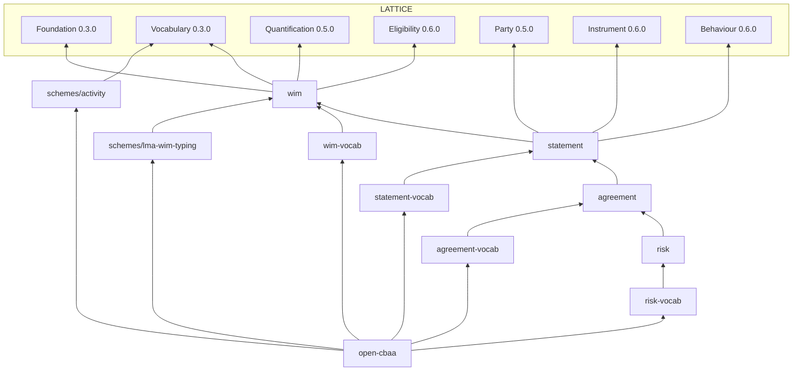

# Open CBAA Ontologies

The OWL 2 ontologies, vocabularies and SHACL shapes for Open CBAA, built on LATTICE. They
implement the [design specification](../docs/design/design-spec.md) (principles AP and DP,
decisions D) and the [LATTICE integration specification](../docs/design/lattice-integration.md)
(DL encoding §5, open questions I, upstream changes L). The
[WIM design review](../docs/design/wim-review.md) records why the first, flat WIM ontology was
replaced. This README says how the documents are put together and why. Decisions taken while
building them are proposed for ratification as D17 to D26 in the design specification's
[decision log](../docs/design/design-spec.md#12-decision-log).

Open [open-cbaa.ttl](open-cbaa.ttl) in Protégé. The [catalog](catalog-v001.xml) resolves every
import, LATTICE's included, without a LATTICE checkout.

## 1. Layout

| Directory | Prefix | Version | Contents |
|---|---|---|---|
| [wim/](wim/) | `wim:` | spec 0.2.0, vocab 0.1.0, shapes 0.1.0 | wording structure: the WIM's four levels, part-whole, data elements, text segments, assembly (inclusion modes, variation slots, inclusion conditions), variable declarations |
| [statement/](statement/) | `stm:` | spec 0.1.0, vocab 0.1.0, shapes 0.1.0 | meaning: statement kinds, templates and bound statements, parameters, parameter bindings, encoding status. The vocab holds parameter kinds and the money, duration and authority-level value spaces |
| [agreement/](agreement/) | `agr:` | spec 0.1.0, vocab 0.1.0, shapes 0.1.0 | agreements: identity, versions, assembly, variable values, parties, bound statements, amendments. The vocab holds the CBAA roles, the markets and the M12 lifecycle |
| [risk/](risk/) | `rsk:` | spec 0.1.0, vocab 0.1.0, shapes 0.1.0 | the operational case: bound policies and risks, the dimensions authority reads |
| [schemes/](schemes/) | `lma:`, `act:` | 0.1.0 each | provisional SKOS editions: the LMA WIM typing schemes and an activity scheme |
| [governance/](governance/) | `cbg:` | | shapes relating scheme contracts to the values they govern, across modules |
| [examples/](examples/) | `ex:` | 0.1.0 | the worked agreement BA-2026-001 (§9) |
| [open-cbaa.ttl](open-cbaa.ttl) | | 0.2.0 | the umbrella: every vocab and scheme document, and through them every spec and the LATTICE layers |

Each module follows LATTICE's layout. `spec/` holds the T-Box, `vocab/` the named individuals
and scheme contracts a module ships, `shapes/` the SHACL, split into `structural.ttl`
(per-node) and `constraints.ttl` (whole-graph SHACL-SPARQL).



Every LATTICE layer a module uses is imported explicitly by its exact version IRI. LATTICE
layers import only Foundation (Vocabulary imports only SKOS), so importing Party does not bring
Quantification. Vocab documents also import the LATTICE vocabs whose individuals they use
(governance states, party roles, Behaviour kinds). A vocab binds its contracts to schemes by IRI
without importing them, so the umbrella is the unit that resolves every term. Quantification's
vocab document has no ontology header and cannot be imported
(L16), so its individuals (`qnt:Compare`, `qnt:TotalOrder`) are used by IRI and resolve only
through the spec's declarations.

## 2. IRIs and versions

- Namespace: `https://nebularis.github.io/open-cbaa/ontology/<module>#`. Schemes use
  `…/ontology/schemes/<name>#`.
- Ontology IRI: `…/ontology/<module>`, with no version. Version IRI:
  `…/ontology/<module>/<x.y.z>` for a spec, `…/ontology/<module>-vocab/<x.y.z>` for a vocab,
  `…/ontology/schemes/<name>/<x.y.z>` for a scheme.
- Imports always name a version IRI. Spec, vocab and each scheme are versioned independently
  under LATTICE's policy (ADR-A86, integration spec §3.4). A shapes directory is versioned by
  its `.version` file, so changing a shape never bumps the spec. The `governance/` shapes sit
  beside no `spec/`, so LATTICE's version check does not track them yet.
- `wim` starts at 0.2.0 with `owl:priorVersion` the retired `lma-wim/core`: reclassifying its
  typing into schemes is a breaking change within 0.x.

Run [`tools/lattice_catalog.py`](../tools/README.md) after adding a document or importing a new
LATTICE release. It maps both IRIs of each local document to its file, and each LATTICE version
IRI to its raw file at its release tag.

## 3. Wording structure (`wim:`)

**Four levels.** `wim:WordingObject ≡ Contract ⊔ ComponentGroup ⊔ Component ⊔ DataElement`,
with the four pairwise disjoint. A wording object is a `fnd:Version` of a persistent identity
and is `fnd:Governable`: a published text is immutable, a new text is a new version, and an
agreement keeps pointing at the version it was made with. `wim:objectId` is the WIM id (5.2,
SC08.1.1). `wim:rankKey` orders siblings lexicographically, so inserting a clause changes no
other key, and clause numbers are computed after inclusion, never stored (DP10).

**Part-whole.** `wim:directlyComprises` is asserted. `wim:comprises` is its transitive
super-property and is never asserted. Per-level `allValuesFrom` restrictions on `comprises`
fix what each level may contain (a component never contains a component group, a data element
contains nothing), and because they sit on the transitive property they also constrain every
entailed skip-level edge. See §7 for why the characteristics are split this way.

**Typing is classification** (DP2, design-spec §11). A WIM type changes how an object is
classified, not which properties it has, so it is a SKOS concept, not a class:
`wim:contractCategory` (functional, so the agreement types sit under Agreement in one
hierarchy), `wim:componentGroupType`, `wim:componentType`, `wim:elementType` (functional) and
`wim:clauseClassification` (not functional, since the clause scheme is a polyhierarchy).
`wim:applicableTo` on a concept replaces the Agreement-related and Policy-related mixins. The
values come from schemes bound to scheme contracts (§6). Where a class is needed, it is
generated, not authored (integration spec §5.4).

The data element classes stay classes because their instances differ in properties: text has
segments, a variable has a key and a value contract or space, a reference has a target.
`wim:GoverningVariable` (read by inclusion conditions) and `wim:EmbeddedVariable` (shown in
text) are disjoint. Analogue attachments (schedule documents, IPIDs, certificates) are
`wim:DocumentObject`, classified by `wim:documentKind`, since their content is not digitised.

**Segments.** A text's content is its `wim:Segment`s, each exactly one of literal text, a
variable reference or an object reference, ordered by `wim:segmentIndex`. SHACL checks the
indices run 0..n-1. This gives closed-world order that queries can read directly, where an
`rdf:List` would give order that OWL cannot see and SPARQL reads awkwardly.

**Assembly** (design-spec §3.6). `wim:inclusionMode` is Mandatory, Variation, Optional or
Conditional, and absent means Mandatory.

- A **variation slot** (M1 1.4 with 1.4A to 1.4C) is a `wim:VariationSlot`. Its variants are
  ordinary wording objects, each `wim:variantOf` the slot with mode Variation, all comprised by
  the slot's parent. The slot holds the position. An agreement includes exactly one variant
  (agreement shapes).
- An **inclusion condition** is `wim:includedWhen`, an `elg:AdmissionProfile` whose conditions
  each read one governing variable (`wim:readsVariable`). It is evaluated once, at assembly and
  on amendment, in question form: assembly poses the agreement's value for the variable as an
  `elg:Question`. It is never evaluated per event, which is what a statement's scope is for.
  Evidence bindings cannot serve here, because a path cannot select one variable's value among
  an agreement's `agr:VariableValue`s. The cost is that design-time exclusivity checks over a
  slot's conditions (integration spec §5.6) need a Surface promotion first.

**Variables** declare what an agreement supplies: `wim:variableKey`, `wim:populationMethod`,
`wim:populatedFrom` another variable, and either `wim:valueContract` (a concept-valued variable,
DP8) or `wim:valueSpace` (a quantity), with optional `wim:admissibleValues`. Single-valued
unless `wim:multiValued`.

## 4. Meaning (`stm:`)

**Two orthogonal axes.** A statement has one of eight pairwise disjoint kinds (design-spec
§3.3). Obligation, Prohibition, Permission, Power and AuthorityGrant are prescriptive
(`stm:PrescriptiveStatement` is their union). Definition, Classification and Precedence are
constitutive or meta. Independently, a statement is a template or bound, and never both.

- A **`stm:StatementTemplate`** is library meaning, attached once to a wording object version
  (`stm:expresses`, inverse `stm:expressedBy` ⊑ `prov:wasDerivedFrom`). It names roles
  (`stm:bearer`, `stm:counterparty`) and takes variable parameters through
  `stm:ParameterBinding`s. Extraction and review happen once per wording, not per contract.
- A **`stm:BoundStatement`** is an agreement's meaning, `stm:boundFrom` exactly one template,
  with the agreement's occupancies and values. It is a `fnd:Version`, so one identity follows
  the same statement across agreement versions, and version 2's grant can be compared with
  version 1's (materiality).

**Only bound obligations are Instrument obligations.** `ins:Obligation` requires role
occupancies as obligor and obligee, which a template does not have. So the axiom is the GCI
`Obligation ⊓ BoundStatement ⊑ ins:Obligation ⊓ =1 ins:obligor.pty:RoleOccupancy`, refining
integration spec §5.5, which stated `Obligation ⊑ ins:Obligation`. A bound obligation names its
parties through `ins:obligor` and `ins:obligee`. The other bound prescriptive kinds use
`stm:bearerOccupancy` and `stm:counterpartyOccupancy`. `stm:bearer` is used for every kind, an
authority grant's grantee included, where §5.5 had a separate `grantee`.

**Parameters** sit on the statement (DP4): `stm:activity` (a concept in the activity scheme),
`stm:scope` (an `elg:AdmissionProfile`), `stm:level` (a `qnt:OrdinalValue`), `stm:trigger` (a
`bhv:TriggerDefinition`), `stm:deadline` (a `qnt:Range`), `stm:recurrence`, `stm:appliesInState`
and, for obligations, `stm:breachTreatment` (condition precedent, warranty, bare condition, as a
classification, not a kind). `stm:appliesInState` is the only place lifecycle state touches a
statement, and it never enters a scope (DP6).

**Scopes and parameter bindings** (I8). A scope parameter says which variable supplies the
values (`stm:fromVariable`), what kind of parameter it is (inclusion, exclusion or limit), the
case class it evaluates (`stm:scopeSubject`, usually `rsk:Risk`), the path from the case to the
value read (`stm:scopeStep`, LATTICE `elg:EvidenceStep`s) and the match strategy. Binding
writes, for the bound statement, an admission profile whose conditions carry the agreement's
values and an `elg:EvidenceBinding` per condition built from the subject and steps. An
inclusion and an exclusion over the same path make one condition. Because the result is plain
LATTICE Eligibility, its compilers turn each scope into SPARQL, SHACL and OWL classes (D14).
An admission profile's decision reads "applies" for Permitted when the statement is not a
grant.

**Encoding status** records, per wording object, that it expresses meaning, was assessed to
have none (a recital), or has not been assessed, so an absence is a finding, not an omission.

## 5. Agreements and the case (`agr:`, `rsk:`)

**Agreement versions.** `agr:AgreementVersion ⊑ wim:Contract ⊓ ins:Element ⊓
fnd:TemporallyScoped ⊓ ∃fnd:hasIdentity.agr:AgreementIdentity`. It is the WIM root of its
assembled wording (contract category Agreement or narrower, checked in SHACL), an Instrument
element so Behaviour effects can target it, and valid from its effective date. Its governance
state is the record's (Draft, Active, Superseded). Its lifecycle state (in force, suspended,
run-off) belongs to Behaviour.

- The **identity** is an opaque surrogate. The UMR is a claimed key, unique per market among
  Active versions (SHACL), because it can change within one agreement (M3 3.7.1.2). Replacing
  the Coverholder entity, the Lead Insurer or the broker number mints a new identity (M3 3.9.1).
- **Markets** (`agr:inMarket`) are `voc:BindingScope`s, so a scheme binding scoped to Lloyd's
  applies to Lloyd's agreements (§6).
- `agr:includes` records the **resolved** wording set: every mandatory object, one variant per
  slot, and the optional and conditional objects that apply. It is recorded, not recomputed,
  so the agreement's text is fixed at acceptance.
- **Variable values** are `agr:VariableValue` nodes (`agr:forVariable`, then `agr:value` or
  `agr:literalValue`), not one property per variable, which would grow the T-Box with every
  wording. `agr:hasVariableValue` and `agr:hasStatement` are inverse functional, so each value
  and bound statement belongs to one version.
- **Parties** are `pty:RoleOccupancy`s in the CBAA roles (agreement-vocab), and the insurers a
  `pty:ParticipationGroup` under `pty:SeveralOnly`, each membership's share its signed line.
- An **amendment** is a `prov:Activity` from one version to the next (`agr:amends` ⊑
  `prov:used`, `agr:resultsIn` ⊑ `prov:generated`), with `agr:agreedOn`, `agr:operationalFrom`
  and `agr:materiality`. It keeps the agreement's identity (SHACL).

**Lifecycle.** agreement-vocab declares M12 on Behaviour as data: a state space (in force,
automatically suspended, notice served, run-off, closed), triggers (external, scheduled,
derived), instrument-targeted effects and nine transitions. Nothing here hard-codes a state
machine (design-spec §8.7). `bhv:forSubject`'s range is `pty:RoleOccupancy`, so an agreement
cannot yet be the subject of its own state occupancy (L15).

**The case is the risk** (I7). The CBAA says a risk "is deemed to be located" in one place, so
`rsk:riskLocation` is functional, and a policy covering several locations has one `rsk:Risk`
per location. A risk has one policy, one location and one sum insured, so each dimension a
grant reads is a single-valued path from the risk, which is what LATTICE's OWL backend compiles
(ADR-A90 option B). `rsk:peril`, `rsk:riskCode`, `rsk:insurableInterest` and
`rsk:territorialLimit` are multi-valued and stay out of design-time classes until I7's survey
decides between finer cases and an upstream quantified reading. A `rsk:BoundPolicy` is bound
under the agreement version valid at `rsk:boundAt` (SHACL). Money is a `qnt:Quantity` on
`stm:MoneySpace` in one currency.

## 6. Vocabulary

Every concept-valued property names a `voc:SchemeContract` (DP8), which a governance shape
checks. Values come from the contract's bound scheme or a scheme a `voc:SchemeBinding` for it
supplies. Tiers follow design-spec §4.1.

| Tier | Where | Examples |
|---|---|---|
| V1, closed and ours | named individuals in a module's vocab, `owl:AllDifferent` | inclusion modes, population methods, parameter kinds, encoding statuses, materiality, `rsk:ContractTypeScheme` |
| V2, market standards | provisional editions in [schemes/](schemes/), each saying so in `skos:editorialNote`, to be superseded when the owner publishes | the LMA WIM typing schemes, the activity scheme |
| V2 and V3, deployment editions | not shipped. Contracts are left unbound and a deployment binds its edition, scoped by market | territories, perils, risk codes, insurable interest, policyholder classification, currencies |

| Contract | Constrains | Bound to |
|---|---|---|
| `wim:ContractCategoryContract` | `wim:contractCategory`, `wim:applicableTo` | `lma:ContractCategoryScheme` |
| `wim:ComponentGroupTypeContract`, `wim:ComponentTypeContract`, `wim:ClauseClassificationContract`, `wim:ElementTypeContract`, `wim:DocumentKindContract` | the matching `wim:` property | the matching `lma:` scheme |
| `stm:ActivityContract` | `stm:activity` | `act:ActivityScheme` |
| `stm:BreachTreatmentContract` | `stm:breachTreatment` | `lma:ClauseClassificationScheme` (the Conditions branch) |
| `stm:ClassificationContract` | `stm:classifiedAs` | unbound: each classification names its scheme |
| `rsk:ContractTypeContract` | `rsk:contractType` | `rsk:ContractTypeScheme` (V1) |
| `rsk:TerritoryContract` | `rsk:riskLocation`, `rsk:policyholderLocation`, `rsk:territorialLimit` | unbound |
| `rsk:PerilContract`, `rsk:InsurableInterestContract`, `rsk:PolicyholderClassificationContract`, `rsk:RiskCodeContract` | the matching `rsk:` property | unbound |

statement-vocab declares three value spaces. `stm:MoneySpace` is dense and totally ordered,
needs a currency unit, and supports compare, contains, sum and difference. A limit stated in
several currencies uses `qnt:alternativeBound`, and an amount is compared only with the
statement in its own currency (ADR-A95). `stm:DurationSpace` is discrete, with day as canonical
unit and business day, month and year as calendar units, whose conversions are contextual
(ADR-A94). `stm:AuthorityLevelSpace` orders authority levels.

## 7. OWL nuances

The profile is OWL 2 DL. The constructs below are where the encoding departs from the obvious.

| Construct | Where | Why |
|---|---|---|
| Simple and non-simple properties | `wim:directlyComprises` (irreflexive, asymmetric) ⊑ `wim:comprises` (transitive) | OWL 2 DL allows irreflexivity and asymmetry only on simple properties, and a transitive property is not simple. The characteristics go on the asserted edge, transitivity on its super-property |
| `allValuesFrom` on the transitive property | per-level restrictions on `wim:comprises` | a restriction on the direct edge would not constrain entailed skip-level edges |
| Union-defined class | `wim:WordingObject ≡ ⊔` of the four levels | every wording object is exactly one level, so the four are covering and disjoint. SHACL sees `rdfs:subClassOf` but not `owl:unionOf`, so shapes target the four levels, never `wim:WordingObject` |
| GCIs on intersections | `Obligation ⊓ BoundStatement ⊑ ins:Obligation`, the template and bound cardinalities in statement | the requirement depends on two independent axes. SHACL cannot target an intersection, so the matching shapes are SPARQL that tests `rdf:type` |
| Qualified cardinality | `=1 boundFrom.StatementTemplate`, `=1 ins:obligor.RoleOccupancy`, `=1 forVariable.Variable` | states the filler's class as well as the count |
| Functional plus exactly-one | functional properties throughout, `owl:cardinality 1` where the value is required | functional gives at most one. Existence needs the restriction, and OWL's open world means only SHACL reports it missing |
| Inverse functional ownership | `wim:hasSegment`, `agr:hasVariableValue`, `agr:hasStatement`, `stm:hasParameterBinding` | a part belongs to one whole, so sharing it by mistake merges wholes or is inconsistent |
| Punning | `voc:constrainsProperty` and `elg:stepProperty` name properties, `stm:scopeSubject` and `elg:subjectClass` name classes | OWL 2 punning lets a property or class IRI stand as an individual, so declarations can point at T-Box terms without breaking DL |
| PROV-O sub-properties | `stm:expressedBy`, `stm:boundFrom` ⊑ `prov:wasDerivedFrom`, `agr:amends` ⊑ `prov:used`, `agr:resultsIn` ⊑ `prov:generated` | lineage queries reach wording and amendments without knowing Open CBAA terms (D5) |
| No unique names | `owl:AllDifferent` over each closed vocab set | without it, a reasoner may merge two named individuals, such as Mandatory and Optional |
| Cross-stratum disjointness | `stm:Statement`, `wim:WordingObject` and their supporting classes disjoint | wording and meaning are separate strata (DP3), and a reasoner reports a node typed as both |

OWL is open world, so it detects contradictions, never omissions. Every "must have" is
therefore also a shape. Rules that depend on a statement's kind, on the whole agreement, or on
values across modules are SHACL-SPARQL.

## 8. Shapes

| File | Enforces |
|---|---|
| [wim/shapes/structural.ttl](wim/shapes/structural.ttl) | identity and governance state on every wording object, one category or type per level, segments are one of three forms, variable declarations |
| [wim/shapes/constraints.ttl](wim/shapes/constraints.ttl) | segment indices run 0..n-1, variants have mode Variation and vice versa, conditional objects state a condition and only they and variants do, each condition reads a governing variable |
| [statement/shapes/structural.ttl](statement/shapes/structural.ttl) | templates are attached and name roles only, bound statements name one template and one identity and occupancies only, parameter value types |
| [statement/shapes/constraints.ttl](statement/shapes/constraints.ttl) | prescriptive templates name a bearer and an activity, obligation templates a counterparty, grant templates a scope, bound statements their parties and activity, bound grants a scope, bound kind equals template kind, scope parameters are complete |
| [agreement/shapes/structural.ttl](agreement/shapes/structural.ttl) | valid time, market, wording, occupancies, one form of variable value, amendment fields |
| [agreement/shapes/constraints.ttl](agreement/shapes/constraints.ttl) | agreement category, one variant per slot, mandatory children included, statements bound from included wording, statement parties are the version's own, UMR unique per market, amendments keep identity |
| [risk/shapes/structural.ttl](risk/shapes/structural.ttl) | one policy, location and sum insured per risk |
| [risk/shapes/constraints.ttl](risk/shapes/constraints.ttl) | bound while the agreement version is valid, money amounts on the money space in a currency |
| [governance/scheme-contracts.ttl](governance/scheme-contracts.ttl) | governed values are in a bound or binding scheme, every concept-valued property has a contract |

Run them with LATTICE's structural and constraint shapes for Foundation, Vocabulary,
Quantification, Party, Eligibility, Instrument and Behaviour, over the data merged with the
ontology closure, with RDFS inference. Written for pySHACL: SPARQL constraints use no `VALUES`,
and a nested `SELECT` projects `$this`. The governance membership check accepts a value from any
binding of the contract. It does not yet select the binding by scope and time, which is
Vocabulary's resolution (a `voc:resolvedUnder` check covers recorded resolutions).

## 9. Worked example

[examples/ba-2026-001.ttl](examples/ba-2026-001.ttl) is the agreement the [architecture
walkthrough](../docs/architecture.md) follows. Harbour Underwriting Ltd is the Coverholder,
Lead Insurer A takes 60% and Follow Insurer B 40%, with a broker. The file holds a territory
edition bound to the territory contract for Lloyd's, a binding for the contract type scheme,
three currency units, library modules M1 (a variation slot with inclusion conditions), M5 (a
SoUA clause with segments, variables and an authority grant template) and M8 (an FNOL onward
transfer obligation template), version 1 with its parties, values and bound statements, an
amendment raising the limit to version 2, and a bound policy with four risks.

| Risk | Location | Sum insured | Expected decision under version 1 |
|---|---|---|---|
| `ex:risk-lyon` | Lyon | GBP 3,000,000 | Permitted |
| `ex:risk-ajaccio` | Ajaccio, under the excluded Corsica | GBP 1,000,000 | Denied |
| `ex:risk-france` | France itself, above the exclusion | GBP 2,000,000 | Undetermined: France-in-general may or may not be Corsica (ADR-A87) |
| `ex:risk-nice-usd` | Nice | USD 2,000,000 | Undetermined: the limit has no USD statement, and currencies are never converted (ADR-A95) |

A GWP allowance (Behaviour `AllowanceDefinition`) is not in the example yet.

## 10. Validation

```bash
cd ../lattice && python ../open-dare/tools/ontology_check.py
```

[tools/ontology_check.py](../tools/ontology_check.py) uses LATTICE's catalog closure, HermiT
testkit and shapes, so it runs from a LATTICE checkout with LATTICE's Python and Java. It checks
that the ontologies are consistent and every Open CBAA class is satisfiable (all asserted
together), that the example is consistent and conforms to all the shapes, then runs 11 OWL
probes (entailments that must hold, contradictions that must be caught) and 14 SHACL probes
(one mutation per constraint that must be reported). A pass prints `0 failure(s)`.

LATTICE's version check covers these documents too:

```bash
cd ../lattice && python tools/ontology_version_check.py --root ../open-dare
```

## 11. Upstream notes

| # | Layer | Finding |
|---|---|---|
| L15 | Behaviour | `bhv:forSubject`'s range is `pty:RoleOccupancy`, so an agreement version cannot be the subject of its lifecycle state occupancy |
| L16 | Quantification | the vocab document has no `owl:Ontology` header or version IRI, so consumers cannot import it |
| L17 | Quantification | `qnt:OperationCapabilityMeetShape`'s query uses `qnt:` without declaring it, so it fails unless the data graph happens to bind the prefix. The check tool binds it |
