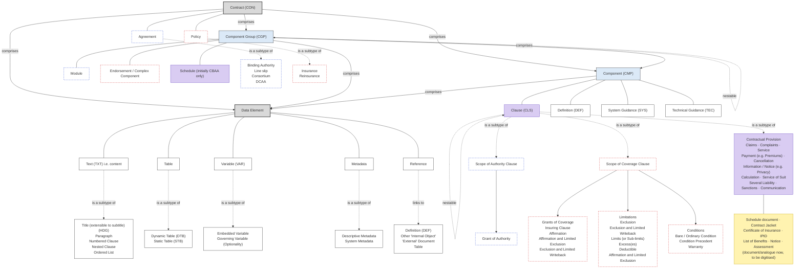

# The WOL and the LMA Wordings Information Model

```mermaid
flowchart TD

%% ===== Object Class Hierarchy (solid = comprises / parent of) =====
CON["Contract (CON)"]
CGP["Component Group (CGP)"]
CMP["Component (CMP)"]
DE["Data Element"]

CON -->|comprises| CGP
CON -->|comprises| CMP
CON -->|comprises| DE
CGP -->|comprises| CMP
CGP -->|comprises| DE
CMP -->|comprises| DE
CGP -.->|nestable| CGP

%% ===== Typing (association with its hierarchy level) =====
AGR["Agreement"]
POL["Policy"]
CON --- AGR
CON --- POL

MOD["Module"]
ENDC["Endorsement / Complex Component"]
SCH["Schedule (initially CBAA only)"]
CGP --- MOD
CGP --- ENDC
CGP --- SCH

CLS["Clause (CLS)"]
DEF["Definition (DEF)"]
SYS["System Guidance (SYS)"]
TEC["Technical Guidance (TEC)"]
CMP --- CLS
CMP --- DEF
CMP --- SYS
CMP --- TEC
CLS -.->|nestable| CLS

TXT["Text (TXT) i.e. content"]
TBL["Table"]
VARN["Variable (VAR)"]
META["Metadata"]
REF["Reference"]
DE --- TXT
DE --- TBL
DE --- VARN
DE --- META
DE --- REF

%% ===== Sub-Typing (dashed = is a (sub)type of) =====
AGR_SUB["Binding Authority<br/>Line slip<br/>Consortium<br/>DCAA"]
POL_SUB["Insurance<br/>Reinsurance"]
AGR -.->|is a subtype of| AGR_SUB
POL -.->|is a subtype of| POL_SUB

SOA["Scope of Authority Clause"]
GRANT["Grant of Authority"]
CLS -.->|is a subtype of| SOA
SOA --> GRANT

SOC["Scope of Coverage Clause"]
GOC["Grants of Coverage<br/>Insuring Clause<br/>Affirmation<br/>Affirmation and Limited Exclusion<br/>Exclusion and Limited Writeback"]
LIM["Limitations<br/>Exclusion<br/>Exclusion and Limited Writeback<br/>Limits (or Sub-limits)<br/>Excess(es)<br/>Deductible<br/>Affirmation and Limited Exclusion"]
COND["Conditions<br/>Bare / Ordinary Condition<br/>Condition Precedent<br/>Warranty"]
CLS -.->|is a subtype of| SOC
SOC --> GOC
SOC --> LIM
SOC --> COND

CP["Contractual Provision<br/>Claims · Complaints · Service<br/>Payment (e.g. Premiums) · Cancellation<br/>Information / Notice (e.g. Privacy)<br/>Calculation · Service of Suit<br/>Several Liability · Sanctions · Communication"]
CLS -.->|is a subtype of| CP

DOC["Schedule document · Contract Jacket<br/>Certificate of Insurance · IPID<br/>List of Benefits · Notice · Assessment<br/>(document/analogue now, to be digitised)"]
CP --- DOC

TXT_SUB["Title (extensible to subtitle) (HDG)<br/>Paragraph<br/>Numbered Clause<br/>Nested Clause<br/>Ordered List"]
TBL_SUB["Dynamic Table (DTB)<br/>Static Table (STB)"]
VAR_SUB["Embedded Variable<br/>Governing Variable (Optionality)"]
META_SUB["Descriptive Metadata<br/>System Metadata"]
REF_SUB["Definition (DEF)<br/>Other 'Internal Object'<br/>'External' Document<br/>Table"]
TXT -.->|is a subtype of| TXT_SUB
TBL -.->|is a subtype of| TBL_SUB
VARN -.->|is a subtype of| VAR_SUB
META -.->|is a subtype of| META_SUB
REF -.->|links to| REF_SUB

%% ===== Legend colors =====
classDef hierarchyGray fill:#d9d9d9,stroke:#333333,stroke-width:2px;
classDef hierarchyBlue fill:#dbe9f7,stroke:#333333,stroke-width:1px;
classDef agreementType fill:#ffffff,stroke:#2244cc,stroke-width:1px,stroke-dasharray: 4 3;
classDef policyType fill:#ffffff,stroke:#cc2222,stroke-width:1px,stroke-dasharray: 4 3;
classDef bothType fill:#d9ccf2,stroke:#6a4cc4,stroke-width:1px;
classDef docType fill:#fff3b0,stroke:#c9a600,stroke-width:1px;
classDef neutral fill:#ffffff,stroke:#333333,stroke-width:1px;

class CON,DE hierarchyGray
class CGP,CMP hierarchyBlue

class AGR,AGR_SUB agreementType
class POL,POL_SUB policyType
class MOD agreementType
class ENDC policyType
class SCH bothType

class CLS bothType
class DEF,SYS,TEC neutral

class SOA,GRANT agreementType
class SOC,GOC,LIM,COND policyType
class CP bothType
class DOC docType

class TXT,TBL,VARN,META,REF neutral
class TXT_SUB,TBL_SUB,VAR_SUB,META_SUB,REF_SUB neutral
```
